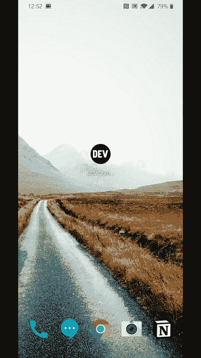

# 宣布 Android 开发

> 原文：<https://dev.to/devteam/announcing-dev-for-android-4c3j>

等待结束了！我们很高兴宣布面向 Android 的[开发社区应用。与我们在 iOS 上的做法类似，我们大量利用了本机 shell/web 视图，并且随着时间的推移将包含更多本机代码。有一些已知的问题，但我们很高兴有一个未来增强的起点！](https://play.google.com/store/apps/details?id=to.dev.dev_android)

我们今天还在[寻找](https://www.producthunt.com/@jessleenyc/collections/dev-community)产品。😊

[](https://play.google.com/store/apps/details?id=to.dev.dev_android)
[T6】](https://play.google.com/store/apps/details?id=to.dev.dev_android&pcampaignid=MKT-Other-global-all-co-prtnr-py-PartBadge-Mar2515-1)

开始试用该应用程序时，请告诉我们您的反馈和建议。就像我们的 web 应用和 iOS 应用一样，Android 应用也是开源的！

非常欢迎通过问题和 PRs 的方式投稿:

## [forem](https://github.com/forem)/[DEV-Android](https://github.com/forem/DEV-Android)

### 开发社区 Android 应用程序

<article class="markdown-body entry-content container-lg" itemprop="text">

# 开发安卓系统<g-emoji class="g-emoji" alias="gift_heart" fallback-src="https://github.githubassets.cimg/icons/emoji/unicode/1f49d.png">💝</g-emoji>

[ ](https://codeclimate.com/github/thepracticaldev/DEV-Android/maintainability) [ ](https://codeclimate.com/github/thepracticaldev/DEV-Android/test_coverage)

这是[开发者到](https://dev.to/)的安卓应用的官方仓库。

[](https://play.google.com/store/apps/details?id=to.dev.dev_android&pcampaignid=MKT-Other-global-all-co-prtnr-py-PartBadge-Mar2515-1)

## 设计精神

DEV Android 是一个基于 WebView 的应用程序。这个应用的灵感来自于 [Basecamp 的方法](https://m.signalvnoise.com/basecamp-3-for-ios-hybrid-architecture-afc071589c25)。随着时间的推移，我们将增加更多的本机代码。

通过尽可能多地利用网络视图，我们可以顺利地同步我们的网络开发工作。在有意义的地方，我们可以完全原生地重新实现某些东西，或者构建完全原生的特性。生活是一次旅行，而不是目的地。

## 贡献

我们希望贡献者遵守我们的基本[行为准则](https://github.com/forem/DEV-Android./CODE_OF_CONDUCT.md)。GitHub 上的所有对话和讨论(问题、拉请求)以及 dev.to 上的所有对话和讨论都必须是尊重和无骚扰的。

### 系统需求

您需要安装 Android Studio 3.5 或更高版本。

### 使用

```
$ ./gradlew tasks --group=custom
------------------------------------------------------------
Tasks runnable from root project
------------------------------------------------------------

Custom tasks
------------
androidTest - Run android instrumentation tests
hello - Hello World task
```

…Enter fullscreen mode Exit fullscreen mode</article>

[View on GitHub](https://github.com/forem/DEV-Android)

## [forem](https://github.com/forem)/[DEV-IOs](https://github.com/forem/DEV-ios)

### 开发社区 iOS 应用程序

<article class="markdown-body entry-content container-lg" itemprop="text">

[](https://travis-ci.com/thepracticaldev/DEV-ios)[](https://github.com/thepracticaldev/DEV-ios/blob/master/LICENSE)[](https://developer.apple.com/swift)[](https://codeclimate.com/github/thepracticaldev/DEV-ios/maintainability)[](https://codeclimate.com/github/thepracticaldev/DEV-ios/test_coverage)

# 开发 iOS <g-emoji class="g-emoji" alias="sparkling_heart" fallback-src="https://github.githubassets.cimg/icons/emoji/unicode/1f496.png">💖</g-emoji>

这是对 iOS 应用程序[开发到](https://dev.to)的回购。

# 状态:

发布了第一个版本，更多信息:[https://twitter.com/bendhalpern/status/1061323718058786822](https://twitter.com/bendhalpern/status/1061323718058786822)

# 设计精神

随着时间的推移，我们将增加更多的本机代码，但目前我们采用的是*本机 shell/web 视图*的方法。这种方法在 iOS 时代很早就失宠了，但我相信这是一种非常有效的方法。它的灵感来自于 Basecamp 的工作方式。我们的技术有点不同，但理念是一样的。

[https://m . signalvnoise . com/base camp-3-for-IOs-hybrid-architecture-AFC 071589 c 25](https://m.signalvnoise.com/basecamp-3-for-ios-hybrid-architecture-afc071589c25)

[https://signalvnoise . com/posts/3743-hybrid-sweet-spot-native-navigation-web-content](https://signalvnoise.com/posts/3743-hybrid-sweet-spot-native-navigation-web-content)

[https://signalvnoise . com/posts/3766-hybrid-how-we-take-base camp-多平台小型团队](https://signalvnoise.com/posts/3766-hybrid-how-we-took-basecamp-multi-platform-with-a-tiny-team)

[https://www.youtube.com/watch?v=SWEts0rlezA](https://www.youtube.com/watch?v=SWEts0rlezA)

通过尽可能多地利用`wkwebviews`,我认为我们可以让这一切变得非常棒，并与我们的网络开发工作非常顺利地同步。在有意义的地方，我们可以完全原生地重新实现某些东西，或者构建完全原生的特性。生活是一次旅行，而不是目的地。

# 贡献的

1.  派生并克隆项目。
2.  在 XCode 中构建并运行项目。
3.  …

</article>

[View on GitHub](https://github.com/forem/DEV-ios)

你仍然可以作为 PWA 安装应用程序，我们将继续支持开发的各种安装路径。

快乐编码