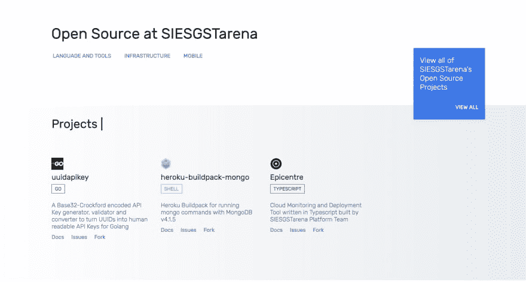

# 宣布 SIESGSTarena 的开源网站

> 原文：<https://dev.to/siesgstarena/announcing-siesgstarenas-open-source-site--4324>

[SIESGSTarena](https://arena.siesgst.ac.in) is the [CodeChef](https://codechef.com/) SIESGST Campus Chapter is an online platform for conducting programming competitions. It is a one spot for friendly competition, built on top of competitive programming platform. It was created as a platform to help programmers learn, share and improve themselves in the world of algorithms. This platform is built and maintained by students of [SIES Graduate School of Technology](http://siesgst.edu.in/).

At SIESGSTarena, we focus on improving the level of Competitive Programming in the college as well as we engineer applications at an aggressive pace. To do so, the software or tools, we develop as well as use must be simple to understand, production-hardened, and easily accessible. That’s why we support open source software. We make use of the best the community has to offer, and contribute our best work back to the community.

Our Developer Team is excited to announce [**SIESGSTarena’s Open Source Site**](https://siesgstarena.github.io/), a page highlighting some of the best softwares and tools available on our [public GitHub page](https://github.com/siesgstarena). We have some exciting projects in the works. And they’ll be highlighted here, first.

We hope that SIESGSTarena’s open source software sparks adoption, discussion, contributions and ultimately, an even richer open source community.