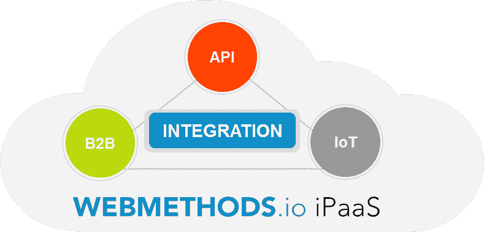

# 宣布 webMethods.io

> 原文：<https://dev.to/techcommunity/announcing-webmethods-io-38b9>

# 软件公司的下一代 iPaaS

4 月，Software AG 发布了 webMethods.io，这是 Software AG 的下一代集成平台即服务(iPaaS ),它将低代码可用性与复杂集成和 API 的高度控制相结合。这款多功能 iPaaS 拥有一套业界领先的 300 多个支持连接器，可集成应用、数据、API、B2B 和物联网设备。

webMethods.io 可在多个云基础架构平台上使用，让您无需执行升级、维护或修复，从而获得成本效益、速度、安全性和灵活性等云优势。

## 你知道 webMethods.io 平台…

*   支持内部和云中的混合集成？
*   300 多个云和内部连接器是否全天候维护和更新？
*   在云端提供 B2B 平台？
*   通过微服务支持的 API 提供下一代集成架构？
*   将低代码可用性与高控制性相结合，使公民集成商能够快速构建直观的服务？

## web methods . io 中你需要知道的新特性

**webMethods.io 集成**

webMethods.io 集成是 webMethods 集成云的新名称。四月份的版本包含了一个易于使用的图形用户界面，可以轻松开发集成工作流，同时保留了复杂集成和 API 的高级编排功能。凭借现成的配方和一套 300 多个连接 SaaS、内部部署和物联网应用的连接器，构建服务和解决方案的速度比以往任何时候都要快。新的连接器包括 sales force Streaming & Replay Events、更新的 Oracle 对应用程序适配器的支持，以及集成云上的 JDBC 适配器，该适配器具有针对云数据库的认证，如 Amazon RDS for Oracle 和 SQL Server 以及 Amazon Aurora for MySQL。随着对 webMethods cloud streams connectors for SaaS 应用程序的新支持，云部署仍然是 web methods 的主要关注点。在 4 月发布的版本中，还提供了回滚部署的能力和对 DevOps 自动化的命令行支持。最后，嵌入式集成功能甚至包括 Salesforce 和 Trello 等应用程序的对话代理(聊天机器人)。

[免费试用](https://signup.softwareag.cloud/#/?product=webmethodsioint)

**webMethods.io B2B**

我们新的 B2B 云解决方案“webMethods.io B2B”提供 B2B 集成即服务。这一新版本提供了安全性、合作伙伴证书增强和简化的入职培训。EDI 功能提供实时电子文档交换，支持通过 HTTP 和 AS2 协议传输的 UNEDIFACT 和 ANSI X12，此外，合作伙伴管理提供端到端可见性监控功能。

[免费试用](https://b2bcloud.webmethodscloud.com/b2bcloud/#/reg)

**webMethods.io API**

webMethods API 管理平台将被称为 webMethods.io API。webMethods API 门户的用户将享受到更轻松的入门和应用程序共享，并且社区将在 API 图库中可见。支付网关集成支持 API 的货币化。在 webMethods API Gateway 中，现在在自定义头中启用了证书转发。导入/导出、转移和升级已得到增强，以简化部署过程。webMethods API 微网关可以进行联合，现在可以从 webMethods API 网关进行管理，还可以使用其他策略和作用域。API Gateway 和 Microgateway 现在都支持 Kubernetes。CentraSite 现在与 API Gateway 配合使用，实现了 API 生命周期的无缝 API 升级和治理。

[免费试用](https://signup.softwareag.cloud/#/?product=apigateway)

了解 webMethods.io 如何推动数字创新:

[https://www.youtube.com/watch?v=uk-8St-bP8k&feature = emb _ logo](https://www.youtube.com/watch?v=uk-8St-bP8k&feature=emb_logo)