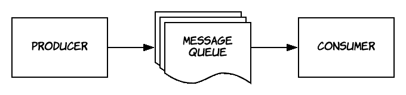
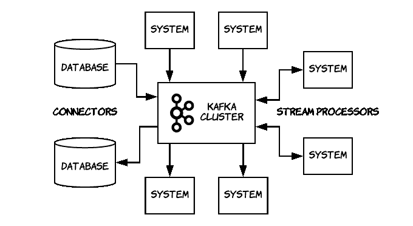
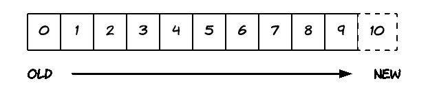
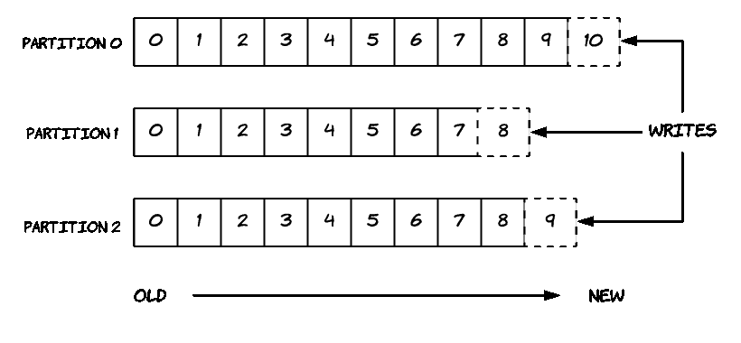
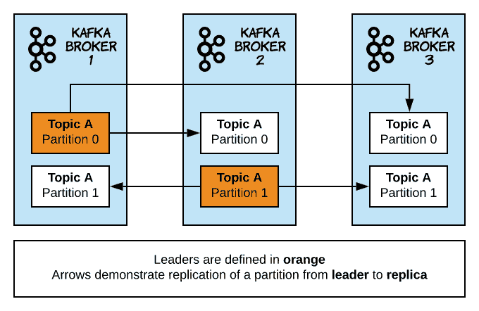
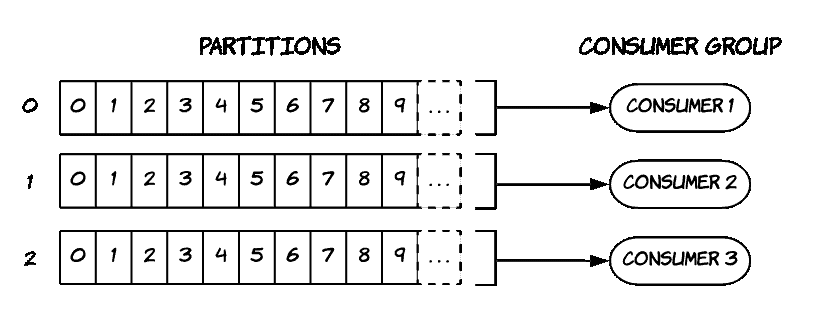

# 阿帕奇·卡夫卡:导论

> 原文：<https://dev.to/devshawn/apache-kafka-an-introduction-3d4o>

*这篇文章最初发表在我的[个人博客](https://devshawn.com/blog/apache-kafka-introduction/)* 上。

Apache Kafka 是一个分布式数据流平台，用于实时发布、订阅、存储和处理事件或记录流。它旨在从多个来源接收数据，以可靠的方式存储这些数据，并允许从多个系统使用这些数据。它还被设计为每天处理数万亿个事件。它最初是在 LinkedIn 开发的，现在是一个开源的 Apache 项目。

## 消息队列

Apache Kafka 是传统消息队列系统(如 ActiveMQ 或 RabbitMQ)的替代方案。一个*消息队列*是异步服务到服务通信的一种形式。它允许一个服务将消息发送到一个队列，然后另一个服务可以读取这些消息。写入队列的服务通常被称为**生产者**。订阅和读取队列的服务被称为**消费者**。

这种通信被称为*异步*，因为一旦服务发送了消息，它就可以继续做其他工作，而不是等待另一个服务的响应。简而言之，消息队列允许许多系统从队列的末尾提取一条或一批消息。通常，消息被读取后，会被从队列中删除。

<figure> 

<figcaption>简单消息队列数据流示例</figcaption>

</figure>

消息队列最常见的实现是任务列表，使用者从队列中读取任务并对其进行处理。可以添加多个消费者来增加并发性和提高任务处理速度，但是它不允许基于*相同的*消息发生多个动作。这可以概括为一列*命令*，其中每个命令只由一个消费者处理。

为了改进这一点，*发布/订阅*模式诞生了(也称为发布/订阅)。在发布/订阅模型中，多个消费者可以订阅同一个队列，每个消费者可以独立地读取同一个消息。

> 例如，假设有一个队列提供给定股票的最新股价。可能有许多系统对消费最新的股票价格感兴趣。这些系统可以订阅队列，每个系统将读取最新的股票价格，即使另一个独立的系统已经读取了它。

这可以概括为一列*事件*，其中每个消费者可以处理每个事件。

## 介绍阿帕奇卡夫卡

如上所述，Apache Kafka 是一个备选的消息传递系统，它包含消息队列、发布/订阅甚至数据库的概念。生产者可以将记录发布到*主题*，而不是队列。然后，消费者可以订阅并阅读来自该主题的消息。与大多数消息队列不同，来自一个主题的消息一旦被使用就不会被删除；相反，卡夫卡把它们保存在磁盘上。这允许您重放消息，并允许大量消费者处理每个记录的不同逻辑，或者像上面的例子一样，每个*事件*。

### 好处

Apache Kafka 提供了许多大多数消息队列系统无法提供的好处。

*   **可靠性** : Kafka 是分布式、分区、复制、容错的。稍后我们将探讨这意味着什么。

*   **可扩展性** : Kafka 可轻松扩展到多个节点，并允许零停机部署和升级。

*   **持久性** : Kafka 的分布式提交日志允许消息持久存储在磁盘上。

*   **性能** : Kafka 的高发布和订阅吞吐量支持高性能的分布式系统。

如上所述，Kafka 提供了超越传统消息队列或发布/订阅系统的独特优势。让我们更深入地挖掘卡夫卡的内在，以及它是如何运作的。

### 卡夫卡术语

卡夫卡的建筑由几个关键部分组成。作为一个分布式系统，Kafka 作为一个*集群*运行。集群中的每个 Kafka 实例被称为一个*代理*。卡夫卡的所有记录都存储在*主题*中。主题被分成数据的*分区*；稍后会详细介绍。最后，*生产者*写主题，*消费者*读主题。

<figure> 

<figcaption>阿帕奇卡夫卡是一个数据流平台的骨干</figcaption>

</figure>

### 提交日志

Apache Kafka 的核心是一个分布式的、不可变的提交日志，它非常类似于我们都知道并喜欢的 *git 日志*。发布到主题的每个记录都被提交到日志的末尾，并被分配一个唯一的、连续的日志条目编号。这通常也称为“预写日志”。本质上，我们得到一个有序的事件列表，它告诉我们两件事:*发生了什么*和*什么时候发生的*。在分布式系统中，由于许多原因，这通常是问题的核心。

<figure> 

<figcaption>预写日志示例，每个条目都有一个顺序 id</figcaption>

</figure>

作为 Kafka 主题基于提交日志的副作用，我们得到了*耐久性*。数据保存在磁盘上，消费者可以根据需要多次读取。如果需要，卡夫卡可以被用作真理的来源，就像一个数据库。

> 比如想象一个`users`题目。每次新用户在应用程序中注册时，都会有一个事件发送到 Kafka。从这里，一个服务可以读取`users`主题并将其保存在数据库中。另一个服务可能会阅读`users`主题并发送一封欢迎邮件。这允许我们将服务彼此分离，并且通常有助于实现微服务和事件驱动的架构。

### 卡夫卡内部的主题和分区

如上所述，Kafka 在主题中存储数据。主题然后被分割成分区。一个*分区*是一个有序的、不可变的记录日志，它被不断地追加。一个分区中的每个记录都被分配了一个顺序 id 号，称为*偏移量*，它惟一地标识了分区中的记录。一个主题由一个或多个分区组成。

<figure> 

<figcaption>例子解剖一个有三个分区的卡夫卡题目</figcaption>

</figure>

将主题分成多个分区有多种好处:

1.  日志可以扩展到超过一台服务器的大小；每个分区必须适合一台服务器的大小，但是具有多个分区的主题可以跨许多服务器传播

2.  主题的消费可以通过为主题的每个分区设置一个消费者来实现并行化，我们将在后面解释这一点

Kafka 集群使用可配置的保持期来持久保存所有已发布的记录。对于具有**和**的记录来说，这是真实的。Kafka 的性能不受磁盘上数据大小的影响；所以长时间存储数据不是问题。可以根据时间长度或主题大小来设置保留期。

> 例如，如果保留策略设置为五天，则记录自发布后最多可以使用五天。五天过后，Kafka 会丢弃唱片以释放磁盘空间。

Kafka 还可以根据消息的密钥无限期地保存数据。这非常类似于数据库表，其中存储了每个键的最新记录。这被称为*日志压缩*，并引出所谓的`compacted`主题。带有过时记录的消息最终将被垃圾收集并从主题中删除。

### 卡夫卡内部的分布和可靠性

每个代理拥有一组分区，其中每个分区或者是给定主题的*领导者*或者是*复制品*。所有对主题的写入和读取都是通过领导者进行的。当新记录被附加到主题时，领导者协调对副本的更新。如果一个主节点出现故障，一个副本节点将作为新的主节点接管。此外，如果所有数据都已从主服务器复制，则称副本服务器为*同步*。默认情况下，如果主服务器出现故障，只有同步副本服务器可以成为主服务器。不同步的副本可能是 Kafka 中代理失败或问题的迹象。

<figure> 

<figcaption>示例图显示具有两个分区和三个复制因子</figcaption>

</figure>

的主题的复制

通过拥有一个主题的多个副本，我们有助于确保在代理失败时数据不会丢失。对于具有`n`个代理和复制因子为`n`个主题的集群，Kafka 在数据丢失之前最多可以容忍`n-1`个服务器故障。

> 例如，假设您有一个包含`3`个代理的集群。想象一个复制因子为`3`的`users`主题。如果一个代理丢失，`users`将拥有`2`同步副本，并且不会发生数据丢失。更进一步，如果另一个代理丢失，`users`将有`1`副本，并且**仍然没有数据丢失**。印象深刻！

通过在集群内的多个代理之间分配分区领导者的数量来管理集群的负载。这使得 Kafka 可以处理大量的读写操作，而不会将所有压力都放在一个代理上——除非你只有`1`个代理！

### 产生于卡夫卡

制作人发布他们选择的主题。生产者负责在它所生产的主题内为记录分配一个分区。这可以通过循环方式来平衡它，或者根据语义分区函数(例如基于记录中的关键字)来完成。

> 例如，Java 客户机的默认分区策略使用记录键的散列来选择分区。这将保留具有相同密钥的消息的顺序。如果记录的键是`null`，那么 Java 客户端将随机对数据进行分区。这对于在顺序不重要的情况下轻松划分大容量数据非常有用。

### 来自卡夫卡的消费

卡夫卡中的消费者被组织成*个消费群体*。使用者组是一组使用者实例，它们使用主题中分区的数据。

<figure> 

<figcaption>有三个消费者的示例消费群从一个有三个分区的主题中阅读</figcaption>

</figure>

消费者一次从一个分区中读取数据，这允许我们将消费者的数量扩展到分区的数量，以增加消费吞吐量。一个主题的使用者组中的每个使用者从一个唯一的分区中读取数据。然后，该组作为一个整体消费来自整个主题的所有消息。

> 例如，想象一个带有`6`分区的主题。如果一个消费者组中有`6`个消费者，每个消费者将从`1`分区中读取数据。如果您有`12`，六个消费者将是空闲的，而其他六个从`1`分区消费。如果有`3`个消费者，每个消费者将从`2`个分区中读取数据。如果你有`1` consumer，它会从所有分区读取数据。

每个消费者群体阅读一个独立于任何其他消费者群体的主题。这允许许多系统(每个系统都有自己的使用者组)读取主题中的每条消息，这与从传统的消息队列中消费消息不同。

重要的是要注意，主题内的**排序**只对每个分区有保证。因此，如果您关心记录的顺序，根据保持顺序的东西(比如主键)进行分区或者只使用一个分区是很重要的。

## 结论

这篇文章只是对卡夫卡的关键概念的简单介绍。在以后的文章中，我们将深入探讨 Kafka 的内部结构、它所做的保证、真实世界的用例以及关于如何使用 Kafka 的深入教程。

总的来说，Kafka 正在迅速成为许多组织的数据管道的主干。它允许消息的大吞吐量，同时保持稳定性。它支持生产者和消费者的解耦，以实现灵活的自适应架构。最后，它提供了许多传统消息队列系统所没有的可靠性、一致性和持久性保证。我希望您喜欢了解 Kafka 如何成为构建大规模数据平台的有用工具！