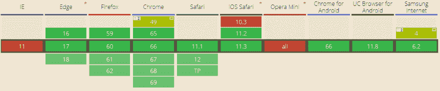
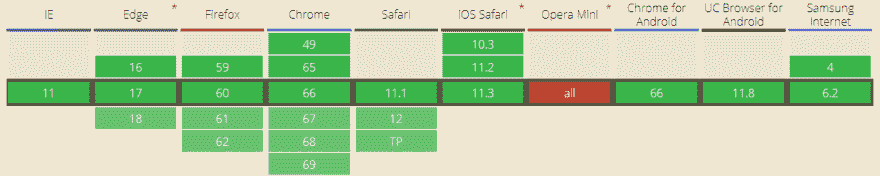

# API 和浏览器兼容性

> 原文：<https://dev.to/lambdatest/api-and-browser-compatibility-4elf>

在我们开始 API 中的浏览器兼容性之前，我们首先需要了解什么是 API 以及它们是如何工作的。如果不了解 API 的正确角色和功能，就很难理解一些不常见的术语，比如 API 的向后兼容性和浏览器使用。

当你浏览它在维基百科上的定义时，你可能会发现一个很长的描述，但简单来说，它们就像餐馆里为你服务的服务员。接受顾客的请求，将这些信息传递给数据中心(这里是厨房)，确认请求，并把数据带过来(这里是食物)。

那么，如果各种代码试图相互交互，网站如何知道你想向它请求什么呢？你将需要一个 API。

现在有许多类型的 API 你可能会在日常生活中遇到。每个 API 都有不同的角色，有一组不同的底层工作协议，以及针对不同环境的独特执行方法。因此，下一步是理解各种类型的 API 及其在各种浏览器中的支持。

### 不同类型的 API

**Web 服务 API:**
这些 API 包括 REST API、SOAP API、XML-RPC、 [JSON-RPC](https://en.wikipedia.org/wiki/JSON-RPC) 。这些 API 中最常见的是 REST 和 SOAP，其中 REST 代表具象状态转移，SOAP 代表简单对象访问协议。

REST API 是两者中的首选，因为它比 SOAP API 有更多的优势。它有一套标准的协议。

**源代码 API:**
这些 API 包括接口、基于库的 API 和基于类的 API。

**硬件 API:**
通过硬件的通信，如读取温度、流量、压力、湿度、型号等信息，都是在硬件 API 的帮助下完成的。然而，这些 API 独立于[浏览器兼容性](https://www.lambdatest.com/url-api)。

对象远程 API:
这些 API 使用像 CORBA 这样的远程协议。

**基于类的 API:**
数据和功能是围绕类来组织的，就像这些 API 中的面向对象语言一样。

**web socket API:**
在 web socket API 中，服务器不会对每个请求做出响应。一旦连接建立，它就发送事件驱动的响应，而不等待服务器回复。

当您在服务器上使用这些 API 进行通信或数据交换时，很多时候您可能会面临某些问题，如 API 不工作、重定向到某个错误页面、链接断开等。这些问题要求理解 API 浏览器兼容性的需求。

API 浏览器兼容性是指不同浏览器对不同 API 的支持。随着浏览器的每一次升级，都会有各种各样的反对意见同时出现。这些弃用增加了对各种标签、代码和技术的支持，因此有必要保持更新。

让我们假设您已经使用 MediaStreams 扩展了对 WebRTC 的支持。当你执行[跨浏览器测试](https://www.lambdatest.com/)时，你发现你不能在 chrome 的更高版本上观看事件。你可能会一遍又一遍地检查你的代码，仍然继续面对同样的情况，但后来你会知道 Chrome 53 更新不赞成这种支持，你需要使用 MediaStreamTracks。你会有什么感觉？傻啊！仅仅一个疏忽，你就可能付出很大代价。因此，有必要确保所使用的 API 是浏览器兼容的。

### 源代码 API 兼容性问题

**弃用的 SDK 浏览器方法**
SDK 或软件开发工具包是程序员下载使用某个 API 的工具包。这个 SDK 包含了程序员调用 API、服务请求所需的所有要素。现在，随着浏览器的每次升级，会有各种各样的技术被添加进来，也有各种各样的技术被弃用。这些过时的技术不支持各种特性、工具、元素等。

因此，正如我已经解释过的，就像 MediaStreams 一样，许多元素发生了变化或被弃用。因此，您需要了解最新浏览器的最新特性，确保您没有在 API 中使用任何不支持的特性或元素，从而导致 API 浏览器不兼容。

您可以使用 caniuse、w3schools 来更新各种浏览器支持的技术。

### REST API 兼容性问题

**使用标准的不兼容 API**
使用 REST API 时，您可能会使用标准的方法，如 GET、POST、PUT、DELETE、OPTIONS、PATCH 等，但并不是每个浏览器都支持这些方法。
[T6】](https://res.cloudinary.com/practicaldev/image/fetch/s--2v9ZVQ5H--/c_limit%2Cf_auto%2Cfl_progressive%2Cq_auto%2Cw_880/https://www.lambdatest.com/blog/wp-content/uploads/2018/06/get-USER-MEDIA-STREAM-API.png)

例如，如果你使用 getUserMedia/Stream API，那么你可能会面临与 IE 11、iOS Safari 10.3、Opera Mini 等特定浏览器的不兼容，以及与 Chrome 49、Samsung internet 4 等浏览器的部分兼容。因此，如果你使用该 API，你可能会破坏你的 API，并且由于通信中断，你的请求将不会得到服务。

### REST API 和 Websocket 兼容性问题

**跨来源违规**
当你试图请求一个私有 API 或一个合作伙伴 API，而他们并没有授权你使用他们的 API 时，你可能会面临跨来源错误。

只要您使用像 Twitter 或 Google 这样的公共 API，就不会遇到这个错误。

但是，如果您面临一个访问控制允许起源错误，那么您可能需要通过找到一个解决方案来解决这个问题。

在我们关于 Javascript 中的[脚本错误的博客上阅读更多关于解决这个错误的内容。](https://www.lambdatest.com/blog/script-error-in-javascript/)

### 源代码 API 问题

**防火墙阻止特定文件的调用**
当你使用某些 API，如 google web font API 时，这些 API 会通过从 web 或本地机器调用它们来呈现不同的文件。有时，防火墙会阻止这些呼叫，您可能会面临不兼容问题。

在这种情况下，您需要确保每个 API 调用都有一个后备。

例如，您正在使用一个字体系列，并将回退设置为 sans-serif。因此，如果 MyWebFont 不渲染，那么 sans-serif 将在其位置渲染，避免一些随机字体渲染。

```
body {
  font-family: 'MyWebFont', Fallback, sans-serif;
}
```

其他 API 调用也是如此。您需要为您使用的每个元素提供后备。

### 浏览器中基于 Websocket 的 API 问题

使用 WebSocket 时，您可能会遇到浏览器兼容性问题，因为 Opera Mini 不支持 web socket，如图所示。

[](https://res.cloudinary.com/practicaldev/image/fetch/s--xiCqG5jB--/c_limit%2Cf_auto%2Cfl_progressive%2Cq_auto%2Cw_880/https://www.lambdatest.com/blog/wp-content/uploads/2018/06/Websocket.png) 
因此，这是一个与 API 相互连接的世界，我们需要确保这些 API 保持连接，没有任何漏洞。因此，我们需要执行 API 测试来确保这一点。

来源: [LambdaTest 博客](https://www.lambdatest.com/blog/api-and-browser-compatibility/)