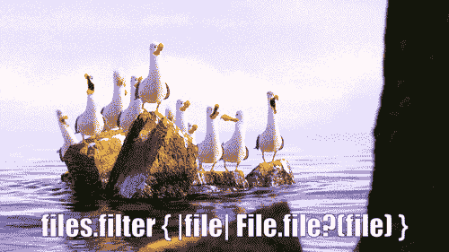

# API 设计:在野外(第 2 部分)

> 原文：<https://dev.to/samwho/api-design-in-the-wild-part-2-5bko>

在之前的帖子中，我们看了一些真实世界的 API，强调了好的和坏的，在这篇帖子中，我们也将这样做！

*   Python 的`datetime.datetime`
*   Java 的`URL.equals`方法
*   Go 的标准库
*   “过滤器”这个词
*   结论

## 巨蟒的`datetime.datetime`

大多数有经验的大画家在他们职业生涯的某个时候都写过这样的东西:

```
import datetime
now = datetime.datetime.now()
print(now) 
```

虽然不是不正确的，但重复命名是不和谐的。

Go 在一篇关于[包命名](https://blog.golang.org/package-names)的博客文章中特别指出了这一点，我认为我不可能对它进行改进，所以我逐字引用它:

> **避免口吃。**由于客户端代码在引用包内容时使用包名作为前缀，因此这些内容的名称不需要重复包名。`http`包提供的 HTTP 服务器叫做`Server`，而不是`HTTPServer`。客户端代码将这种类型称为`http.Server`，因此没有歧义。

您可以使用 Python 的`from x import y`语法:
来应对口吃

```
from datetime import datetime
now = datetime.now()
print(now) 
```

作为一个有趣的小礼物，一个朋友送给我以下的红宝石

```
files = Dir.entries(Dir.pwd)
files.select! { |file| File.file?(file) } 
```

[](https://res.cloudinary.com/practicaldev/image/fetch/s--EwuV_Ymj--/c_limit%2Cf_auto%2Cfl_progressive%2Cq_66%2Cw_880/http://samwho.dimg/file-file-file-file-file.gif)

## 爪哇的`URL.equals`法

如果你要测试两个 URL 是否相等，你会怎么做？

对字符串表示进行比较是完全合理的。`”https://google.com” != “https://facebook.com”`。然而，这不是 Java 的`URL`类的最初作者所走的路。

```
import java.net.URL;

public final class Main {
    public static void main(String... args) throws Exception {
        URL a = new URL("https://google.com");
        URL b = new URL("https://google.com");
        System.out.println(a.equals(b));
    }
} 
```

这是否总是返回 true？

很遗憾没有。

`java.net.URL.equals`通过一个长的间接链，最终为这两个 URL 调用`java.net.InetAddress.getByName`，后者执行 DNS 查找，以检查它们是否解析到同一个 IP 地址。它确实有一个缓存，但如果你非常不幸，并且缓存在两次查找之间过期，那么如果主机名使用 DNS 循环调度，你就有可能为同一个主机名获得两个不同的 IP 地址，这在 2019 年很常见。

与`java.io.File.exists`类似，这个方法并不完全像它宣传的那样。因为这个原因，以及它发出阻塞网络调用的事实，它被静态分析工具标记为[。](http://errorprone.info/bugpattern/URLEqualsHashCode)

## 围棋标准库

我犹豫要不要添加这一部分，因为它很有争议，但我确实认为这里存在一个真正的问题。

Go 的标准库缺少一些我期望在标准库中找到的关键东西。保持语言实现和使用简单的愿望将负担从语言实现者转移到了语言使用者身上。

例如，检查一个列表是否有特定的元素，这不是语言为您提供的。如果你去[查阅](https://stackoverflow.com/a/10485970)，你会发现这样的方法写起来微不足道。虽然这是真的，但我发现自己每周都在频繁地查找和复制粘贴琐碎的方法。

向标准库添加通用操作的努力值得赞赏，但通常很笨拙。获得一个[绝对值](https://golang.org/pkg/math/#Abs)需要你在一个`float64`之间转换。对一个数组进行排序需要你牺牲类型安全并提供你自己的交换函数。创建一个大整型变量每种类型都有一个方法，你可以通过将类型附加到方法名上来创建它们。

泛型和方法重载的增加虽然使语言及其实现变得复杂，但会使语言用户的生活变得更容易。

## “过滤”一词

你如何定义“过滤器”这个词的一般用法？大多数人，包括我自己，都想搬走东西。金属中的杂质，黄金中的污垢，意大利面中的水分。

那么这个回报是什么呢？

```
list(filter(lambda n: n > 5, [0, 1, 2, 3, 4, 5, 6, 7, 8, 9])) 
```

如果您猜测“包含所有大于 5 的数字的列表”，您将是正确的。

我觉得这很令人困惑。几乎每次使用时，我都必须检查哪种方式的`filter`有效，尽管在我为这篇文章所做的研究中，我了解到`filter`在我检查的每种语言中的工作方式都是一样的。

我喜欢 Ruby 解决这个问题的方法:

```
list = [0, 1, 2, 3, 4, 5, 6, 7, 8, 9]
list.select { |n| n > 5 } # [7, 8, 8, 9]
list.reject { |n| n <= 5 } # [0, 1, 2, 3, 4, 5] 
```

`select`和`reject`更加直接明显，是这些用例的通用词汇。至少他们比 [`filterfalse`](https://docs.python.org/3/library/itertools.html#itertools.filterfalse) 强。

## 结论

另一个帖子，另一组真实世界的 API 示例和改进它们的建议。

我很想听听你的想法，如果你有任何你喜欢或讨厌的 API，我也很想听听它们！