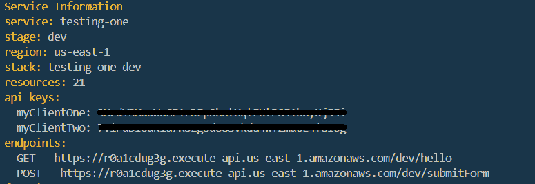
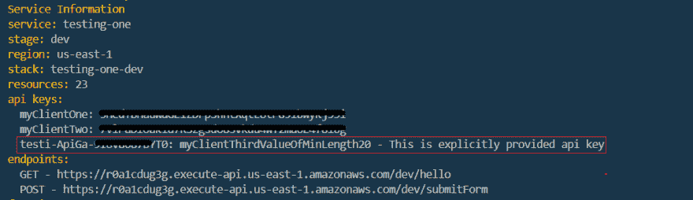
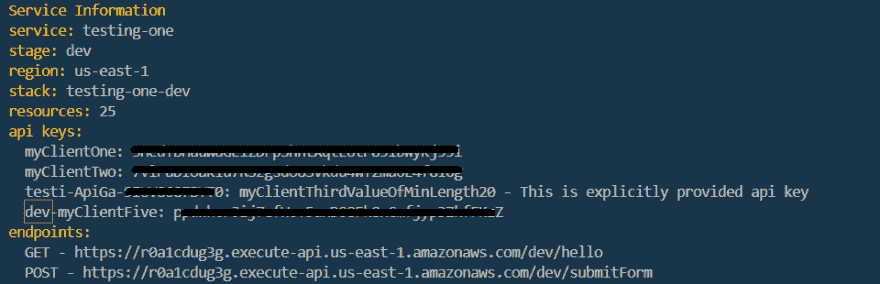

# 用于在 AWS Api 网关访问无服务器 API 的 API 密钥认证

> 原文：<https://dev.to/3sanket3/api-key-authentication-for-accessing-serverless-api-at-aws-api-gateway-lfd>

任何 REST API 都应该建立某种身份验证机制来防止意外使用。AWS 控制台和无服务器配置通过设置 API 密钥提供了一种保护 API 端点的简单方法。

我假设您已经对无服务器框架和为无服务器功能设置 API 网关有了基本的了解。如果没有，请赶紧查看一下我的[相关帖子](https://dev.to/3sanket3/how-to-create-serverless-api-functions-with-aws-lambda-4k8m)。

## 首先，使端点私有

按如下方式在单个功能的`http`部分设置`private: true`。

```
functions:
  hello:
    handler: handler.hello
    events:
      - http:
          path: hello
          method: get
          private: true 
```

## 列出 serverless.yml 中的 API 键名

在如下所示的`serverless.yml`的`provider`部分，列出所有我们想要生成 api 密匙的 API 密匙名称。

```
apiKeys:
  - myClientOne
  - myClientTwo 
```

AWS 将为我们提供的每个名称生成实际的密钥。这些键将显示在`sls deploy`命令的输出中。

[](https://res.cloudinary.com/practicaldev/image/fetch/s--8BOMobxK--/c_limit%2Cf_auto%2Cfl_progressive%2Cq_auto%2Cw_880/https://thepracticaldev.s3.amazonaws.com/i/80i7jdxgurtk5jmpn4kn.png)

## 如果你明确想要指定 API 键

您可以通过如下指定`value`属性来设置自己的 API 键值。它应该是最小长度为 20 的字符串。或者，您也可以为该值提供描述。

```
apiKeys:
  - myClientOne
  - myClientTwo
  - value: myClientThirdValueOfMinLength20
    description: This is explicitly provided api key 
```

通过运行`sls deploy`部署更改，AWS 将自动生成 api 键的名称并设置提供的值

[](https://res.cloudinary.com/practicaldev/image/fetch/s--o-u9M3HX--/c_limit%2Cf_auto%2Cfl_progressive%2Cq_auto%2Cw_880/https://thepracticaldev.s3.amazonaws.com/i/obdvk2j8f7svruw89opq.png)

以下示例将显式设置名称和值

```
apiKeys:
  - name: myClientFour
    value: myClientFourValueOfR@n0mStr1n6 
```

## 将阶段追加到 API 键名

API 密钥是全局存储的。因此，如果允许客户端访问多个阶段，建议在阶段名称后面附加 API 键名。

```
apiKeys:
  - ${self:provider.stage}-myClientFive 
```

[](https://res.cloudinary.com/practicaldev/image/fetch/s--VrZGnFYw--/c_limit%2Cf_auto%2Cfl_progressive%2Cq_auto%2Cw_880/https://thepracticaldev.s3.amazonaws.com/i/1fsea17skatrepuu7ijh.png)

同样，如果你想使用环境变量，你可以通过`${self:provider.environment.YOUR_ENV_VARIABLE}`来完成

> 每次我们在`serverless.yml`中做任何改变，我们都应该使用`sls deploy`进行部署，以便对 AWS 产生影响。
> 
> **提示:**在运行`sls deploy`之前，可以使用`sls print`命令查看编译好的 yaml 配置文件

## 设置额度限制

我们可以为 API 设置如下配额限制

```
provider:
  ...
  usagePlan:
    quota:
      limit: 5000
      offset: 2
      period: MONTH
    throttle:
      burstLimit: 200
      rateLimit: 100 
```

我们甚至可以对额度进行分类，比如*免费*和*付费*。我们应该将 api 键分配给各自的类别。

```
apiKeys:
  - free:
      - myClientOne
      - myClientTwo
  - paid:
      - value: myClientThirdValueOfMinLength20
        description: This is explicitly provided api key
      - ${self:provider.stage}-myClientFive

usagePlan:
  - free:
      quota:
        limit: 5000
        offset: 2
        period: MONTH
      throttle:
        burstLimit: 200
        rateLimit: 100
  - paid:
      quota:
        limit: 50000
        offset: 1
        period: MONTH
      throttle:
        burstLimit: 2000
        rateLimit: 1000 
```

我们在这里所做的所有配置，可以在 AWS 控制台的 [API 网关服务中看到](https://console.aws.amazon.com/apigateway/home?region=us-east-1)

我希望你能找到同样的帮助。

## 代码

你可以在[https://github.com/3sanket3/serverless-aws-api-gateway](https://github.com/3sanket3/serverless-aws-api-gateway)找到这里解释的代码

## 学分

参考:[https://server less . com/framework/docs/providers/AWS/events/API gateway/# setting-API-keys-for-your-rest-API](https://serverless.com/framework/docs/providers/aws/events/apigateway/#setting-api-keys-for-your-rest-api)

图像演职员表:[三六五](https://thenounproject.com/search/?q=ticket&i=1807395)和 https://worldvectorlogo.com/downloaded/aws-api-gateway