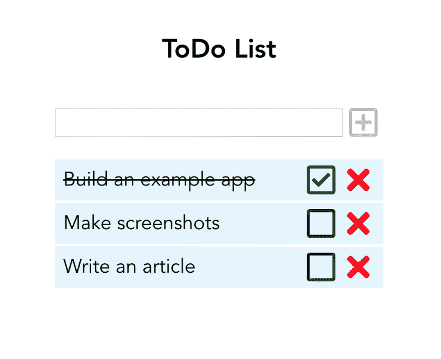

# Apollo 状态管理在 Vue 应用中的应用

> 原文：<https://dev.to/n_tepluhina/apollo-state-management-in-vue-application-8k0>

> 本文假设你已经知道什么是 GraphQL 和 T2 Apollo 客户端，并且你能够用 Vue CLI 构建 Vue 应用程序

## 🤔为什么我们需要阿波罗地方政府管理？

想象一个 Vue 应用程序从 REST API 获取一些数据。您通常将这些数据存储在哪里？答案可能是“在本地组件状态中”，或者，如果应用程序足够大，“在剩余数据的 [Vuex](https://vuex.vuejs.org/) 存储中”。这个答案是有意义的，因为我们的应用程序可以有单一的真实来源。

现在想象一个应用程序使用 Apollo 客户端从 GraphQL 端点获取数据。默认情况下，Apollo 会将这些数据存储到 *Apollo 缓存*中。但是如果我们有一些本地应用程序状态，存储在 Vuex 中呢？如果我们将数据从 Apollo 缓存复制到 Vuex，我们的数据会翻倍。如果我们将来自 API 的数据放在 Apollo 中，将本地数据放在 Vuex 中，就会有两个真实的来源。存储本地数据的好方法是什么？

以前有一个名为 [apollo-link-state](https://www.apollographql.com/docs/link/links/state) 的库来管理本地数据。但是自从 Apollo 2.5 发布以来，我们不再需要它了，因为这个功能现在是 Apollo 核心的一部分。因此，我们可以简单地管理我们的本地状态，而无需添加任何新的依赖项🎉

## 🏗️我们要建造什么

让我们试着用 Vue 和 Apollo 客户端创建一个简单的待办应用。

我从一个 Vue CLI 驱动的待办事项应用程序开始，其中包含一些自定义样式。你可以在这里找到它的源代码[。](https://github.com/NataliaTepluhina/vue-apollo-todo/tree/initial)

[](https://res.cloudinary.com/practicaldev/image/fetch/s--qnI-Y3l3--/c_limit%2Cf_auto%2Cfl_progressive%2Cq_auto%2Cw_880/https://i.imgur.com/837MnGj.png)

## 🔧将 Apollo 添加到 Vue 应用程序

我们需要做的第一件事是安装 Apollo 客户端，并将其集成到我们的 Vue 应用程序中。为了集成，我们将使用 [vue-apollo 插件](https://vue-apollo.netlify.com/)。

要安装我们需要的一切，在终端中键入以下命令:

```
npm install --save vue-apollo graphql apollo-boost 
```

或者

```
yarn add vue-apollo graphql apollo-boost 
```

然后打开`main.js`文件并添加

```
// main.js

Vue.use(VueApollo); 
```

通过这种方式，我们将 vue-apollo 插件添加到我们的 vue 应用程序中。

现在我们需要配置我们的阿波罗客户端。首先，让我们在`main.js`文件的顶部添加一个导入:

```
// main.js

import ApolloClient from 'apollo-boost';
// rest of imports

Vue.use(VueApollo); 
```

然后，让我们创建一个客户端:

```
// main.js

import ApolloClient from 'apollo-boost';
// rest of imports

Vue.use(VueApollo);

const apolloClient = new ApolloClient({}); 
```

基于这个新创建的客户端添加一个提供者，并将其注入 Vue 应用实例:

```
// main.js

const apolloProvider = new VueApollo({
  defaultClient: apolloClient,
});

new Vue({
  render: h => h(App),
  apolloProvider, //here goes your Apollo provider
}).$mount('#app'); 
```

现在，我们准备创建一个基于 Apollo 的商店。

## 🗃️初始化阿波罗缓存

我们将初始化一个 Apollo 缓存，用来存储我们的待办事项。Apollo 有一个`InMemoryCache`构造函数来做这件事:

```
// main.js

import ApolloClient from 'apollo-boost';
import { InMemoryCache } from 'apollo-cache-inmemory';

// rest of imports

const cache = new InMemoryCache(); 
```

现在我们需要将它添加到我们的客户端:

```
// main.js

const apolloClient = new ApolloClient({
  cache,
}); 
```

到目前为止，我们的`cache`是空的，我们将向其中添加一些数据。但是首先让我们创建一个本地模式。这一步可以是可选的，但是就像模式是在服务器上定义数据模型的第一步一样，编写本地模式是我们在客户机上采取的第一步。

## 📃创建本地模式

让我们思考一下:我们的待办事项应该是什么样的？它肯定需要一些文本，但还有什么呢？可能我们需要一些属性来定义它是否已经完成，还需要一个 ID 来区分 todo-item。所以，它应该是一个具有三个属性的对象:

```
{
  id: 'uniqueId',
  text: 'some text',
  done: false
} 
```

现在我们准备将条目*类型*添加到 GraphQL 本地模式中。

让我们在`src`文件夹中创建一个新文件`resolvers.js`,并将下面的代码添加到其中

```
import gql from 'graphql-tag';

export const typeDefs = gql`
  type Item {
    id: ID!
    text: String!
    done: Boolean!
  }
`; 
```

`gql`这里代表解析 GraphQL 查询字符串的 JavaScript 模板文字标签。

厉害！让我们导入`typeDefs`并将它们添加到我们的 Apollo 客户端:

```
// main.js

import ApolloClient from 'apollo-boost';
import { InMemoryCache } from 'apollo-cache-inmemory';
import { typeDefs } from './resolvers';
// rest of imports

const apolloClient = new ApolloClient({
  cache,
  typeDefs,
  resolvers: {},
}); 
```

> 请注意这里的空解析器对象:如果我们不将它分配给 Apollo 客户机选项，它将不会识别对本地状态的查询，而是会尝试向远程 URL 发送请求

现在我们需要向缓存中添加一些初始数据。这里直接写，我们就用`writeData`的方法:

```
// main.js

// apollo client code

cache.writeData({
  data: {
    todoItems: [
      {
        __typename: 'Item',
        id: 'dqdBHJGgjgjg',
        text: 'test',
        done: true,
      },
    ],
  },
});

// apollo provider code 
```

我们刚刚添加了一个数组`todoItems`到我们的缓存`data`中，我们说每个条目都有一个类型名`Item`(在我们的本地模式中指定)。

现在我们已经准备好从我们的 Vue 组件中查询本地数据了！

## 🔦查询本地数据

首先，我们需要构建一个 GraphQL 查询来检索数据。让我们创建一个`graphql`文件夹，向其中添加一个`queries.js`文件，并在那里导入`graphql-tag`。

```
// queries.js

import gql from 'graphql-tag'; 
```

现在让我们编写一个查询:

```
// queries.js

import gql from 'graphql-tag';

export const todoItemsQuery = gql`
  {
    todoItems @client {
      id
      text
      done
    }
  }
`; 
```

因此，我们在这里定义了查询的名称(`todoItems`)，并指定这个查询*不应该针对远程 GraqhQL API* 执行。`@client`这里的指令告诉 Apollo 客户机应该在本地数据存储中获取结果。

最后，我们准备从 Vue 组件发送查询。为此，让我们打开我们的`App.vue`，在那里导入查询常量:

```
<script>
import {
  todoItemsQuery,
} from "./graphql/queries.js";

export default {
// rest of App.vue 
```

并在组件:
中创建一个 Apollo 查询

```
// App.vue

export default {
  ...
  apollo: {
    todoItems: {
      query: todoItemsQuery
    }
  },
  ... 
```

你能相信这足够得到我们需要的一切吗？事实上，是的！这个查询将有效地获取我们的本地数据，并将其存储到`App.vue`的`todoItems`属性中。

## ✏️更改本地数据

现在我们需要找到一种方法来改变存储中的数据:添加新项目、删除项目或切换项目的`done`属性。

当我们将 initial `todoItems`设置为缓存时，我们已经更改了本地数据。这种方式被称为*直接缓存写*，对于初始设置或进行一些非常简单的更改非常有用。

对于 GraphQL 中更复杂的变化，我们使用`mutations`。因此，让我们回到我们的模式，并在那里定义一些突变！

```
// resolvers.js

export const typeDefs = gql`
  type Item {
    id: ID!
    text: String!
    done: Boolean!
  }

  type Mutation {
    changeItem(id: ID!): Boolean
    deleteItem(id: ID!): Boolean
    addItem(text: String!): Item
  }
`; 
```

我们刚刚添加了三个突变来用我们的`todoItems`执行不同的操作。其中两个(`changeItem`和`deleteItem`)取物品 ID；`addItem`需要一个文本来创建一个新项目，我们将为它生成一个唯一的 ID。

### 勾选/取消勾选待办事项

我们将从`changeItem`突变开始。首先，我们把它添加到我们的`queries.js`文件:

```
// queries.js
...
export const checkItemMutation = gql`
  mutation($id: ID!) {
    checkItem(id: $id) @client
  }
`; 
```

我们定义了一个接受 ID 的*局部*变异(因为这里有一个`@client`指令)。现在，我们需要一个*解析器*:一个为模式中的类型或字段解析值的函数。

在我们的例子中，resolver 将定义当我们有某个突变时，我们希望对我们的本地 Apollo 缓存做什么改变。本地解析器具有与远程解析器相同的功能签名`((parent, args, context, info) => data)`。事实上，我们只需要`args`(传递给变异的参数)和`context`(我们需要它的`cache`属性来读写数据)

让我们从将`resolvers`常量添加到我们的`resolvers.js`文件开始。

```
// resolvers.js

export const resolvers = {
  Mutation: {
    checkItem: (_, { id }, { cache }) => {},
}; 
```

因此，我们为`checkItem`创建了一个解析器，但是到目前为止它什么也没做。我们通过使用 [ES6 对象析构](https://developer.mozilla.org/en-US/docs/Web/JavaScript/Reference/Operators/Destructuring_assignment#Object_destructuring)将来自突变参数的`id`和来自`context`的`cache`传递给它。让我们读取缓存来检索当前的`todoItems` :

```
// resolvers.js

import { todoItemsQuery } from './graphql/queries';

export const resolvers = {
  Mutation: {
    checkItem: (_, { id }, { cache }) => {
      const data = cache.readQuery({ query: todoItemsQuery });
    },
}; 
```

如您所见，我们导入了我们的`todoItemsQuery`来告诉我们的解析器我们正在从 Apollo 缓存中读取什么。现在让我们添加一个逻辑来将`done`属性值更改为相反的值:

```
// resolvers.js

import { todoItemsQuery } from './graphql/queries';

export const resolvers = {
  Mutation: {
    checkItem: (_, { id }, { cache }) => {
      const data = cache.readQuery({ query: todoItemsQuery });
      const currentItem = data.todoItems.find(item => item.id === id);
      currentItem.done = !currentItem.done;
    },
}; 
```

最后，我们需要将更改后的数据写回缓存，并返回`currentItem.done` :
的值

```
// resolvers.js

import { todoItemsQuery } from './graphql/queries';

export const resolvers = {
  Mutation: {
    checkItem: (_, { id }, { cache }) => {
      const data = cache.readQuery({ query: todoItemsQuery });
      const currentItem = data.todoItems.find(item => item.id === id);
      currentItem.done = !currentItem.done;
      cache.writeQuery({ query: todoItemsQuery, data });
      return currentItem.done;
    },
}; 
```

现在我们的解析器准备好了，我们要从 Vue 组件调用我们的突变。让我们回到`App.vue`，在那里导入突变并改变`checkItem`方法:

```
<script>
  import {
    todoItemsQuery,
    checkItemMutation,
  } from "./graphql/queries.js";

  export default {
    ...
    methods: {
      checkItem(id) {
        this.$apollo.mutate({
          mutation: checkItemMutation,
          variables: { id }
        });
      },
    }
  };
</script> 
```

这是怎么回事？我们调用`$apollo.mutate`方法(由`vue-apollo`插件提供)，并传递我们之前在`queries.js`中创建的变异和一个`id`变量(ID 从我们检查项目的模板中传递):

```
<ListItem
  v-for="(item, index) in todoItems"
  :key="index"
  :content="item"
  @toggleDone="checkItem(item.id)"
  @delete="deleteItem(item.id)"
/> 
```

现在，当我们单击复选框时，我们将发送一个改变本地状态的突变。我们可以立即看到我们的`todoItems`数组因这一突变而改变，因此 checkbox 变为选中/未选中。

### 删除一个项目

现在我们需要删除一个项目的方法。让我们再次开始创建一个`deleteItem`突变:

```
// queries.js

export const deleteItemMutation = gql`
  mutation($id: ID!) {
    deleteItem(id: $id) @client
  }
`; 
```

如您所见，它与前一个非常相似:同样，我们将 ID 作为参数传递。现在让我们为它添加一个解析器:

```
// resolvers.js

deleteItem: (_, { id }, { cache }) => {
  const data = cache.readQuery({ query: todoItemsQuery });
  const currentItem = data.todoItems.find(item => item.id === id);
  data.todoItems.splice(data.todoItems.indexOf(currentItem), 1);
  cache.writeQuery({ query: todoItemsQuery, data });
  return true;
}, 
```

同样，作为第一步，我们从缓存中读取`todoItemsQuery`，稍后再写回来(我们只是返回`true`来表明请求成功)。但是我们没有改变`currentItem`，而是将它从`todoItems`数组中移除。

现在让我们将这个突变添加到`App.vue`中。

```
<script>
  import {
    todoItemsQuery,
    checkItemMutation,
    deleteItemMutation
  } from "./graphql/queries.js";

  export default {
    ...
    methods: {
      deleteItem(id) {
        this.$apollo.mutate({
          mutation: deleteItemMutation,
          variables: { id }
        });
      }
    }
  };
</script> 
```

很像`checkItem`不是吗？

### 添加新项目

虽然之前的两个突变彼此非常相似，但`addItem`会有所不同。首先，我们将传递一个文本，而不是一个 ID，我们希望能够看到实际添加了什么:

```
// queries.js

export const addItemMutation = gql`
  mutation($text: String!) {
    addItem(text: $text) @client {
      id
      text
      done
    }
  }
`; 
```

您可以假设解析器也会更加复杂:我们需要以某种方式生成一个惟一的 ID。对于这个项目，我们将使用[的缩写](https://github.com/dylang/shortid)库:

```
npm install shortid 
```

或者

```
yarn add shortid 
```

现在让我们开始构建我们的解析器:

```
// resolvers.js
import shortid from 'shortid';

export const resolvers = {
  Mutation: {
    ...
    addItem: (_, { text }, { cache }) => {
      const data = cache.readQuery({ query: todoItemsQuery });
      const newItem = {
        __typename: 'Item',
        id: shortid.generate(),
        text,
        done: false,
      };
    },
  }
} 
```

如你所见，现在我们从突变参数中取出一个`text`，并设置一个`newItem` `text`属性与之相等。对于`id`,我们正在用`shortid.generate`方法生成一个新的唯一 ID。至于`done`属性，我们总是在创建新的 todo-item 时将其设置为 false(因为显然它还没有完成！).

现在，我们只需要将这个新创建的项推送到`todoItems`数组，将数据写回缓存，并返回一个`newItem`作为变异结果。

```
// resolvers.js

addItem: (_, { text }, { cache }) => {
  const data = cache.readQuery({ query: todoItemsQuery });
  const newItem = {
    __typename: 'Item',
    id: shortid.generate(),
    text,
    done: false,
  };
  data.todoItems.push(newItem);
  cache.writeQuery({ query: todoItemsQuery, data });
  return newItem;
}, 
```

我们准备从组件中调用我们的`addItem`突变！我们把它导入到`App.vue`...

```
<script>
  import {
    todoItemsQuery,
    checkItemMutation,
    addItemMutation,
    deleteItemMutation
  } from "./graphql/queries.js";
  ...
</script> 
```

...并将其添加到`addItem`方法:

```
 addItem() {
    if (this.newItem) {
      this.$apollo.mutate({
        mutation: addItemMutation,
        variables: { text: this.newItem }
      });
      this.newItem = "";
    }
  }, 
```

这里代表输入字段中的一个字符串，只有当我们有实际的文本要发送时，我们才会调用一个变异。此外，在我们添加了一个新条目之后，我们想要清除一个输入。

耶，我们的申请准备好了！🎉

你可以在这里找到完整的应用源代码。

## 有用的链接

*   [graph QL 简介](https://graphql.org/learn/)
*   [阿波罗文档](https://www.apollographql.com/docs/react/)
*   [阿波罗视图](https://vue-apollo.netlify.com/)