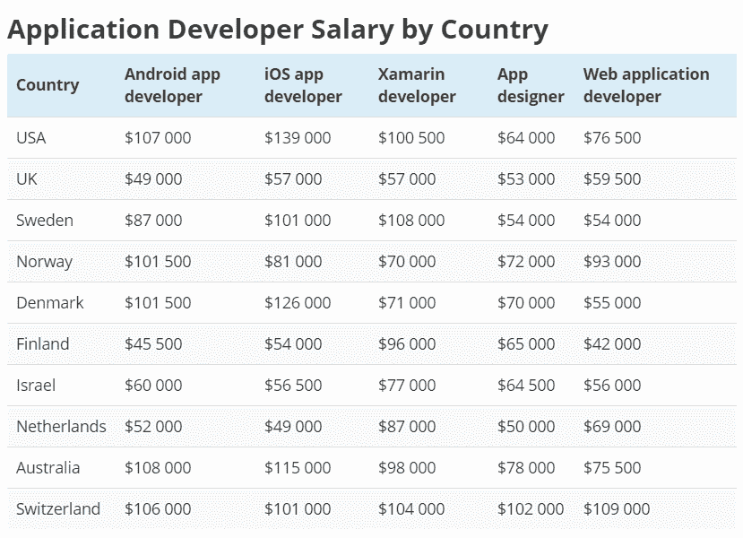

# 不同国家的应用程序开发人员工资

> 原文：<https://dev.to/julia_qubit/app-developer-salaries-by-country-4452>

当该公司打算招聘一名应用程序开发人员时，我们正在讨论最敏感的话题——应用程序开发人员的合理薪酬。

对于一个有经验、有能力的专业人员应该花多少钱感到困惑的原因是，例如，高级应用程序开发人员的工资与入门级移动应用程序开发人员的工资有很大不同。

此外，应用程序开发人员的平均工资取决于他们工作的国家和他们在职业生涯中完成的项目。因此，支付问题主要是与每个候选人谈判的主题。

然而，如果一家公司需要在一定的预算内[雇用一名应用程序开发人员](https://qubit-labs.com/mobile-application-development-services/)，并且需要制定一个明确的计划，如在哪里寻找专家，对求职者有什么硬技能和软技能要求等，该怎么办？？

大多数企业仍然希望至少在一定的灵活工资范围内保持一定的清晰度，因此为了满足你对这个问题的好奇心，我们汇编了一份详细的 Android 开发人员工资、移动应用程序设计师工资、web 应用程序开发人员工资的国际概览，以及一系列其他开发专业的费率概览。

所以，下面是我们的工资分析揭示的情况:

**安卓应用开发者工资**

Android 应用程序开发率最高的是澳大利亚、瑞士和美国；在这里，一个强大的 Android 开发者平均每年可以赚 106，000-108，000 美元。

该职业的最低工资记录在英国(大约每年 31000 美元)和芬兰(45500 美元)。但是你应该考虑到你对开发人员的资历要求。

这个工资是一个平均指标，而高级 Android 开发人员的工资可能要高得多。

如果你正在寻找一个入门级的 Android 开发人员工资指标，这可能是我们给出的平均水平的两倍。

**App 设计师薪资**

在瑞士，应用程序设计师的工资最高(每年 10 万美元以上)，而在其他国家，应用程序设计师的平均工资在 5-7 万美元之间。

这意味着，在广泛需求 app 设计师的同时，这方面的专业人才供应也相当高，市场竞争均衡。

**Web 应用开发人员工资**

有争议的是，一些国家支付给 web 应用程序开发人员的工资较少，而在另一些国家，平均工资高于其他开发人员专业。

例如，瑞士的开发人员年收入约为 108，000 美元，美国的 web 应用程序开发人员年收入高达 76，500 美元，而在芬兰，平均工资不超过 42，000 美元。

**iOS 应用开发者薪资**

iOS 开发者薪资比 web app 开发者更有竞争力；在美国、澳大利亚、瑞士、丹麦和瑞典，iOS 开发人员的收入超过 100，000 美元，而在其他国家，iOS 开发工作的工资也是其他开发人员专业工资的数倍。

最低的是荷兰，那里的 iOS 高级开发人员年薪也不超过 5 万美元。

**Xamarin(混合应用)开发者薪资**

Xamarin 移动开发人员的工资水平相当高，在所分析的国家中极具竞争力。

在美国和瑞典，该专业的专业人员薪酬最高(10 万美元以上)，而英国的薪酬最低(约 5.7 万美元)。

*点击这里阅读全文[点击这里](https://qubit-labs.com/hire-app-developer-salaries-market-overview/)。*