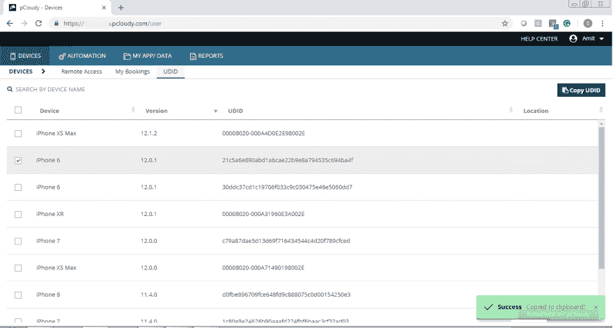
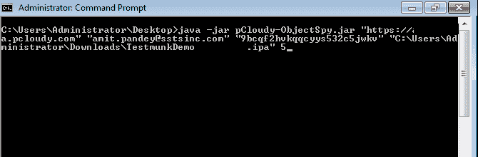
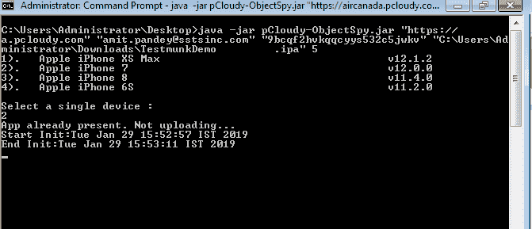
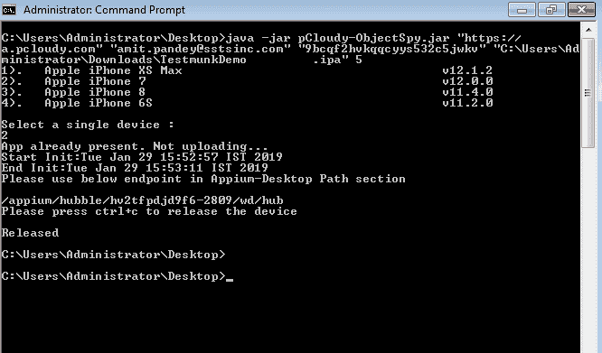
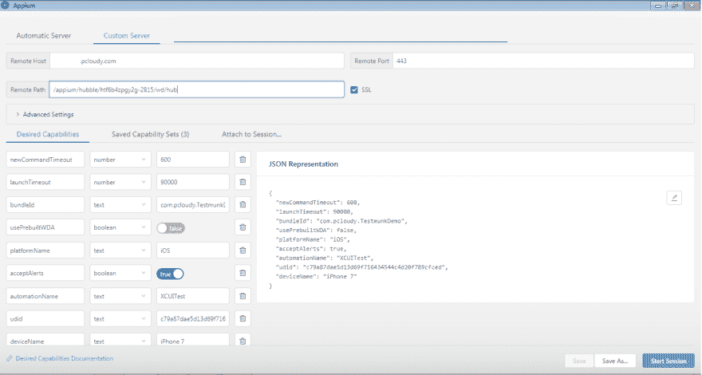
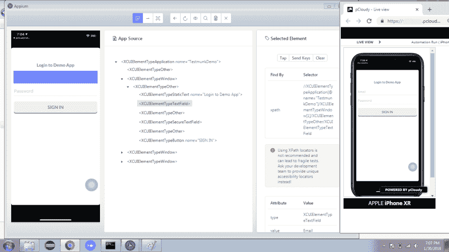

# Appium 桌面(Object Spy)与 pCloudy 的集成

> 原文：<https://dev.to/pcloudy/appium-desktop-object-spy-integration-with-pcloudy-5g8n>

用于测试自动化的 Appium 桌面
Appium 桌面是一个图形界面，用于使用 Appium 和检查您的应用程序结构。它有助于创建简单的测试脚本和设置快速的应用测试服务器。

Appium Desktop 有两个组件:
Appium Server:支持应用测试(和测试自动化)的服务器实例。

Appium Inspector:用于检查和获取应用程序 UI 元素的所有细节。

**什么是对象间谍？**
Object spy 是在运行 Appium Desktop 时向对象库中添加对象并查看对象属性的机制。它在“对象侦测”对话框的“属性”选项卡中显示所选对象的层次结构树及其属性和方法。

**如何将 Appium Desktop 与 pCloudy**
集成调用 Object Spy 的步骤:

1.  我们有三个专用的 Android 设备，我们需要输入下面提到的特定设备 id:
    *   ce 011821 和 8f 5671 C1-银河 S8
    *   213581e02d0b7ece -Galaxy S9
    *   803KPRW1598286 像素 2 XL
        1.  对于 iOS，您需要输入 UDID，为此您需要转到云，然后点击 UDID

然后选择设备并复制该 UDID。如果您在 iOS 设备上检查某个元素，您应该使用已退出的应用程序来避免异常。
转到命令提示符并执行 Jar
例如:Java-Jar pCloudy-object spy . Jar " https://[company]. pCloudy . com " " Your _ email id " " Your _ API key " " Application _ Path " Booking _ Duration(整数类型)

选择您将获得终点的设备。

现在您需要复制端点，因为您将在接下来的步骤中使用它。

**打开 Appium 桌面**
转到“自定义服务器”选项卡
然后在远程主机部分，输入“[company]. pcloudy . com”
然后添加远程端口“443”
点击“SSL”复选框
输入 Android 的功能

样本:
【新人推出】:600、
【推出逾时】:90000、
【pcloudy _ application name】:【pcloudyappummo . apk】、
【apppackage】:【com . pcloudy . appummo】、
【停用】:【com.ba.mobile.LaunchActivity】、
【platform name】

iOS 的功能
示例:
"newCommandTimeout": 600，
"launchTimeout": 90000，
pCloudy _ application name ":" testmunkdemo . IPA "，
"platformName": "iOS "，
" bundleId ":" com . pCloudy . testmunkdemo "，
" useprebuildtwda ":false，
"acceptAlerts": true，
"automationName "

将您复制的端点(参考步骤 5)粘贴到 Appium 桌面的“远程路径”部分。

然后点击“开始会话”。它将在 pCloudy 中预订设备，一旦启动，您将获得元素属性。

