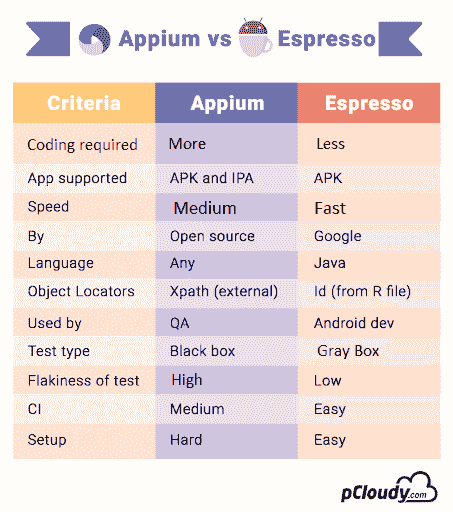

# app ium vs Espresso:2019 年最受欢迎的自动化测试框架

> 原文：<https://dev.to/pcloudy/appium-vs-espresso-the-most-popular-automation-testing-framework-in-2019-28i2>

 
移动应用程序自动化测试已经发展成为移动应用程序开发过程中的一个重要方面，有助于在受控的时间周期和成本计划下交付更高质量的解决方案。但是为了交付无 bug 的应用，为你的应用选择最合适的自动化测试框架是非常重要的。市场上有许多自动化测试框架，它们都具有非凡的能力。这篇博客是关于 Appium 和 Espresso 的，我们将分析这两个最广泛使用的自动化测试框架哪一个更适合你的应用测试。

浓缩咖啡不是首选，因为它的片状和不稳定的问题。但是，自从谷歌推出 Android Test Orchestrator 这一梯度测试选项以来，Android Espresso 测试的不稳定性和不可靠性就消失了。这反过来给最流行的自动化框架 Appium 带来了严重的问题。

让我们在这篇博客中发现，现在的浓缩咖啡是否有能力杀死 Appium，或者 Appium 是否能在这个竞争激烈的市场中站稳脚跟。

让我们进入细节。

**什么是 Appium？**

它是一个开源的、[跨平台的](https://www.pcloudy.com/cross-platform-mobile-test-automation-using-appium/)手机 app 自动化测试框架。Appium 允许本地、混合和 web 应用程序测试，并支持物理设备以及仿真器或模拟器上的自动化测试。Appium 服务器使用 selenium web 驱动程序，它允许平台独立性，并允许用户在 Android 或 iOS 上使用相同的代码。

**使用 Appium 的优势**

在没有服务器机器的情况下促进测试执行
Appium 是使用跨平台运行时环境开发的，如 NodeJs，它使程序员能够用 javascript 编写服务器端代码。它被设计成一个 HTTP 服务器，您可以运行测试而不需要服务器。

**不需要重新编译应用程序代码**

大多数自动化测试工具要求测试人员修改应用程序代码。一些测试自动化框架要求测试专业人员根据目标移动平台重新编译代码。Appium 使测试人员能够评估跨平台和本机应用程序，而无需经常重新编译和修改代码。

**自动化各种类型的移动应用**

测试人员可以避免对不同类型的应用使用不同的自动化工具，因为 Appium 也可以用于 [web 应用、混合应用和本地应用](https://www.pcloudy.com/types-of-mobile-apps/)。作为一个跨平台的测试自动化框架，它促进了混合和移动 web 应用的测试。同时，它使测试人员能够通过 web 驱动协议测试原生应用。

测试人员可以使用真实的设备、仿真器和模拟器

测试人员使用真实设备更精确地评估移动应用的可用性和用户体验。尽管如此，为了加快移动应用程序的测试速度，还需要使用[仿真器或模拟器](https://www.pcloudy.com/problems-with-online-android-emulator-and-how-to-solve-it/)。Appium 通过支持真实设备、仿真器和模拟器，帮助测试人员产生可靠的测试结果并减少测试时间。

**提供记录和回放工具**

在 Appium 中，测试人员可以使用 inspector 通过记录和回放功能来加速测试。Appium inspector 可以通过检查其文档对象模型(DOM)来记录本机应用程序的行为。记录和回放工具可以用多种编程语言生成测试脚本。

**测试人员无需添加额外组件就能自动化应用**

测试人员可以在多个移动平台上执行相同的测试，而不需要投入额外的时间和精力或者添加额外的组件。Appium 通过将复杂性保留在 Appium 服务器中来简化自动化。

**支持多种网络驱动兼容语言**

您可以将 Appium 与许多测试框架和 WebDriver 兼容的语言集成，包括 PHP、Java、Ruby、Javascript、C#和 Objective C。因此，测试人员可以选择用他喜欢的编程语言编写测试脚本。

**使用 Appium 的缺点**

**常用手势**

Appium 缺少常用的手势，比如 java 客户端库中的双击。它也不直接支持 Android 警报处理，用户无法通过本机 API 评估警报处理。测试人员不得不投入额外的时间和精力来测试这些手势。

**在多个 iOS 模拟器上没有脚本执行**

模拟器使测试人员更容易模拟底层 iOS 设备的内部行为。虽然 Appium 不允许用户在多个模拟器上同时运行多个测试脚本。

**缺乏识别图像的能力**

Appium 无法自动定位和识别图像，以精确评估游戏和应用程序。测试人员必须借助屏幕坐标来使 Appium 定位和识别图像。

**不支持旧版本的 android**

Appium 仅支持 Android 4.2 及更高版本，不支持 Android 的旧 API。仍然有许多人使用运行旧版本 Android 的设备，开发者发现很难测试针对旧版本 Android API 级别开发的移动应用程序。

**什么是浓缩咖啡？**

Espresso 是 Google 开发的一个工具，用于测试 Android 应用程序的 UI。它会自动将您的测试操作与移动应用程序的用户界面同步，并确保在测试运行之前启动活动。

尽管当你执行一个 Espresso 测试时，你会在单独的测试中共享状态，并且会有一些剥落。对此，谷歌提出了一个解决方案。Android Test Orchestrator 是一个梯度测试选项，有助于测试并增加我们自动化测试套件的可靠性。

如果你在 Android Studio 以下的任何版本中使用 Gradle build 工具，那么你也必须更新依赖设置。下面我们来看看使用 Android Espresso 的优势。

**使用浓缩咖啡的优势**

**与 Gradle 整合**

新的 Android Espresso 现在拥有 Android Studio 和 Gradle 的强大功能。所以现在调用你的测试，运行它或者修改它只是一个调用 Gradle 命令的问题。这将命令行的全部功能赋予了开发人员，并使可测试性变得更加容易。

**测试协调器**

新的 Android Espresso 具有 Android Test Orchestrator 的强大功能，允许您在自己调用 Instrumentor 的过程中运行每个应用程序的测试。它确保了最小共享状态和崩溃被隔离。它允许您过滤您想要运行的测试，并在设备间分配测试。这意味着您可以更好地控制测试的运行方式。

**更少的片状剥落**

由于执行的同步方法，Android Espresso 中测试周期的可伸缩性很高。Espresso 中的内置机制，用于验证对象是否确实显示在屏幕上。当遇到“没有检测到对象”和其他错误时，这可以避免测试执行中断。

**开发浓缩咖啡测试自动化很容易**

测试自动化基于 Android 开发人员熟悉的 Java 和 JUnit。在 app SDLC 的周期内阶段，没有实施质量的设置或准备。

**可靠快速的反馈**

Android Espresso 不需要任何服务器进行通信，相反，它与应用程序并排运行，并快速提供结果。它对代码更改给出快速反馈，以便开发人员可以进行下一个 bug 修复。

**简单的工作流程**

Espresso 允许开发人员构建一个测试套件，作为一个独立的 APK，可以安装在目标手机上，与被测应用程序放在一起，并快速执行。

**使用浓缩咖啡的缺点**

它需要访问应用程序源代码
,没有源代码，你什么也做不了。此外，习惯内置的测试同步和 UI 也有风险——那么可能很难使用 WebDriver。

**窄焦距**

如果 Android 和 iOS 都需要 UI 测试，那么有必要为两个不同的系统编写两次。如果测试需要在应用程序之外使用 Android(例如，打开一个收到的短信通知)，你将不得不使用额外的工具，如 UIAutomator。

在仿真器上启动 Android 应用程序所需的知识
最好至少有在仿真器上构建和启动 Android 应用程序的经验。

**结论**

Appium 和 Espresso 都可以用来在 Android 应用程序上执行 UI 测试，但如果你必须选择其中一个，那么你需要根据你的需求来决定。是什么样的 app，要进行什么样的测试。想要对自己的原生 Android 应用进行 UI 测试的开发者应该选择 Android Espresso。但是，如果测试需要支持 iOS 和 Android，并且您希望在功能级别进行测试，那么您可以使用 Appium。