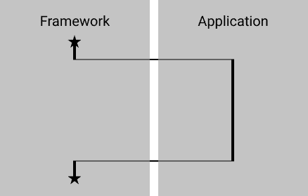
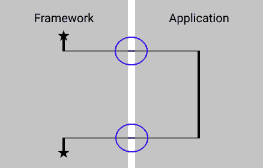
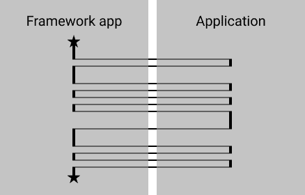
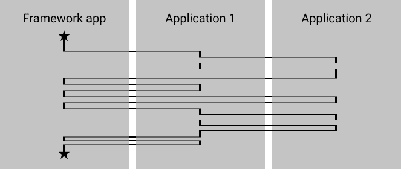

# 作为框架的应用程序

> 原文：<https://dev.to/jeroendedauw/applications-as-frameworks-j1f>

构建在框架之上和构建在应用之上有什么区别？使用一个应用程序作为框架是如何引起问题的，如何避免这些问题？这就是这篇文章的内容。

### 分离的 web 应用程序

在典型的 web 应用程序中，代码处理请求并返回响应。让我们假设我们正在使用一个 web 框架来处理路由等常见任务。让我们也假设我们认为框架绑定有很高的成本，并使我们的应用程序与之解耦。控制流程如下所示:

执行从框架开始。对于 PHP 框架，这将在一个类似于`public/index.php`的文件中。然后框架启动自己，做一堆事情。可以肯定的是，这些东西将包括路由，而且通常还包括依赖关系构建和错误处理等内容。

在框架完成了您希望它完成的任务之后，它会将控制权交给您的应用程序。您的应用程序执行一系列应用程序和域逻辑，并与持久性交互。它可能使用许多库，特别是对于像日志和数据库访问这样的基础设施任务。即便如此，控制权仍然属于应用程序。(框架和库的关键区别在于，你控制/调用库，而框架控制/调用你。)你的应用程序也可能调用这个框架，并把它当作一个库来使用。同样，控制权属于应用程序。

最后，当应用程序完成时，它将某种结果返回给框架。然后框架会做另一堆事情，比如模板渲染和翻译。在 web 框架的情况下，它会发出一个 HTTP 响应，然后执行结束。

像这样的应用程序可以让你控制所发生的事情，使改变事情变得更容易。这种风格也很容易与框架分离。只有两点需要解耦。

我的文章[实现干净的架构](https://www.entropywins.wtf/blog/2016/11/24/implementing-the-clean-architecture/)概述了一种导致这种应用的架构方法。

### 框架与应用

让我们比较一下框架和应用程序在作为一个/另一个应用程序的基础时有什么不同。

框架不会自己做事情。没有应用程序或域逻辑。没有一组现有的网页或 API 端点具有它们自己的结构和行为。这都是在使用框架时由应用程序定义的。当在作为框架的应用程序之上构建时，您需要处理现有的结构和行为。你需要插入你自己的东西，在某些情况下改变现有的行为，在其他情况下完全防止默认行为。

我知道有些“框架”确实提供了它们自己的现成的东西。(例:网店框架。)虽然它们本身可能不是一个完整的应用程序，但对于这篇博文来说，它们与用作框架的应用程序是一样的。

### 插件和扩展

在应用程序之上构建东西本身并没有什么不好。插件和扩展是一种非常有用的模式。与单个插件点交互的插件可以在适当的时候解耦，并控制自己。对于使用应用程序许多扩展点的扩展来说，框架解耦可能没有意义。

这篇文章是关于使用应用程序作为大量代码的框架基础，这些代码本身就是应用程序。

### 作为框架的应用程序

让我们想象一下，我们有一个应用程序，在某个站点上用于某个用例。我们将这个应用程序称为 FrameworkApp，因为我们将把它作为支持另一个站点的另一个应用程序的框架。

当在 FrameworkApp 上构建我们的应用程序时，我们需要注册新的行为并修改现有的行为。为了实现这一点，FrameworkApp 需要提供适当的扩展点。虽然扩展点的确切性质对于我们的目的来说并不重要，但是它们通常采用抽象类甚至系统的形式。

这导致了非常不同的控制流程。FrameworkApp 调用我们的应用程序处理的每个扩展点，而不是调用我们一次。

该图只显示了 6 个扩展点，尽管可能有 100 个。

当像这样可视化时，很容易看到从框架解耦变得几乎不可能。即使你设法避免在你的应用程序中耦合到框架*代码*，它的整个结构仍然是由框架定义的。这意味着您在应用程序中可以做的事情非常有限，并且需要了解框架才能有效地开发应用程序。框架耦合会导致更多的问题，尽管对这些问题的全面概述超出了本文的范围。

### 面向对象的解决方案

> 重组合轻继承 <small>- OOP 原则</small>

使用应用程序作为框架非常类似于使用继承来实现代码重用。

就像构建在作为框架的应用程序之上的应用程序一样，子类可能不受控制，并被基类多次调用。当使用模板方法模式和具有深度继承层次时，尤其如此。控制流可能到处乱跳，并且从层次结构上的类中分离子类几乎是不可能的。

您可以通过使用复合来避免这种经典的继承混乱。这建议了一种方法来摆脱将应用程序用作框架或者完全避免这样做:停止将框架视为基类。如果有代码要分享，就用复合。这样你保持控制，可以更容易地解耦并避免[干](https://www.entropywins.wtf/blog/2017/09/06/the-fallacy-of-dry/)的谬误。

就像类的层次结构一样，你总是可以增加一个额外的层次。

 

感谢 [Raz Shuty](https://somehowimanage.blog/) 的校对和一些建议。

[作为框架的应用](https://www.entropywins.wtf/blog/2019/02/28/applications-as-frameworks/)最初发布在[我的博客](https://www.entropywins.wtf/blog)上，在那里你可以找到很多类似的帖子。