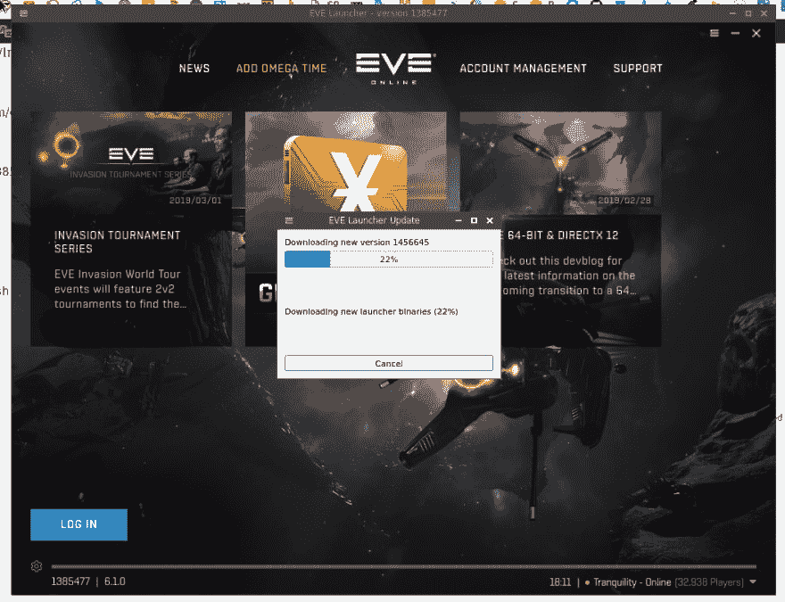
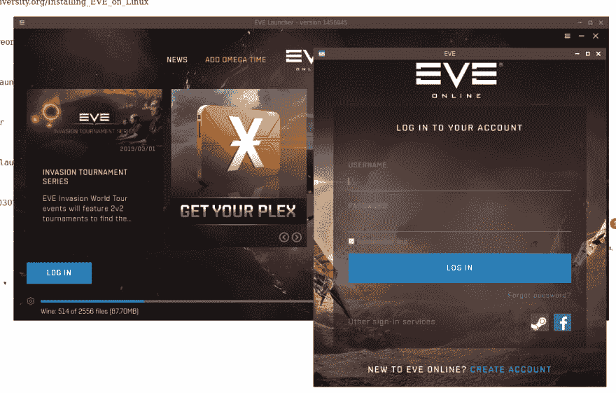
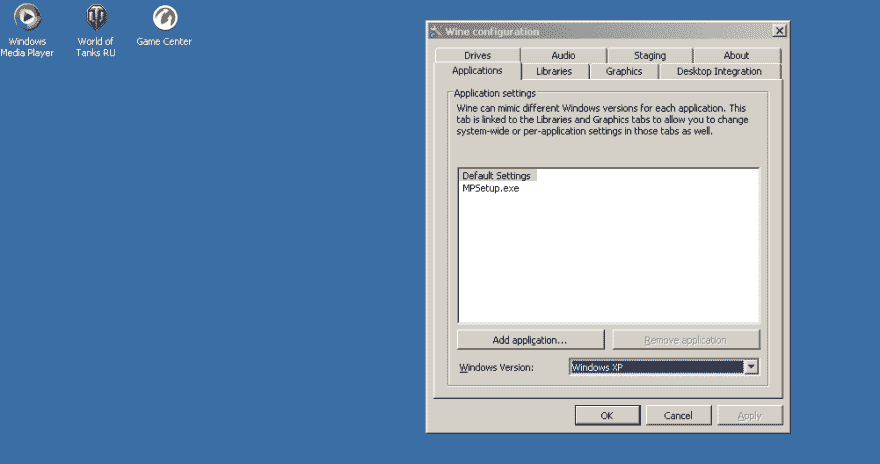
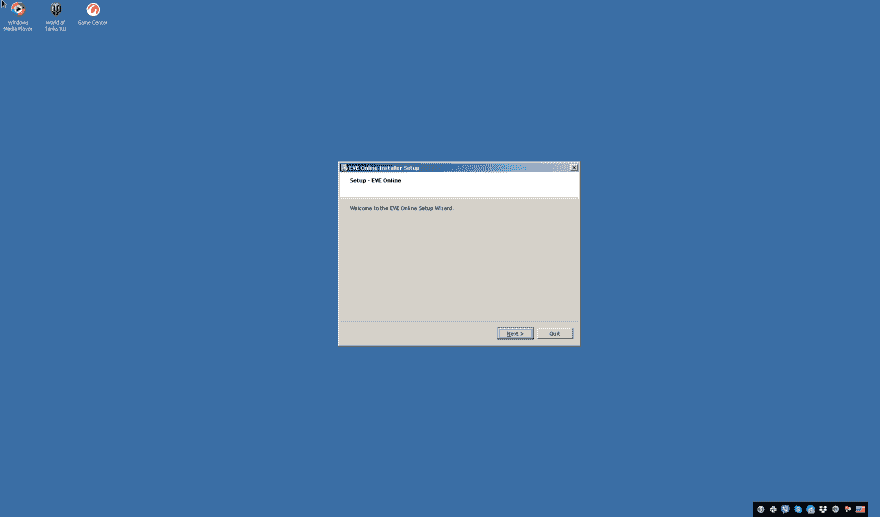
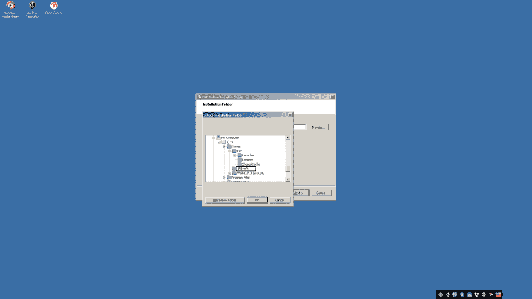
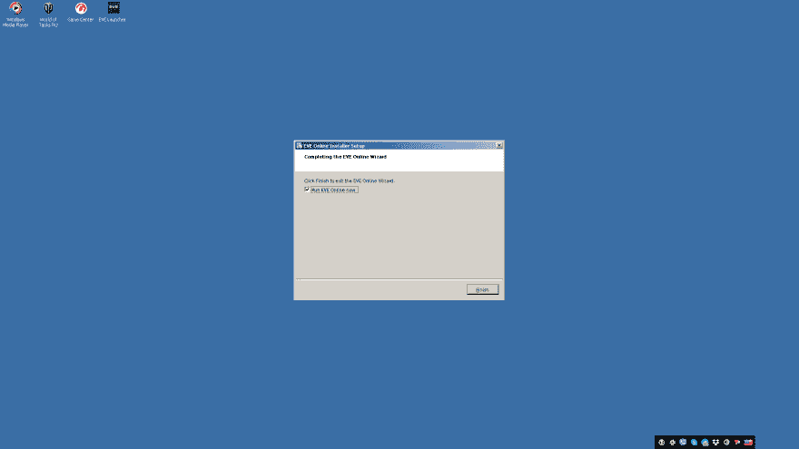
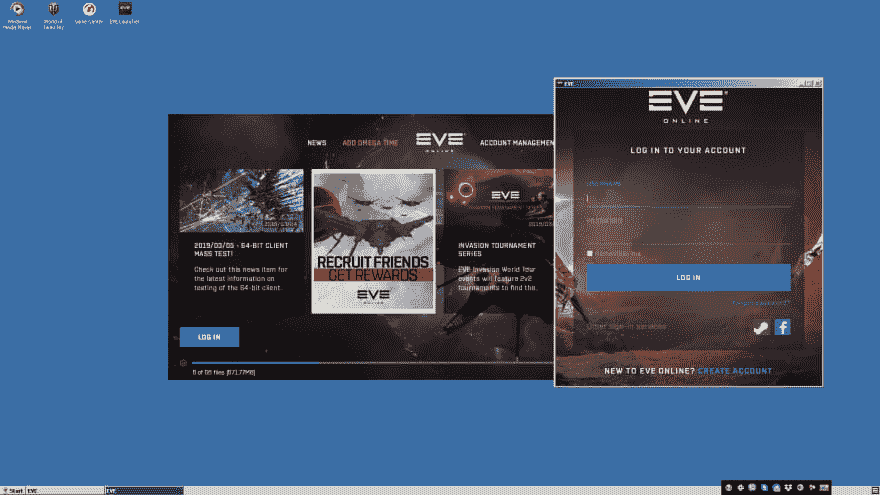
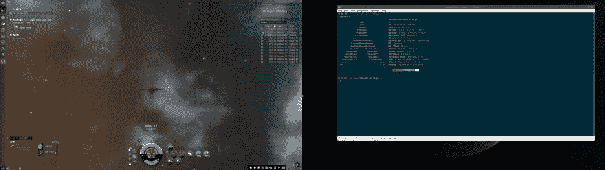

# Arch Linux:安装、故障排除和在线玩 EVE

> 原文：<https://dev.to/setevoy/arch-linux-installation-troubleshooting-and-playing-eve-online-871>

[](https://rtfm.co.ua/wp-content/uploads/2018/04/archlinux_logo.png) 在我的新 Arch Linux 系统上成功安装 WoT 之后(参见[坦克世界:在 Arch Linux 上安装和运行](https://dev.to/setevoy/world-of-tanks-installing-and-running-on-arch-linux-ofo)帖子)我决定“实现下一个里程碑”——在线安装 eve。

通过“ *EVE Online Linux* ”的谷歌搜索请求，我找到了 wiki.eveuniversity.org 的[指南，并尝试先使用它。](https://wiki.eveuniversity.org/Installing_EVE_on_Linux)

然后，经过几个晚上的调试尝试，我放弃了，并询问…

但是——最好自己读完整个故事。先读完它，然后开始安装。

太迷人了:-)

### 为 Linux 安装 EVE Online

从[binaries.eveonline.com](https://binaries.eveonline.com/evelauncher-1385477.tar.gz)下载档案，解压:

```
$ tar -xvf evelauncher-1385477.tar.gz 
```

在将运行 EVE 的启动器的脚本上设置执行权限:

```
$ cd evelauncher
$ chmod u+x evelauncher.sh 
```

运行它:

[](https://rtfm.co.ua/wp-content/uploads/2019/03/Screenshot_20190302_201125.png)

[](https://rtfm.co.ua/wp-content/uploads/2019/03/Screenshot_20190302_201217.png)

到目前为止一切正常，但是控制台中的消息已经让我担心了:

```
$ ./evelauncher.sh
[0302/201111.113776:WARNING:stack_trace_posix.cc(699)] Failed to open file: /tmp/.gljSq34Q (deleted)
Error: No such file or directory
[0302/201111.115110:WARNING:resource_bundle_qt.cpp(115)] locale_file_path.empty() for locale
Installed Qt WebEngine locales directory not found at location /home/setevoy/Downloads/evelauncher/translations/qtwebengine_locales. Trying application directory...
Qt WebEngine locales directory not found at location /home/setevoy/Downloads/evelauncher/qtwebengine_locales. Trying fallback directory... Translations MAY NOT not be correct.
Path override failed for key ui::DIR_LOCALES and path '/home/setevoy/.QtWebEngineProcess'
[0302/201111.135019:WARNING:resource_bundle_qt.cpp(115)] locale_file_path.empty() for locale
[13296:13296:0302/201111.176173:ERROR:gpu_process_transport_factory.cc(1019)] Lost UI shared context.
[S_API FAIL] SteamAPI_Init() failed; no appID found.
Either launch the game from Steam, or put the file steam_appid.txt containing the correct appID in your game folder.
QObject::startTimer: Timers can only be used with threads started with QThread
[0302/201159.727425:WARNING:stack_trace_posix.cc(699)] Failed to open file: /tmp/.glIHo6Pu (deleted)
Error: No such file or directory
[0302/201159.728371:WARNING:resource_bundle_qt.cpp(115)] locale_file_path.empty() for locale
Installed Qt WebEngine locales directory not found at location /home/setevoy/Downloads/evelauncher/translations/qtwebengine_locales. Trying application directory...
Qt WebEngine locales directory not found at location /home/setevoy/Downloads/evelauncher/qtwebengine_locales. Trying fallback directory... Translations MAY NOT not be correct.
Path override failed for key ui::DIR_LOCALES and path '/home/setevoy/.QtWebEngineProcess'
[0302/201159.744418:WARNING:resource_bundle_qt.cpp(115)] locale_file_path.empty() for locale
[13918:13918:0302/201159.750353:ERROR:gpu_process_transport_factory.cc(1019)] Lost UI shared context.
[S_API FAIL] SteamAPI_Init() failed; no appID found.
Either launch the game from Steam, or put the file steam_appid.txt containing the correct appID in your game folder.
[13918:14061:0302/201201.698642:ERROR:leveldb_database.cc(311)] Failed to open LevelDB database from /home/setevoy/.local/share/CCP/EVE/QtWebEngine/Default/IndexedDB/https_launcher.eveonline.com_0.indexeddb.leveldb,IO error: /home/setevoy/.local/share/CCP/EVE/QtWebEngine/Default/IndexedDB/https_launcher.eveonline.com_0.indexeddb.leveldb/LOCK: No further details. (ChromeMethodBFE: 15::LockFile::1)
[13918:14061:0302/201201.698920:ERROR:indexed_db_backing_store.cc(951)] Unable to open backing store, not trying to recover - IO error: /home/setevoy/.local/share/CCP/EVE/QtWebEngine/Default/IndexedDB/https_launcher.eveonline.com_0.indexeddb.leveldb/LOCK: No further details. (ChromeMethodBFE: 15::LockFile::1) 
```

一切看起来都很好——游戏开始，我可以登录，甚至可以使用那里的菜单…

但是任何对开放空间的点击——只会完全杀死游戏，没有任何额外的信息。

嗯——有蒸汽版本——但它只适用于 Windows

#### 【S _ API 失败】SteamAPI_Init()失败；找不到 appID。

第一个明显的错误——“***【S _ API FAIL】steam API _ Init()失败；没有找到 appID***”。

它的出现是因为 EVE 的发射器检测到安装了蒸汽。

可以通过创建`steam_appid.txt`文件来解决 EVE 的 ID(在 Steam Store 中可以看到 ID，在一个游戏的 URL 中可以看到——***8500**/EVE _ Online*):

```
$ echo 8500 > ~/Downloads/evelauncher/steam_appid.txt 
```

重启游戏并检查 Steam 的日志:

```
[0302/202552.786715:WARNING:keyboard_code_conversion_x.cc(1438)] Unknown keycode:108
ExecuteSteamURL: "steam://run/8500"
GameAction [AppID 8500, ActionID 3] : LaunchApp changed task to RequestingLicense with ""
GameAction [AppID 8500, ActionID 3] : LaunchApp failed with AppError_29 with ""
GameAction [AppID 8500, ActionID 3] : LaunchApp changed task to Failed with ""
Installing breakpad exception handler for appid(steam)/version(1550534751)
ExecuteSteamURL: "steam://run/8500"
GameAction [AppID 8500, ActionID 4] : LaunchApp failed with AppError_29 with ""
GameAction [AppID 8500, ActionID 4] : LaunchApp changed task to Failed with ""
Game update: AppID 8500 "", ProcID 31006, IP 0.0.0.0:0
>>> Adding process 31006 for game ID 8500
JS method call SharedConnection.SendMsgAndAwaitResponse with 3 arguments 
```

这里没有犯罪-但游戏仍然崩溃…

#### security_connector.cc 无法获取默认 pem 根证书

我注意到的下一行是:

```
E0302 20:13:56.504529618   15744 security_connector.cc:1027] Could not get default pem root certs.
E0302 20:13:56.504570632   15744 secure_channel_create.cc:121] Failed to create secure subchannel for secure name 'elg.evetech.net'
E0302 20:13:56.504580587   15744 secure_channel_create.cc:154] Failed to create subchannel arguments during subchannel creation.
E0302 20:13:56.504603018   15744 security_connector.cc:1027] Could not get default pem root certs
E0302 20:13:56.504608140   15744 secure_channel_create.cc:121] Failed to create secure subchannel for secure name 'elg.evetech.net'
E0302 20:13:56.504613771   15744 secure_channel_create.cc:154] Failed to create subchannel arguments during subchannel creation.
E0302 20:13:56.504626647   15744 security_connector.cc:1027] Could not get default pem root certs.
E0302 20:13:56.504632789   15744 secure_channel_create.cc:121] Failed to create secure subchannel for secure name 'elg.evetech.net'
E0302 20:13:56.504637557   15744 secure_channel_create.cc:154] Failed to create subchannel arguments during subchannel creation. 
```

以及:

```
E0302 20:32:52.067379002   31312 security_connector.cc:1184] load_file: {"created":"@1551551572.067330651","description":"Failed to load file","file":"src/core/lib/iomgr/load_file.cc","file_line":71,"filename":"/usr/local/share/grpc/roots.pem","referenced_errors":[{"created":"@1551551572.067322629","description":"OS Error","errno":2,"file":"src/core/lib/iomgr/load_file.cc","file_line":45,"os_error":"No such file or directory","syscall":"fopen"}]} 
```

嗯——也许启动器需要在`grpc`和它的证书中？

它出现在 AUR，所以让我们尝试安装它

```
$ yaourt -S grpc 
```

再次运行游戏——但是“*无法获得默认 pem 根证书*”的消息仍然存在…

查找证书本身:

```
$ sudo find / -name roots.pem
/usr/share/grpc/roots.pem 
```

实际目录和错误消息中的路径不同–在此创建一个符号链接:

```
$ sudo mkdir -p /usr/local/share/grpc/
$ sudo ln -s /usr/share/grpc/roots.pem /usr/local/share/grpc/roots.pem 
```

再次运行游戏-这个错误现在消失了，但游戏仍然不能正常工作…

#### lutris.net

通过耳朵，我找到了 lutris.net 项目，它也提供 EVE 在线安装，但是它对我来说并不奏效。

#### 关键字 ui::DIR_LOCALES 和路径“/home/setevoy/”的路径覆盖失败。' QtWebEngineProcess '

好吧…

也许——因为这个错误？

我有`qt5-webengine`吗？

不是:

```
$ pacman -Qqe | grep qt5
qt5ct 
```

安装它:

```
$ sudo pacman -S qt5-webengine 
```

还是老样子…

去你妈的。...

#### Wine Windows XP、Vulkan 和 DirectX11

然后我在 Arch Linux 论坛上搜索了讨论和这个评论。

检查`wine`的设置——已经设置了 Windows XP 模式:

[](https://rtfm.co.ua/wp-content/uploads/2019/03/Screenshot_20190303_162504.png)

[Vulkan](https://wiki.archlinux.org/index.php/Vulkan) ？

`vulkan-icd-loader`–已安装…

没有，但我不认为这有什么帮助(事实也的确如此)。

好吧…

[DXVK](https://linuxconfig.org/improve-your-wine-gaming-on-linux-with-dxvk) 为酒？

让我们安装它:

```
$ winetricks dxvk 
```

不，还是同样的问题…

### 安装用……EveLauncher-1456374.exe？哦哦

这时我真的放弃了，去 Arch Linux 论坛求一些助攻[这里> > >](https://bbs.archlinux.org/viewtopic.php?id=244646) 。

根据@sincomil 的评论(上面是他的评论，关于 Vulkan，但在一年前发布)——让我们尝试使用一个常见的 EVE 发射器。

从[下载页面](https://www.eveonline.com/download)下载并运行常用的`wine`:

```
17:57:59 [setevoy@setevoy-arch-pc ~/Downloads]
wine EveLauncher-1456374.exe 
```

[](https://rtfm.co.ua/wp-content/uploads/2019/03/Screenshot_20190304_175842.png)

为此 EVE 的设置创建一个新目录:

[](https://rtfm.co.ua/wp-content/uploads/2019/03/Screenshot_20190304_175924.png)

[](https://rtfm.co.ua/wp-content/uploads/2019/03/Screenshot_20190304_180000.png)

登录:

[](https://rtfm.co.ua/wp-content/uploads/2019/03/Screenshot_20190304_180053.png)

而且——它有效！

[](https://rtfm.co.ua/wp-content/uploads/2019/03/Screenshot_20190304_180350.png)

我们完了！:-)

愉快的战斗！

### 类似的帖子

*   <small>05/06/2017</small>[Arch Linux:запускаем暗黑破坏神 2](https://rtfm.co.ua/arch-linux-zapuskaem-diablo-2/) <small>(3)</small>