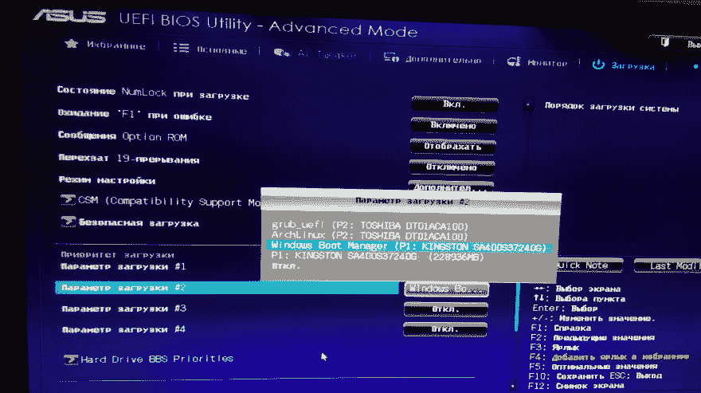
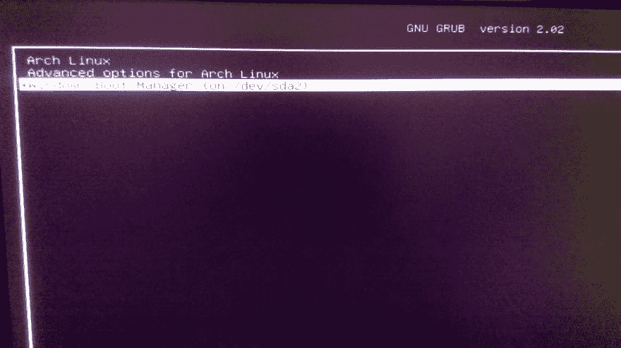

# Arch Linux:使用 EFI 和 Windows 双引导安装

> 原文：<https://dev.to/setevoy/arch-linux-installing-with-efi-and-windows-dual-boot-1eoh>

[](https://res.cloudinary.com/practicaldev/image/fetch/s--bNb1hH5q--/c_limit%2Cf_auto%2Cfl_progressive%2Cq_auto%2Cw_880/https://rtfm.co.ua/wp-content/uploads/2018/04/archlinux_logo.png) 我的目标是在我的新电脑上安装一个新的 Arch Linux 和 Windows(只是为了一些游戏)并使用 GRUB 的双引导。

### 磁盘

目前，接下来是磁盘布局:

```
[root@archiso ~]# lsblk
NAME   MAJ:MIN RM   SIZE RO TYPE MOUNTPOINT
loop0    7:0    0 476.7M  1 loop /run/archiso/sfs/airootfs
sda      8:0    0 223.6G  0 disk
sdb      8:16   0 931.5G  0 disk
sdc      8:32   1  28.9G  0 disk
├─sdc1   8:33   1   588M  0 part /run/archiso/bootmnt
└─sdc2   8:34   1    64M  0 part 
```

*   `/dev/sda`–固态硬盘，将用于 Windows
*   `/dev/sdb`–硬盘，适用于 Arch Linux

在`/dev/sdb`必须创建下一个分区:

1.  `sdb1`–电喷，512 米
2.  `sdb2`–靴子，1G
3.  `sdb3`–交换，32G
4.  LVM，所有

#### `fdisk`

运行`fdisk`，创建新的分区表:

```
[root@archiso ~]# fdisk /dev/sdb
Welcome to fdisk (util-linux 2.33).
Changes will remain in memory only, until you decide to write them.
Be careful before using the write command.
Command (m for help): p
Disk /dev/sdb: 931.5 GiB, 1000204886016 bytes, 1953525168 sectors
Disk model: TOSHIBA DT01ACA1
Units: sectors of 1 \* 512 = 512 bytes
Sector size (logical/physical): 512 bytes / 4096 bytes
I/O size (minimum/optimal): 4096 bytes / 4096 bytes
Disklabel type: dos
Disk identifier: 0x73c946df
... 
```

为 EFI 创建新的，512м:

```
...
Command (m for help): n
Partition type
p   primary (0 primary, 0 extended, 4 free)
e   extended (container for logical partitions)
Select (default p):

Using default response p.

Partition number (1-4, default 1):
First sector (2048-1953525167, default 2048):
Last sector, +/-sectors or +/-size{K,M,G,T,P} (2048-1953525167, default 1953525167): +512M

Created a new partition 1 of type 'Linux' and of size 512 MiB.
... 
```

将其类型设置为 EFI:

```
...
Command (m for help): t
Selected partition 1

Hex code (type L to list all codes): L
...
10  OPUS            55  EZ-Drive        a7  NeXTSTEP        ef  EFI (FAT-12/16/
...
Hex code (type L to list all codes): ef

Changed type of partition 'Linux' to 'EFI (FAT-12/16/32)'.
... 
```

下一个分区–对于`/boot`，1G:

```
...
Command (m for help): n
Partition type
p   primary (1 primary, 0 extended, 3 free)
e   extended (container for logical partitions)
Select (default p):

Using default response p.

Partition number (2-4, default 2):

First sector (1050624-1953525167, default 1050624):

Last sector, +/-sectors or +/-size{K,M,G,T,P} (1050624-1953525167, default 1953525167): +1G

Created a new partition 2 of type 'Linux' and of size 1 GiB.
... 
```

接下来—对于 swap，32G:

```
...
Command (m for help): n
Partition type
p   primary (2 primary, 0 extended, 2 free)
e   extended (container for logical partitions)
Select (default p):

Using default response p.

Partition number (3,4, default 3):

First sector (3147776-1953525167, default 3147776):

Last sector, +/-sectors or +/-size{K,M,G,T,P} (3147776-1953525167, default 1953525167): +32G

Created a new partition 3 of type 'Linux' and of size 32 GiB.
... 
```

将其类型设置为 swap:

```
...
Command (m for help): t
Partition number (1-3, default 3):
Hex code (type L to list all codes): 82
Changed type of partition 'Linux' to 'Linux swap / Solaris'.
... 
```

最后一个是针对 LVM 的(注意:`fdisk`会建议*加长*型——我这里用的是*初级*):

```
...
Command (m for help): n

Partition type
p   primary (3 primary, 0 extended, 1 free)
e   extended (container for logical partitions)
Select (default e): p

Selected partition 4

First sector (70256640-1953525167, default 70256640):

Last sector, +/-sectors or +/-size{K,M,G,T,P} (70256640-1953525167, default 1953525167):

Created a new partition 4 of type 'Linux' and of size 898 GiB.
... 
```

现在检查分区布局:

```
...
Command (m for help): p
Disk /dev/sdb: 931.5 GiB, 1000204886016 bytes, 1953525168 sectors
Disk model: TOSHIBA DT01ACA1
Units: sectors of 1 \* 512 = 512 bytes
Sector size (logical/physical): 512 bytes / 4096 bytes
I/O size (minimum/optimal): 4096 bytes / 4096 bytes
Disklabel type: dos
Disk identifier: 0x73c946df

Device     Boot    Start        End    Sectors  Size Id Type
/dev/sdb1           2048    1050623    1048576  512M ef EFI (FAT-12/16/32)
/dev/sdb2        1050624    3147775    2097152    1G 83 Linux
/dev/sdb3        3147776   70256639   67108864   32G 82 Linux swap / Solaris
/dev/sdb4       70256640 1953525167 1883268528  898G 83 Linux
... 
```

写入新的分区表:

```
...
Command (m for help): w
The partition table has been altered.
Calling ioctl() to re-read partition table.
Syncing disks. 
```

### LVM

创建物理卷:

```
[root@archiso ~]# pvcreate /dev/sdb4
Physical volume "/dev/sdb4" successfully created. 
```

创建卷组:

```
[root@archiso ~]# vgcreate vg_arch /dev/sdb4
Volume group "vg_arch" successfully created 
```

名为*根*的逻辑卷:

```
[root@archiso ~]# lvcreate -L 100G -n root vg_arch
Logical volume "root" created. 
```

具有*主目录*名称的逻辑卷:

```
[root@archiso ~]# lvcreate -l 100%FREE -n home vg_arch
Logical volume "home" created. 
```

#### 文件系统创建

对于 EFI-`fat32`:

```
[root@archiso ~]# mkfs.fat -F32 /dev/sdb1
mkfs.fat 4.1 (2017-01-24) 
```

`ext2`–对于`/boot`:

```
[root@archiso ~]# mkfs.ext2 /dev/sdb2 
```

`ext4`为`root`:

```
[root@archiso ~]# mkfs.ext4 /dev/vg_arch/root 
```

`ext4`为`/home`

```
[root@archiso ~]# mkfs.ext4 /dev/vg_arch/home 
```

创建交换:

```
[root@archiso ~]# mkswap /dev/sdb3
Setting up swapspace version 1, size = 32 GiB (34359734272 bytes)
no label, UUID=14e18ccc-11f4-4e2b-baf2-c141735b8800 
```

打开它:

```
[root@archiso ~]# swapon /dev/sdb3 
```

将根目录挂载到`/mnt`目录中:

```
[root@archiso ~]# mount /dev/vg_arch/root /mnt/ 
```

`/home`:

```
[root@archiso ~]# mkdir /mnt/home
[root@archiso ~]# mount /dev/vg_arch/home /mnt/home/ 
```

`/boot`:

```
[root@archiso ~]# mount /dev/sdb2 /mnt/boot/ 
```

电喷:

```
[root@archiso ~]# mkdir /mnt/boot/EFI
[root@archiso ~]# mount /dev/sdb1 /mnt/boot/EFI 
```

### Arch Linux 安装

立即安装操作系统、`sshd` и `vim`和您想要的任何软件:

```
[root@archiso ~]# pacstrap -i /mnt base base-devel openssh vim 
```

生成`/etc/fstab`:

```
[root@archiso ~]# genfstab -pU /mnt >> /mnt/etc/fstab 
```

Chroot 到新系统:

```
[root@archiso ~]# arch-chroot /mnt /bin/bash 
```

编辑`/etc/mkinitcpio.conf`，添加`lvm`挂钩:

```
HOOKS=(base udev autodetect keyboard keymap modconf block lvm2 filesystems fsck) 
```

构建内核:

```
[root@archiso /]# cd /boot/ && mkinitcpio -p linux 
```

#### 蛴螬

安装 GRUB 和其他需要的软件包:

```
[root@archiso boot]# pacman -S grub efibootmgr dosfstools os-prober mtools 
```

用 EFI 类型和 *ArchLinux* 名称安装 bootloader:

```
[root@archiso boot]# grub-install --target=x86_64-efi  --bootloader-id=ArchLinux --recheck

Installing for x86_64-efi platform.
GUID Partition Table Header signature is wrong: 0 != 5452415020494645
GUID Partition Table Header signature is wrong: 0 != 5452415020494645
GUID Partition Table Header signature is wrong: 0 != 5452415020494645
GUID Partition Table Header signature is wrong: 0 != 5452415020494645
GUID Partition Table Header signature is wrong: 0 != 5452415020494645
GUID Partition Table Header signature is wrong: 0 != 5452415020494645

Installation finished. No error reported. 
```

创建 GRUB 的配置文件:

```
[root@archiso boot]# grub-mkconfig -o /boot/grub/grub.cfg 
```

检查这个帖子是否挂起-[Arch Linux:grub-MK config 在/boot/grub/grub.cfg 配置生成中挂起](https://rtfm.co.ua/en/arch-linux-grub-mkconfig-hangs-on-the-boot-grub-grub-cfg-config-generation/)。

```
[root@archiso /]# grub-mkconfig -o /boot/grub/grub.cfg
Generating grub configuration file ...
Found linux image: /boot/vmlinuz-linux
Found initrd image: /boot/initramfs-linux.img
Found fallback initrd image(s) in /boot: initramfs-linux-fallback.img
done 
```

我们现在已经完成了。

### Windows 双引导

因为显而易见的原因——Windows 安装过程超出了本博客的范围:-)

将其安装在`/dev/sda`设备上，并立即检查分区:

```
[root@archlinux /]# lsblk
NAME             MAJ:MIN RM   SIZE RO TYPE MOUNTPOINT
sda                8:0    0 223.6G  0 disk
|-sda1             8:1    0   499M  0 part
|-sda2             8:2    0   100M  0 part
|-sda3             8:3    0    16M  0 part
`-sda4             8:4    0   223G  0 part
sdb                8:16   0 931.5G  0 disk
|-sdb1             8:17   0   512M  0 part /boot/EFI
|-sdb2             8:18   0     1G  0 part /boot
|-sdb3             8:19   0    32G  0 part [SWAP]
`-sdb4             8:20   0   898G  0 part
|-vg_arch-root 254:0    0   100G  0 lvm  /
`-vg_arch-home 254:1    0   798G  0 lvm  /home
sdc                8:32   1  28.9G  0 disk
|-sdc1             8:33   1   588M  0 part
`-sdc2             8:34   1    64M  0 part 
```

在设备 1 的 UEFI BIOS 中可以看到 windows-boot(`/dev/sda`):

[](https://res.cloudinary.com/practicaldev/image/fetch/s--yBWlw-X4--/c_limit%2Cf_auto%2Cfl_progressive%2Cq_auto%2Cw_880/https://rtfm.co.ua/wp-content/uploads/2019/02/IMAG0582.jpg)

аnd 拱门-在装置 2 ( `/dev/sdb`)上。

如果`os-prober`尚未安装，安装它:

```
[root@archlinux /]# pacman -S os-prober 
```

检查`/dev/sda`分区:

```
[root@archlinux /]# fdisk -l /dev/sda
Disk /dev/sda: 223.6 GiB, 240057409536 bytes, 468862128 sectors
Disk model: KINGSTON SA400S3
Units: sectors of 1 \* 512 = 512 bytes
Sector size (logical/physical): 512 bytes / 512 bytes
I/O size (minimum/optimal): 512 bytes / 512 bytes
Disklabel type: gpt
Disk identifier: 78241A73-6994-4D0B-9FCB-433076B5EC41

Device       Start       End   Sectors  Size Type
/dev/sda1     2048   1023999   1021952  499M Windows recovery environment
/dev/sda2  1024000   1228799    204800  100M EFI System
/dev/sda3  1228800   1261567     32768   16M Microsoft reserved
/dev/sda4  1261568 468860927 467599360  223G Microsoft basic data 
```

为了让`os-prober`可以找到安装在另一个设备上的 Windows，我们需要安装它的引导分区，即 *204800 100M EFI 系统*。对于 Windows。

安装它:

```
[root@archlinux /]# mount /dev/sda2 /mnt/
[root@archlinux /]# ls -l /mnt/
total 1
drwxr-xr-x 4 root root 1024 Feb 24 10:24 EFI 
```

运行`os-prober`:

```
[root@archlinux /]# os-prober
/dev/sda2@/EFI/Microsoft/Boot/bootmgfw.efi:Windows Boot Manager:Windows:efi 
```

备份现有 GRUB 的配置:

```
[root@archlinux /]# cp /boot/grub/grub.cfg /boot/grub/grub.cfg-origin 
```

重新生成它:

```
[root@archlinux /]# grub-mkconfig -o /boot/grub/grub.cfg
Generating grub configuration file ...
Found linux image: /boot/vmlinuz-linux
Found initrd image: /boot/initramfs-linux.img
Found fallback initrd image(s) in /boot: initramfs-linux-fallback.img
Found Windows Boot Manager on /dev/sda2@/EFI/Microsoft/Boot/bootmgfw.efi
done 
```

重新启动电脑:

[](https://res.cloudinary.com/practicaldev/image/fetch/s--da7X0IDs--/c_limit%2Cf_auto%2Cfl_progressive%2Cq_auto%2Cw_880/https://rtfm.co.ua/wp-content/uploads/2019/02/IMAG0581.jpg)

我们结束了。

### 关于拱门安装的类似帖子(俄语)

*   arch:安装在 Ubuntu 上方，在 LVM t1 中保留 home
*   arch linux:采用 UEFI、GPT、LVM 和 LUKS 加密的安装
*   arch linux:采用 DVM 和 LUKS 驱动器加密安装
*   t0arch:t1 安装后设置

### 类似的帖子

*   <small>02/24/2019</small>[Arch Linux:установкасEFIи双启动с Windows](https://rtfm.co.ua/arch-linux-ustanovka-s-efi-i-dual-boot-s-windows/) <small>(0)</small>
*   t04/09/2017 年 t1t2arch:安装 NTFS T3t 4
*   <small>2017 年 12 月 3 日</small>[Linux:LVM–/root≤home](https://rtfm.co.ua/linux-lvm-razdelit-root-i-dobavit-home/)<small>【0】</small>
*   T003/09/2017 t1t2arch:安装在 Ubuntu 上方，同时在 LVM T3 中保留 home
*   T003/29/2017 t1t2arch:SKYPE-T3T 4 音频和麦克风