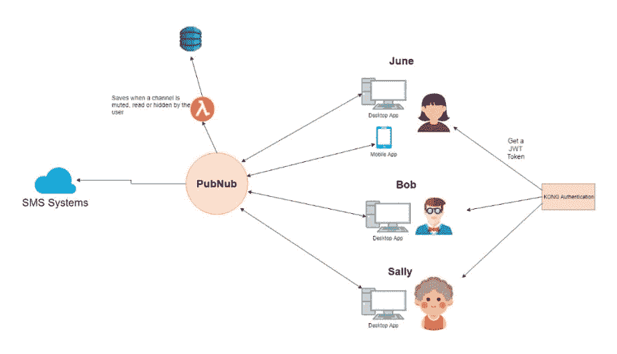
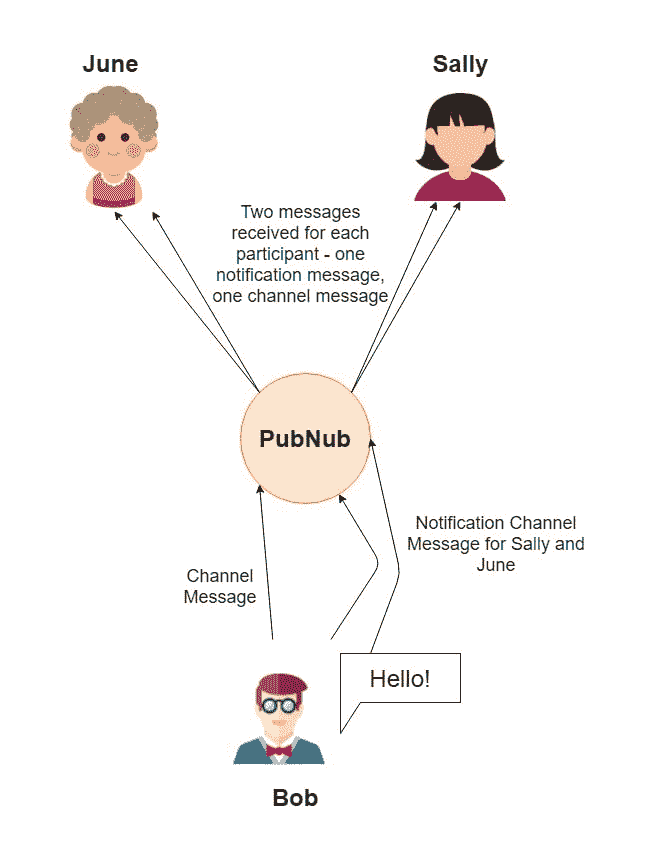
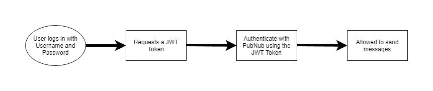

# 构建下一代通信

> 原文：<https://dev.to/joshghent/architecting-the-next-generation-of-communication-2b8e>

随着向移动的转变，以及“年轻”一代(你好)不使用电话作为沟通方式的统计数据，不断有一种推动以平台不可知的方式联系人们——通过电子邮件、linkedin、twitter dm，你能想到的。当您需要创建一个需求可扩展且足够灵活的平台，以在以后侵入任何其他新的通信流时，挑战就出现了——也许我们突然想要支持 MySpace 消息传递。

我下面讨论的架构来自于对这个问题的第一手经验，以及我们想出的解决方案——所有这些都要在截止日期前交付。

### web sockets 的方式！

因为在 IM 的情况下这需要是实时的，在 SMS 的情况下需要是接近实时的，所以 websockets 是最好的方法，并且是 web 上实时操作的事实上的标准。对于这一点，PubNub 是一个很好的选择，因为它已经内置了很多功能，比如不同的通道和在这些通道上订阅、发送和接收的机制。

PubNub 也有一个叫做“PubNub functions”的机制，通过这个机制，一个通道上任何匹配特定模式的新 websocket 消息都将由一个用普通的 ol' javascript 编写的函数来处理。这意味着你可以将短信发送到其他系统，这些系统将处理短信的实际发送，并通过另一个途径将 whatsapp 的消息发送到 Twilio 的 API。它提供了巨大的灵活性，尤其是当您扩展到不同的通信方法和渠道类型时。

虽然 PubNub 在后台有自己的数据存储，但您只能通过他们的 API 查询它，这使得很难深入数据库并找到所有包含 accountId 123 的通道。此外，使用 PubNub 一次只能带回 99 条记录，这意味着生成准确的报告是一个挑战。解决方案是引入第二个数据源。这潜在地打开了许多真理来源的问题。这可以通过在所有读取操作都要经过的非关系数据库(我推荐 ElasticSearch)前放置一个 API 来避免。

### 打字时间

对于一个将跨越许多不同 API 和服务的项目，Typescript 将被证明是非常宝贵的，因为它允许我们重用大量代码，同时提高开发人员的生产率并减少 bug。听起来好得难以置信，对吗？当然，还是有一些错误，在所有的开发人员都适应了之后，生产率才开始上升，但总的来说，这是一个了不起的进步。您应该做的第一件事是创建一个公共的“类型”库，您可以在需要它们的所有服务和系统之间共享它。在这个类型库中，所有的接口和枚举都将在整个系统中使用。您可以在其中存储所有内容，从错误代码到通道类型，以及如何构建消息的接口。然后，您可以将该库包含在所有服务中，以确保一致性。

### 不同的渠道

区分通信类型，你有，集团即时消息，直接消息，短信，群发短信，信鸽等。您可以将其作为频道名称的一部分。再说一次，PubNub(我保证它不会赞助这篇文章)提供了很大的灵活性，它允许频道名是你想要的。我建议使用平台、渠道类型和唯一标识符来构建它们，例如`production.sms.123456`。在 pubnub 函数中，您可以使用正则表达式检查通道名称中的通道类型，并相应地处理消息。

应该为每种渠道类型的每组参与者创建渠道。例如，为联系人创建新的 sms 会创建新的频道，再次向同一联系人发送 sms 不会创建新的频道。但是，与 Bob、June 和 Sally 创建一个称为“销售拜访”的组，然后与相同的人创建另一个称为“另一个销售拜访”的组，将创建两个不同的渠道。这是许多其他聊天应用程序的构建方式，它们符合雅各布定律，是你想要做的。

现在我们有了一个基本的即时消息和 SMS 系统，我们有一个新的问题要解决——我们如何通知用户？在现有频道上发出不同类型的消息听起来是一个显而易见的解决方案，但它假设用户订阅了频道。幸运的是，解决这个问题的一个方法是使用“通知”通道。应为每个帐户分配一个通知渠道。每次发送消息时，它也会被发送到参与者通知通道。

例如，如果 Bob 创建了一个与 June 和 Sally 的新群聊，它将在 June 和 Sally 的通知频道上发送一条新消息，通知我们的应用程序“嘿，有一个新频道需要您订阅！”。这将触发应用程序中的一个进程，在后台订阅该频道。当 Bob 在该通道上发送消息时，它会在两个参与者(June 和 Sally)通知通道上发送另一条消息。当应用程序收到此消息时，您可以根据平台弹出桌面或移动通知。

此外，您可以使用此通知通道发送其他类型的消息，例如当通道被读取时，或者当用户静音、离开或隐藏通道时。再次利用 PubNub 函数，这些通知可以被捕获并转发到 CRUD API，该 API 将它们保存在 DynamoDB 中。这使我们能够在客户使用的任何设备上提供一致的体验。

有些人可能想知道为什么我们不直接调用 API，而是通过 PubNub，这是为了迎合用户同时打开我们的移动和桌面应用程序的情况。通过通知频道发送消息意味着如果你在桌面上隐藏了一个频道，它将立即在移动应用程序上隐藏。

### 认证

当将整体架构分解为微服务时，身份验证可能是一个很大的障碍，这就是我的公司发现自己所处的情况。在开发这些 SMS/IM 系统之前，用户使用用户名、密码和许可证密钥在我们的后端进行身份验证。所有对 API 的请求都使用了这些参数。当使用 PubNub 认证时，这不是一个选项，因为首先我们不想让他们访问我们的帐户数据库，其次因为这不是他们系统上的一个选项。基于令牌的系统是唯一的方法。对于基于令牌的身份认证，我们考虑了许多不同的选项，但最终选择了 JWT，因为它具有灵活性、易于实施和安全性。结合这一点，我们发现 Kong 和插件在处理我们扔给它的所有流量方面表现出色。

大量的工作不仅包括修改 API 以接受 JWT 认证，还包括修改我们所有的应用程序以处理 JWT 认证。此外，我们需要这些令牌的更新策略，例如，如果一个人连续几天保持登录状态，那么我们缓存的 JWT 令牌可能已经过期。这意味着我们需要刷新令牌。对于应用程序的任何请求，我们都会检查 JWT 还有多长时间到期。如果还有一天或不到一天，那么我们首先刷新令牌。

我们利用 JWT 来存储请求所需的信息，例如，当请求进入 API 时，我们很可能需要 accountId，我们可以在 JWT 中找到它，而不必通过请求体传递任何信息。

对于一个看似简单的系统架构，还有更多的东西要告诉你，如果你曾经不得不设计你自己的通信平台，你是怎么做的？我有兴趣找出并建立一个知识库。

* * *