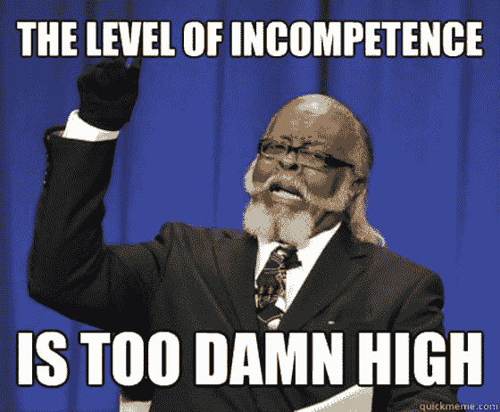
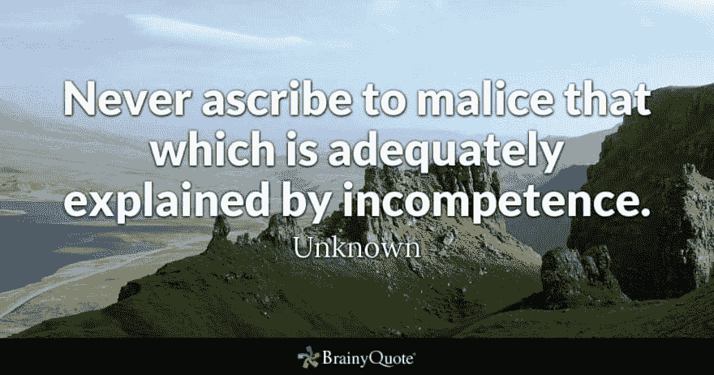
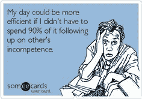

# 无能的开发者-你认识吗？

> 原文：<https://dev.to/chris_bertrand/are-you-an-incompetent-developer-4kc6>

软件开发最有趣的部分之一，是为了完成手头的任务而形成的团队动力。

这一群人包括许多不同领域的专业知识、个性和技能。

尼尔·格林创建了这个[的神奇网站](https://neilonsoftware.com/books/personality-patterns-of-problematic-projects/)，描述软件项目中出现的这些个性模式。这些个性存在的原因，他们对项目有什么影响，以及可以做什么来纠正可能出现的任何问题。我首先要讨论的是**无能**。

# 无能的人

我想首先关注这一点的原因是，每个人**都觉得**他们认识/曾经认识一个**无能的程序员**。

尼尔将这种人格定义为:

> 缺乏编写软件的智力或技能的开发人员。

我们知道我们不知道我们不知道的事情。这有点拗口，但本质上，我们自己并不知道自己的无能程度！这可以被称为[邓宁克鲁格效应](https://en.wikipedia.org/wiki/Dunning%E2%80%93Kruger_effect)，通常可以在询问你的驾驶水平时发现。在一个你不想与之共乘一辆车的朋友身上试试吧！

这里有一些问题，通常会被询问这些人的一群人问到。

## 这个人是怎么被录用的？

面试过程不是 100%万无一失的，每个组织都会让那些可能达不到你所在组织标准的人通过。

随着时间的推移，组织和技术会发生变化，几年前可能有效的东西现在可能不再有效。开发人员需要不断发展，技能提升和培训是保持能力曲线不可或缺的！

> 有时候人们不善于自学新事物。

这些人**并不愚蠢**，他们是**受过高等教育**的人，可能已经在这个行业呆了很长时间。他们设法通过了面试过程，而且很可能**拥有你想要和/或期望的所有资格**。然而，没有指导，他们无法学习他们需要的东西。当你不再有一个讲师/导师告诉你学什么和怎么学的时候，人们会很纠结。

## 为什么这个人没有被开除？

解雇一个人会涉及很多法律问题！在某些情况下，这可以通过其他方式解决。任何熟练程度的能力水平并不是一个人成为一个组织的一部分的唯一原因；性格，领域知识，沟通能力，是老板的侄子还是侄女！

有些人只是还没有准备好完成他们的工作描述。我是彼得原则的忠实信徒，在这个原则中，人们不断得到晋升，直到他们达到不称职的程度。

这并不意味着他们的工作中有任何恶意，他们只是不具备足够完成手头任务的技能！

## 现在应该怎么做？

在大多数情况下，这些人通常不会被发现，如果他们被发现了，大多数时候他们只是被遗忘了。发生这种情况可能有几个原因；组织中是否有保持技能相关性的指南？是否存在可能导致水平降低的外部影响？这些原因会改变你对这件事的看法吗？

不要等到最后一分钟才讨论性能，最好尽可能快地提前讨论，否则会很尴尬。是否有一个可以改进的计划？

> 我们所有人都有与生俱来的天赋，但很少有人尝试去发现它们是什么。

最后一根稻草是试图将这个人转移到他们更适合的另一个角色。

## 因此...你是一个不称职的开发者吗？

你呢；

*   将你的生产力低下归咎于 T2 缺乏公司提供的培训？
*   反对"**太复杂**"的技术、工具和技巧
*   大大**高估**自己的工作？
*   当被问及你的进展状况时，你总是有一大堆借口，而且经常是防御性的？
*   你的特性，一旦实现，就会被**漏洞百出**？

如果你对其中几个问题的回答是**是的，听起来很熟悉**，那么也许你正在成为一个不称职的开发人员！但是不要担心，一旦你意识到这一点，你就可以扭转这种局面！

> 软件开发是一项压力很大的工作

在大多数情况下，你将致力于改善你不太擅长的领域。如果你不知道自己有哪些不擅长的领域，你就不会这么做。

你很有可能自信地说你是 T2，而不是擅长某些运动、烹饪或者公共演讲。如果你问自己在实际工作中不擅长什么，答案通常会更难理解。了解你的长处和短处会帮助你明白应该把精力集中在哪里，希望你能在别人注意到之前扭转局面...

然后你可以**安全地**回到你的同事身边，再次谈论**如何不称职**！

* * *

感谢阅读，我希望这能让你思考！如果你想分享我的观点，请使用下面的按钮。

要阅读更多关于这个性格比喻的细节，请点击下面的链接。

[https://neilonsoftware . com/books/personality-patterns-of-problem-projects/developers/the-competency/](https://neilonsoftware.com/books/personality-patterns-of-problematic-projects/developers/the-incompetent/)