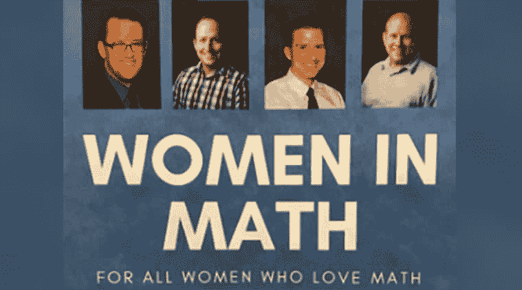

# 你愿意不舒服的去支持女开发者吗？

> 原文：<https://dev.to/bengreenberg/are-you-willing-to-be-uncomfortable-to-support-women-developers-30bb>

您正在参加一个聚会。你不是发言人、组织者之一，也不以任何方式与这个团体的领导层有联系。你只是一个简单的出席者。随着活动的开始，你意识到在你面前的是一个行业专家小组。但是，它不是普通的面板。这是一个故事。

A manel??

<figure>

<figcaption>source: https://indianexpress.com/article/trending/trending-globally/no-woman-for-women-in-math-discussion-twitterati-mock-the-all-men-panel/</figcaption>

</figure>

你环顾房间，你会看到许多女性开发人员。有能力的，合格的，优秀的开发人员。为什么他们都不在小组里？

关于男性代表过多的影响的研究仍在出现，但[研究](https://onlinelibrary.wiley.com/doi/full/10.1111/ajps.12391#ajps12391-sec-0160-title)表明，全男性代表具有使所发生的过程失去合法性的效果，而性别平衡赋予决策和过程合法性。这种合法化和去合法化的范式可以应用于“进步”和“保守”的结果。

从轶事的角度来看，从未见过像你这样的人担任领导角色会对个人产生打击士气的效果。作为一个在美国出生和长大的人，并且在那里度过了几乎所有的成年生活，作为一个少数民族社区的成员，我亲身体会到一个人的文化没有在流行文化中得到体现或者只有一幅漫画展示的感觉。

记住这一点，让我们回到聚会上的马内尔的情况。

你是做什么的？

这是我几个月前经历的真实情况。它一直伴随着我，因为与电视剧不同，在我们面对重量和重力的时刻之前，可能会经历很长一段时间。通常，我们过着单调的日常生活，日子就像世俗的拼贴画一样相互融合。然而，这是一个感觉不同的时刻。

我做的并不是特别优雅，但这几乎是一种本能的反应。

当主持人扫视观众时，我们对视了一会儿，我说:“*这是 bullsh*t* ”他的面部反应让我知道他看到了。我还发了一条消息给 WhatsApp 的同事，他们在房间里以更详细的形式表达了问题所在。这在小组中引起了一些议论。

到了问答时间，观众中的一名女性被叫了出来，并明确提出了问题/陈述。她比我勇敢得多，因为作为男性盟友，我可以行使我的愤慨，但她冒着被拒绝和嘲笑的实际风险。然而，她没有受到嘲笑，而是得到了其他观众热烈的掌声，组织者保证不会让这种事情再次发生。

如此坦率地说出我的不舒服让我很不舒服。我担心别人会如何回应我。我是不是在敞开心扉接受侮辱？我不是一个喜欢对抗的人，就像我们中的许多人一样，这是我对抗的舒适区的一种感觉。

做盟友就是愿意变得不自在。成为盟友就是愿意行使自己的特权，尤其是当个人很难这样做的时候。

我记得在我的一生中，许多人为我挺身而出。当我在公立学校的时候，这位朋友提出了一个问题，那就是圣诞主题派对不包含多文化节日庆祝活动。作为一名专业人士，是我的同事们询问餐饮活动的特殊饮食要求。还有很多其他的例子。

当然，我可以，也经常提高我的声音，但是当来自特权集团的人为你辩护时，力量会更大。它从属于那个群体(例如，性别、种族、文化、宗教等。)问题，到成为每个人的问题。

尽管这并不容易，而且经常让我不舒服，但我保证当情况需要时，我会继续让自己不舒服。正如其他人已经做的，并继续为我做的，我将为这个领域的妇女做。正是通过将一种相互依存的文化结合在一起，我们将使这个领域成为一个真正属于我们所有人的地方。