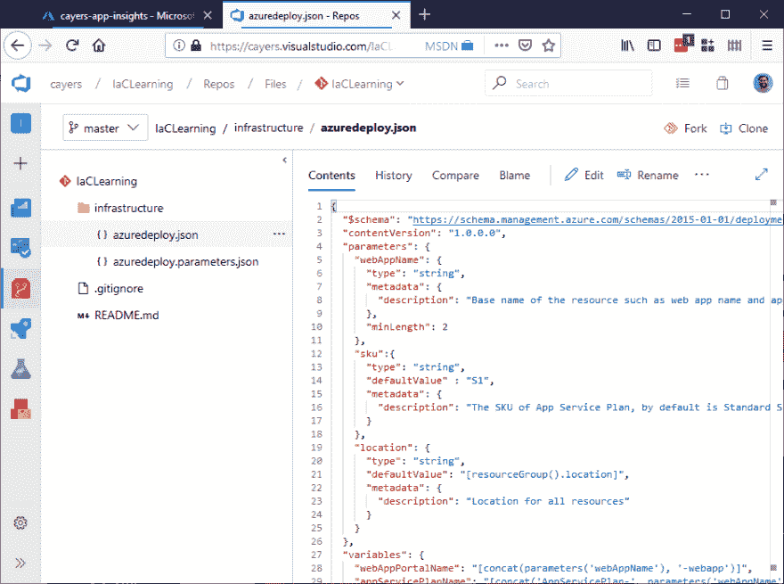
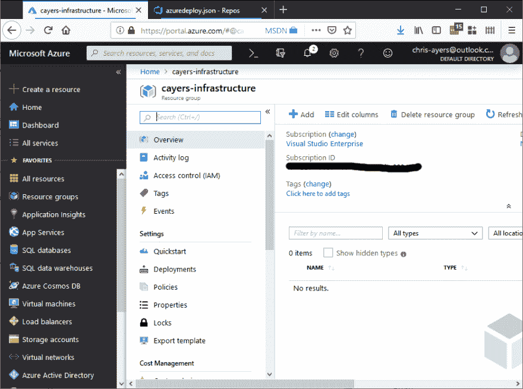
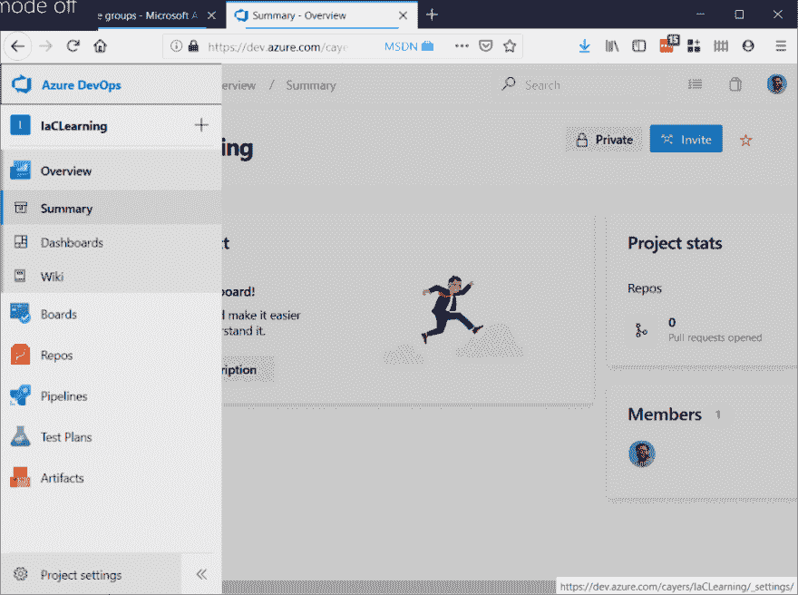
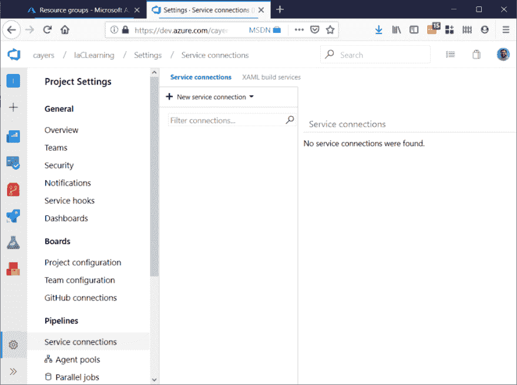
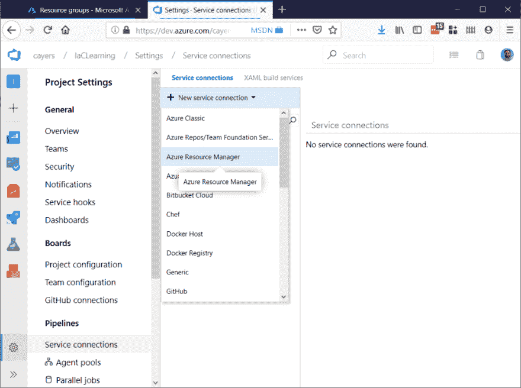
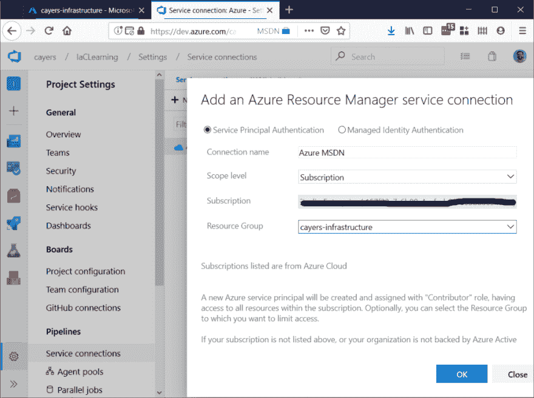

# 手臂-第 3 部分:连接管道

> 原文：<https://dev.to/chris_l_ayers/arm-part-3-hook-up-the-pipes-29pg>

我从微软直接得到了一个模板。我想把它连接到一个 CI/CD 管道中，这样我就可以到处玩并得到快速的反馈。我将使用 Azure DevOps 来帮助实现这一切。让我们将这些模板放入一个回购中开始吧。新的 repo，初始化它，添加新文件。

接下来，我将创建一个新的资源组来使用我的 web 应用程序资源。

现在我们需要确保 DevOps 拥有在 Azure 中创建和更新资源的权限。这可以通过以下几种不同的方式来实现:[https://docs . Microsoft . com/en-us/azure/devo PS/pipelines/library/connect-to-azure？view=azure-devops](https://docs.microsoft.com/en-us/azure/devops/pipelines/library/connect-to-azure?view=azure-devops)

我将设置从 DevOps 到 Azure 的服务连接。在 Azure Devops 中，我将转到我的项目设置:

并转到服务连接:

我们将创建一个新的 Azure 资源管理器服务连接。

我们只需要选择正确的订阅，登录，并指向我们的资源组。还有更复杂的设置，我们将在以后讨论这些，但现在我们只将它指向我前面创建的那个资源组。现在，为了正常工作，您必须能够向连接器授予权限。

现在我们有一个连接器可以部署到 Azure。我们下次会完成这个。