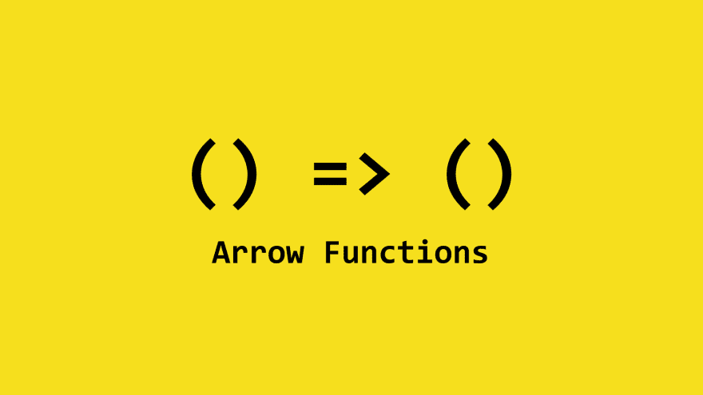

# 理解 JavaScript 中的箭头函数

> 原文：<https://dev.to/arghasoumak/arrow-functions-in-javascript-19n7>

[](https://res.cloudinary.com/practicaldev/image/fetch/s--Ikj7z82C--/c_limit%2Cf_auto%2Cfl_progressive%2Cq_auto%2Cw_880/https://thepracticaldev.s3.amazonaws.com/i/er6hpt4l34quc2ktxkkt.png)

箭头功能是在 es6 或 es2015 中引入的，此后它在开发人员中非常受欢迎。这是我最喜欢的最酷的东西。

箭头函数改变了我们声明函数的方式。它使得函数声明变得简单、快速和时尚。

它的名字中的箭头来自它的箭头式语法。让我们举一个例子

```
const foo = () => console.log('Hey, Arrow!'); 
```

## 如何使用

箭头函数的工作方式非常类似于匿名函数。

```
//Anonymous functions
const foo = function () {
    console.log("I'm old!");
}

//Arrow functions
const foo = () => {
    console.log("I'm new!");
} 
```

但是箭头函数提供了更多的灵活性。就像如果你在函数体中只有一个语句，那么你可以去掉那些花括号。

```
const foo = () => console.log("Isn't it cool!"); 
```

此外，如果你返回一些值，你不需要提供返回关键字。

```
const foo = () => "Wow!" 
```

如果你需要返回一个对象。

```
const msg = () => ({
    type: 'msg',
    body: 'Hey'
}) 
```

现在，您可以向它传递多个参数。

```
const add = (a, b) => a + b; 
```

最后但同样重要的是，如果你只有一个参数，你也可以删除那些括号。

```
const product = a => a * a; 
```

现在看看使用箭头函数声明一个函数是多么容易。

我希望你能从这篇文章中学到一些东西。感谢阅读..