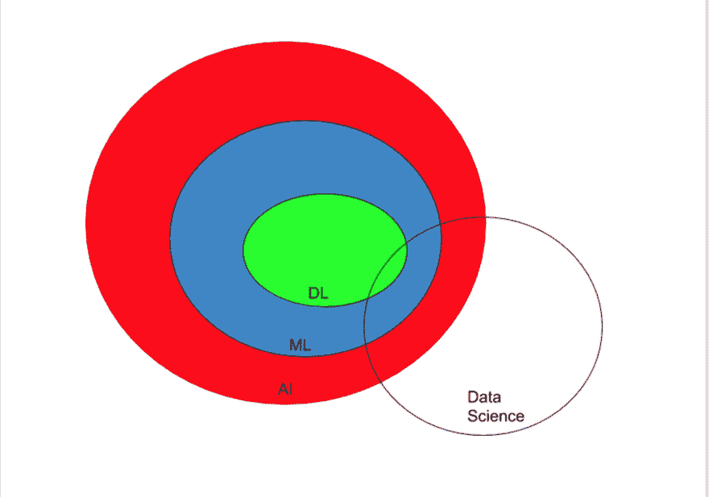

# 人工智能、机器学习、深度学习和数据科学——有什么区别？

> 原文：<https://dev.to/princesoluebube/artificial-intelligence-machine-learning-deep-learning-and-data-science-what-s-the-difference-14mn>

当我开始研究机器学习时，我有很多困惑。我的困惑不是技术上的，而是在我的机器学习之旅中单词是如何被抛出的。

我听到了数据科学、人工智能、机器学习、深度学习这些词。在这些范围内，仍然有许多词引起人们的好奇心。

你可能想知道它们有什么不同。希望我能消除你的疑虑，所以请坐吧！

这些领域发展迅速，您今天在这里找到的定义可能与明天会找到的不同，所以不要忘记跟上技术的发展。

### 什么是人工智能？

在寻找人工智能的具体含义之前，我有一个概念，人工智能(AI)是指机器人能够像人类一样做我们可以做的事情，从而接管世界。

虽然这是事实的一部分，但这并不完全是人工智能的全部。众所周知，一半的事实几乎不是事实。

根据韦氏词典，智力一词是“学习、理解或处理新的或棘手情况的能力”。它还被定义为理性的熟练运用和运用知识来操纵个人环境的能力，或按照客观标准(如测试)进行抽象思考的能力

因此，人工智能(AI)是基于机器或计算机程序像人类一样思考(推理)、理解和学习的能力的想法。

根据智能的定义，我们也可以说，人工智能是对创造能够应用从数据中获得的知识来操纵环境的机器的可能性的研究。

还是流行语？等等！简单来说…

AI(人工智能)正在通过学习、推理和自我修正，在机器特别是计算机系统中复制人类智能。

### 现实生活中人工智能的例子:

如果你是我的朋友，我知道你喜欢动作片，我会根据我对你的了解给你一些动作片的建议。这是人类的智慧。

机器也能够做到这一点，例如，如果你在网飞上观看某一特定类别的电影，网飞就会根据你的观看模式向你推荐电影。

这怎么可能？人工智能。这是人工智能的一个非常普遍的例子。

### 什么是机器学习？

人工智能非常广阔。机器学习(ML)是人工智能的子集。还记得上一段中智力定义的学习方面吗？这就是曼梯·里的用武之地。

机器学习(ML)是一套从数据中学习的统计工具。ML 的核心是教会计算机如何学习并根据数据做出预测，而不需要编程。

### 现实生活中 ML 的例子:

我们都会收到垃圾邮件。例如，这些总是被 gmail 过滤掉。此外，邮件分为促销类和社交类，以及基于您使用的邮件服务的其他类别。gmail 是如何学会做到这一点的？机器学习！别忘了 ML 是 AI 的一部分。随着时间的推移，该服务已经能够学习电子邮件可能属于的类别。它有时可能是错误的，但它一直在学习。

### 什么是深度学习？

在机器学习中，数据主要通过对其执行线性变换的算法来产生输出。

深度学习是机器学习的一个子集，其中数据经过多次非线性转换以获得输出。

在这种情况下,“深”是指许多步骤。一个步骤的输出是另一个步骤的输入，这个过程会持续下去，直到得到最终的输出。所有这些步骤都不是线性的。非线性变换的一个例子是矩阵变换。

深度学习有时也被称为深度神经网络(DNN)，因为它利用多层人工神经网络来实现深度学习。

看过人类大脑神经元的照片吗？人工神经网络的构建类似，神经节点像网络一样连接在一起。

深度学习算法需要非常强大的机器，在从输入数据中检测模式时非常有用。

### 深度学习的一个应用:

听说过 WaveNet 和 Deep Speech 吗？它们都是自动生成语音的深度学习网络。在 WaveNet 和 Deep speech 被人工训练之前，文本到语音系统。

通过深度学习，系统正在学习模仿人类的声音，以至于很难区分人类和计算机的画外音。深度学习让我们更接近于赋予计算机像人类一样说话的能力。

深度学习是 ML 的子集，ML 是 AI 的子集，所以它是 AI。

### 什么是数据科学？

数据科学与人工智能有交集，但不是人工智能的子集。

数据科学是对任何给定领域引起的好奇心的研究，从与头脑中的问题相关的大量数据来源中提取数据，处理数据，分析和可视化这些数据，从而使其对 it 和业务战略有意义。

简单来说，就是理解和理解数据。数据科学中使用了很多工具。它们包括统计工具，概率工具，线性和度量代数，数值优化和编程。

### 数据科学的一个应用:

随便挑一个概念。

我选择赞助。人们如何为一项事业获得赞助。他通常愿意回复一封寻找赞助者的邮件。他们在请求赞助的电子邮件中寻找什么关键词？他们会喜欢电话吗？

在这种情况下，数据科学可以有所帮助。一个与赞助过某项事业的每个人、他们为什么赞助、他们在沟通渠道方面的偏好等相关的数据池是一个大型的非结构化数据集。

使用各种工具对数据进行处理、分析和可视化。从这些数据中可以得出结论。

这些信息可以帮助非营利组织和寻求赞助的人们寻找赞助者。

数据科学不完全是人工智能，但是数据科学的一些部分与人工智能交叉。

说到底，这些热门词汇有一个共同点——数据！