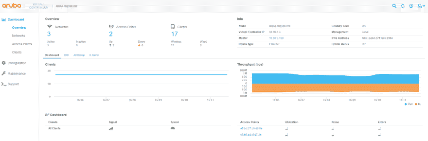
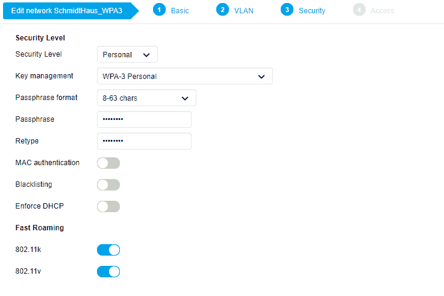
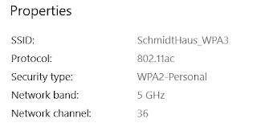
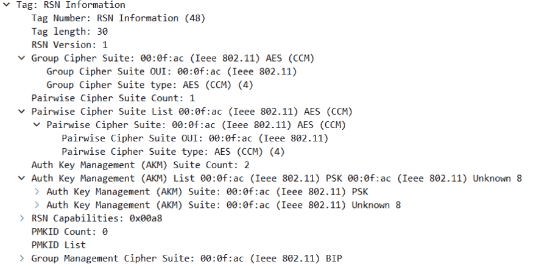

# 阿鲁巴早期实现 WPA3，混合模式

> 原文：<https://dev.to/ngschmidt/arubas-early-implementation-of-wpa3-mixed-mode-4o95>

阿鲁巴已经发布了阿鲁巴 8.4，其中包括 WPA3-PSK: <！[CDATA[//Comment public class Testing { public Testing(){ } public void Method(){/*多行另一个注释*/int x = 9；} }]]>

[https://www . arubanetworks . com/tech docs/ArubaOS/8.4 . x . x/default . htm](https://www.arubanetworks.com/techdocs/ArubaOS/8.4.x.x/Default.htm)

可以理解的是，我非常兴奋地尝试了它，并立即升级了我的即时集群，它包含在我家实验室的“安全区”内。它之前运行的是 8.3.0.3，升级需要我建立一个 HTTP 服务器来分发二进制文件。一键式升级没有出现任何问题，两个接入点只需大约 10 分钟，没有客户端宕机。

我会尽量不在这里滔滔不绝，但这是一个相当邪恶的软件发布。虚拟控制器用户界面得到了极大的改进，并且有了一些新的选项:

配置 WPA3-SAE 也非常简单:

 
配置好之后，我就可以连接到我创建的 WPA3 SSID 了。

等等，**什么？** Windows 10 还没有任何 WPA3 支持！再深入一点，我发现我连接到一个支持 WPA2 个人的 SSID。

 
看来我们有能力同时运行 WPA2 和 T3。当然，我们可以相信，但要用数据包捕获来验证。如果没有软件定义的无线电，这通常是不可行的，但是 Aruba 提供了一个工具(PEEKREMOTE ),可以让您远程捕获数据包。如果您对自己做这件事感兴趣，如何做的指南在本文的末尾。解码 PCAP 时，需要遵循一些重要步骤。

以下是我在 802.11 信标帧的 RSN IE 部分发现的内容:

 
从外观上看，RSN ie 允许多个密码套件和 akm。这并不奇怪，因为这就是 WPA1/2 在混合模式下的工作方式。根据 PCAP，我推测 00:0f:ac:08 是 SAE 的 802.11i 名称。

WPA2 & 3 差异，由 Ruckus Networks 提供:

[https://theruckusroor . Ruckus wireless . com/wired-wireless/technology trends/wpa 2-wpa 3-new-changed-future/](https://theruckusroom.ruckuswireless.com/wired-wireless/technologytrends/wpa2-wpa3-new-changed-future/)

802.11 I 健壮安全网络信息元素:

[https://mrncciew . com/2014/08/21/cwsp-rsn-Information-Elements/](https://mrncciew.com/2014/08/21/cwsp-rsn-information-elements/)

air heads 公告:

[https://www.youtube.com/watch?v=RWGPCdP47E8](https://www.youtube.com/watch?v=RWGPCdP47E8)

关于 WPA3 的详细信息及其重要性(非轻读):

[https://www.mdpi.com/2079-9292/7/11/284/htm](https://www.mdpi.com/2079-9292/7/11/284/htm)

instant OS 数据包捕获:

[https://wifiromigh . WordPress . com/2018/03/22/capture-client-traffic-on-Aruba-campus-and-instant-access-points-using-wireshark/](https://wifiromigh.wordpress.com/2018/03/22/capturing-client-traffic-on-aruba-campus-and-instant-access-points-using-wireshark/)