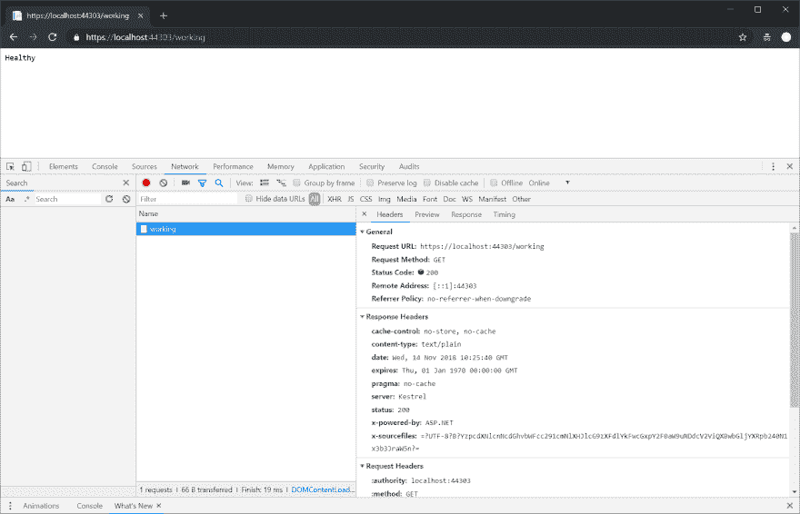
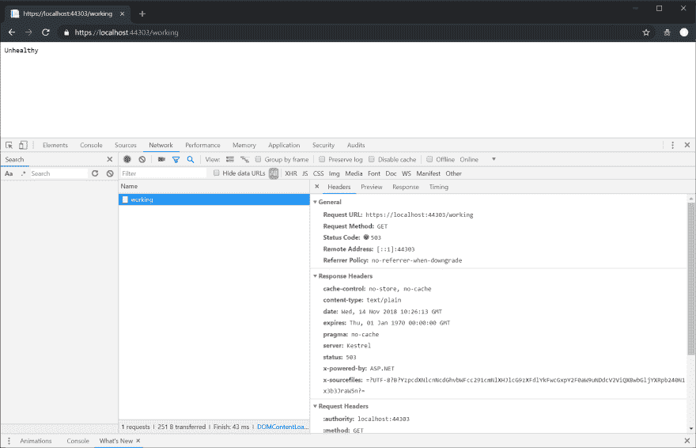
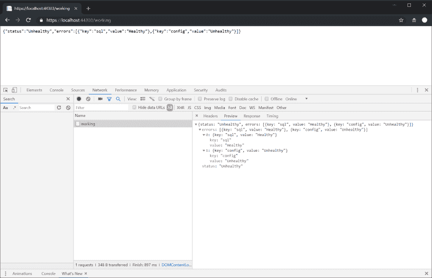
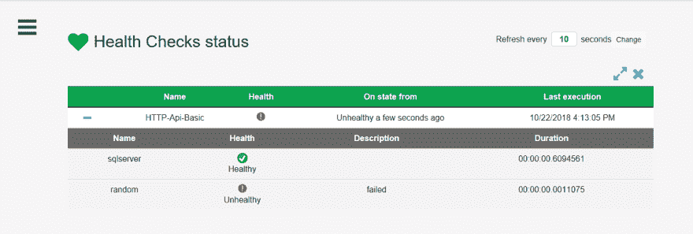

# ASP.NET 核心 2.2 健康检查说明

> 原文：<https://dev.to/thomasardal/asp-net-core-2-2-health-checks-explained-49mk>

ASP.NET 核心 2.2 引入了一系列新功能。其中比较有趣的(IMO)是健康检查。您可以使用类似 Pingdom 或 [elmah.io Uptime Monitoring](https://elmah.io/features/uptimemonitoring/) 这样的工具在指定的时间间隔内 ping 您的网站。ping 一个 HTML 页面可能会也可能不会揭示您的应用程序是否健康。健康检查来拯救！在亲自尝试代码之前，请确保安装最新版本的 ASP.NET 核心 2.2 和 Visual Studio 2017。

当开发一个新的服务时，我通常会定义一个定制的路线(比如`/working`)。正常运行时间监控请求这个端点，如果事情停止工作，就会发送一个通知。如何实现`/working`,取决于每个 API。一些 API 可能需要数据库连接，而另一些则完全不需要。到目前为止，我的一个自定义健康端点可能看起来像这样:

```
[Route("working")]
public ActionResult Working()
{
    using (var connection = new SqlConnection(_connectionString))
    {
        try
        {
            connection.Open();
        }
        catch (SqlException)
        {
            return new HttpStatusCodeResult(503, "Generic error");
        }
    }

    return new EmptyResult();
} 
```

在这个例子中，如果我们无法打开到 SQL Server 的连接，但是可以是另一个数据库或任何其他资源，`/working`端点返回`503`。

借助 ASP.NET 核心 2.2 中新的运行状况检查功能，运行状况检查不再需要您像上例中那样创建新的控制器。通过`Startup.cs` :
启用和配置健康检查

```
public void ConfigureServices(IServiceCollection services)
{
    ...
    services.AddHealthChecks();
    ...
}

public void Configure(IApplicationBuilder app, IHostingEnvironment env)
{
    ...
    app.UseHealthChecks("/working");
    ...
} 
```

在上面的示例中，您的首选正常运行时间监控系统可以请求一个名为`/working`的新端点，或者只需通过浏览器:

[](https://res.cloudinary.com/practicaldev/image/fetch/s--YcYz_WLA--/c_limit%2Cf_auto%2Cfl_progressive%2Cq_auto%2Cw_880/https://blog.elmah.io/conteimg/2018/11/health-check-healthy.png)

在这个例子中，请求端点将返回一个状态代码`200`和主体`Healthy`，表明 API 是可访问的。如果我们想复制第一个例子中的控制器动作，我们有几个选择。您只需要在单个 API 中进行的健康检查可以直接指定为新的检查:

```
public void ConfigureServices(IServiceCollection services)
{
    ...
    services
        .AddHealthChecks()
        .AddCheck("sql", () =>
        {
            using (var connection = new SqlConnection(_connectionString))
            {
                try
                {
                    connection.Open();
                }
                catch (SqlException)
                {
                    return HealthCheckResult.Unhealthy();
                }
            }

            return HealthCheckResult.Healthy();
        });
    ...
} 
```

请求`/working`端点自动执行提供给`AddCheck`方法调用的所有 lambdas。在健康检查中抛出`SqlException`的情况下，返回状态代码`503`和身体`Unhealthy`:

[](https://res.cloudinary.com/practicaldev/image/fetch/s--HH0RhTM4--/c_limit%2Cf_auto%2Cfl_progressive%2Cq_auto%2Cw_880/https://blog.elmah.io/conteimg/2018/11/health-check-unhealthy.png)

更好的方法是编写一个可重用的健康检查，包含在它的类中:

```
public class SqlServerHealthCheck : IHealthCheck
{
    SqlConnection _connection;

    public string Name => "sql";

    public SqlServerHealthCheck(SqlConnection connection)
    {
        _connection = connection;
    }

    public async Task<HealthCheckResult> CheckHealthAsync(CancellationToken cancellationToken = default(CancellationToken))
    {
        try
        {
            connection.Open();
        }
        catch (SqlException)
        {
            return HealthCheckResult.Unhealthy();
        }

        return HealthCheckResult.Healthy();
    }
} 
```

配置新的健康检查只需要一行代码:

```
public void ConfigureServices(IServiceCollection services)
{
    ...
    services
        .AddHealthChecks()
        .AddCheck<SqlServerHealthCheck>("sql");
    ...
} 
```

基于 lambda 和基于`IHealthCheck`的检查可以混合和匹配。添加多个检查时，ASP.NET 核心会按照添加的顺序执行每个检查。所有检查都需要返回`HealthCheckResult.Healthy()`以便请求成功。这意味着一个失败的健康检查将导致一个`Unhealthy`响应。

健康检查是对已经非常优秀的平台的一个很好的补充。最终,(希望)对大多数可能的依赖项进行健康检查。事实上，BeatPulse 项目已经将他们的检查转移到了 ASP.NET 核心健康检查。检查 SQL Server、MySQL 和 Oracle 等流行数据库是否已经存在。我希望。NET 兼容软件以及社区来承担为各种资源编写可重用健康检查的任务。

## 依赖注入

如`SqlServerHealthCheck`的代码所示，使用`AddCheck<T>`方法添加的健康检查可以使用依赖注入，就像您知道的来自 ASP.NET 核心的其他区域一样。健康检查是作为瞬态对象创建的，这意味着每次请求`/working`端点时都会创建一个新的实例。如果您想要另一个生命周期，可以像这样手动添加健康检查:

```
public void ConfigureServices(IServiceCollection services)
{
    ...
    services
        .AddHealthChecks()
        .AddCheck<SqlServerHealthCheck>("sql");

    services.AddSingleton<SqlServerHealthCheck>();
    ...
} 
```

在这里，`SqlServerHealthCheck`是作为单例添加的。

## 自定义状态码

运行状况检查带有一系列现成的状态代码。像`503`对于不健康的反应。在某些情况下，您可能希望更改代码，以使健康端点与期望某个状态代码的客户端一起工作。

要更改状态代码，您可以在调用`UseHealthChecks`-方法:
时提供自定义选项

```
var options = new HealthCheckOptions();
options.ResultStatusCodes[HealthStatus.Unhealthy] = 418;
app.UseHealthChecks("/working", options); 
```

在这个例子中，我用`418`替换了`Unhealthy`状态的状态代码([我是茶壶](https://developer.mozilla.org/en-US/docs/Web/HTTP/Status/418))。

## 自定义响应

与返回的状态代码非常相似，响应的主体也可以定制:

```
var options = new HealthCheckOptions();
options.ResponseWriter = async (c, r) =>
{
    c.Response.ContentType = "application/json";

    var result = JsonConvert.SerializeObject(new
    {
        status = r.Status.ToString(),
        errors = r.Entries.Select(e => new { key = e.Key, value = e.Value.Status.ToString() })
    });
    await c.Response.WriteAsync(result);
};
app.UseHealthChecks("/working", options); 
```

在该示例中，返回了一个 JSON 对象，该对象包含总体状态和每个运行状况检查的状态。

[](https://res.cloudinary.com/practicaldev/image/fetch/s--TLCSRDvz--/c_limit%2Cf_auto%2Cfl_progressive%2Cq_auto%2Cw_880/https://blog.elmah.io/conteimg/2018/11/health-check-custom.png)

我希望微软和/或社区能够提供多个健康检查响应编写器。一个能够将结果序列化为[draft-in darei-API-health-check-02](https://tools.ietf.org/html/draft-inadarei-api-health-check-02)或 [rfc7807](https://tools.ietf.org/html/rfc7807) 的编写器会很有意义。

## 发布健康检查结果

如果您使用 elmah.io 这样的正常运行时间监控解决方案，我们会自动记录来自`/working`端点的响应。在某些情况下，直接从应用程序发布运行状况检查结果可能是更好的选择。

ASP.NET 核心健康检查提供了一个名为*发布者*的概念。通过设置一个或多个发布者，健康检查结果可以存储在内部或外部存储中，如 Application Insights 或 elmah.io。

要将 elmah.io 配置为健康检查结果的存储，请安装`Elmah.Io.AspNetCore.HealthChecks` NuGet 包:

```
Install-Package Elmah.Io.AspNetCore.HealthChecks -IncludePrerelease 
```

然后添加 elmah.io 发布者:

```
public void ConfigureServices(IServiceCollection services)
{
    ...
    services
        .AddHealthChecks()
        // Configure your health checks here
        .AddElmahIoPublisher("API_KEY", new Guid("LOG_ID"));
    ...
} 
```

所有降级或不健康的结果现在都保存在 elmah.io 中，可以在其中配置附加的通知规则。有关我们与健康检查集成的更多信息，请查看[将 ASP.NET 核心 2.2 健康检查结果发布到 elmah.io](https://blog.elmah.io/publishing-asp-net-core-2-2-health-check-results-to-elmah-io/) 。

更像是一个有应用洞察力的人？幸运的是，AI 也被支持:

```
Install-Package AspNetcore.HealthChecks.Publisher.ApplicationInsights 
```

然后配置 AI 发布者:

```
public void ConfigureServices(IServiceCollection services)
{
    ...
    services
        .AddHealthChecks()
        // Configure your health checks here
        .AddApplicationInsightsPublisher();
    ...
} 
```

## 可视化健康检查

如果您希望您的健康检查结果不仅仅是一个错误列表，还有一个很好的开源可视化工具 HealthChecksUI。

要启用 HealthChecksUI，请安装`AspNetCore.HealthChecks.UI`包:

```
Install-Package AspNetCore.HealthChecks.UI 
```

在`Startup.cs` :
中启用 UI

```
public void ConfigureServices(IServiceCollection services)
{
    services.AddHealthChecksUI();
}

public void Configure(IApplicationBuilder app, IHostingEnvironment env)
{
    app.UseHealthChecksUI();
} 
```

健康检查 sUI 可在`/healthchecks-ui`访问:

[ ](https://res.cloudinary.com/practicaldev/image/fetch/s--PC6fLKbm--/c_limit%2Cf_auto%2Cfl_progressive%2Cq_auto%2Cw_880/https://blog.elmah.io/conteimg/2018/11/ui-home.png) <small></small> 

<center><small>功劳:[霸气](https://github.com/Xabaril/AspNetCore.Diagnostics.HealthChecks)</small></center>

<small></small>

* * *

## 你的用户会喜欢更少的错误吗？

elmah.io 是一个简单的错误记录和正常运行时间监控服务。NET web 和日志框架。

➡️ [错误监控。NET 网络应用](https://elmah.io/?utm_source=devto&utm_medium=social&utm_campaign=devtoposts) ⬅️

本文首次出现在 elmah.io 博客上，网址为[https://blog . elmah . io/ASP-net-core-2-2-health-checks-explained/](https://blog.elmah.io/asp-net-core-2-2-health-checks-explained/)