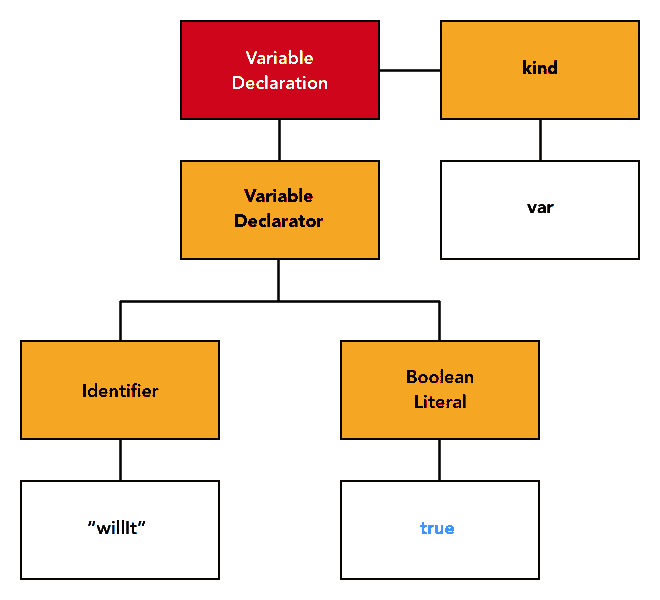
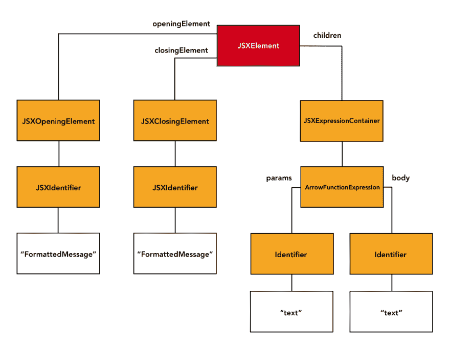

# AST 选择器规则

> 原文：<https://dev.to/mlennox/ast-selectors-rule-286i>

我的上一篇关于抽象语法树的文章对语法树以及如何操作它们做了一个快速但相对宽泛的概述。

第二篇文章将向您展示如何使用抽象语法树的基础知识，通过添加仅使用 AST 选择器实现的简单 ESlint 规则来实施代码标准，不需要使用 javascript！

## 规则-‘无-限制-语法’

Eslint 提供了一个`no-restricted-syntax`规则，允许您使用 AST 选择器添加简单的规则——这非常类似于 CSS 选择器。

在本文中，我将快速浏览几个例子

*   [强制常量超过变量](#constnotvar)
*   [保证`FormattedMessage`永远不会渲染出`span`T3】](#formattedmessage)

这里提供的例子可以在 github repo[https://github.com/mlennox/abstractsyntaxforfunandprofit](https://github.com/mlennox/abstractsyntaxforfunandprofit)的`AST Selectors`文件夹中找到

AST 选择器是使用 esquery 实现的[。另外，关于选择器](https://github.com/estools/esquery)的 [eslint 文档作为参考是不可或缺的。](https://eslint.org/docs/developer-guide/selectors)

## [t1](#const-not-var)有一张纸条

我将使用前一篇文章中的一个例子——强制使用`const`而不是`var`。eslint 已经内置了一个[优秀的‘无风险’规则](https://eslint.org/docs/rules/no-var#require-let-or-const-instead-of-var-no-var)。这是作为一个 eslint 插件实现的，需要花些功夫去写！

然而，我们可以只使用 AST 选择器来复制`no-var`插件的大部分功能。正如我已经提到的，AST 选择器是基于 CSS 选择器的，如果你以前使用过 CSS，这不会是一个挑战。我将用一种不了解 CSS 选择器的人也能理解的方式来解释规则的构造。

使用下面非常简单的变量声明进行测试，我们将编写一个 AST 选择器，它将在我们的 IDE 中强制执行“no var”规则。

```
var willIt = true; 
```

首先，我们需要提醒自己一个简单的`var`变量声明的 AST 结构。

[](https://res.cloudinary.com/practicaldev/image/fetch/s--7fDfDJxE--/c_limit%2Cf_auto%2Cfl_progressive%2Cq_auto%2Cw_880/https://thepracticaldev.s3.amazonaws.com/i/j9fbjahqwcfg73c7rd5n.png)

首先，让我们试着用英语陈述这个问题

> 将任何种类`var`的`VariableDeclaration`高亮显示为错误

很简单。

### 创建选择器

首先，我们需要知道如何选择变量声明。记住，我们的变量声明的节点类型只是简单的`VariableDeclaration`。我们使用的 AST 选择器是一个节点类型选择器——它就是节点的类型，就像这样

```
VariableDeclaration 
```

接下来，当我们针对*所有*为您代码库中的每个文件选择抽象语法树中的节点时，我们需要将我们的选择细化到仅那些种类`var`的节点。

我们所指的`kind`是`VariableDeclaration`节点的一个属性。

我们可以使用下面的选择器选择所有具有`kind`属性的节点

```
[kind] 
```

为了选择值为`var`的任何`kind`属性，我们像这样扩展选择器

```
[kind='var'] 
```

现在我们有了一个选择器，它将选择值为`var`的所有 `kind`属性，但是我们只想选择具有该属性和值的`VariableDeclaration`节点，所以:

```
VariableDeclaration[kind='var'] 
```

这是我们最后的选择器，但是我们如何将它添加到 eslint 规则列表中呢？

### 添加规则

为了将规则应用到我们的代码库，我们将示例`no-restricted-syntax`规则添加到`.eslintrc.js`配置文件的`rules`部分

```
"rules": {
    "no-restricted-syntax": [
      "error", "VariableDeclaration[kind='var']"
    ],
} 
```

这会在 VS 代码中产生以下错误

[](https://res.cloudinary.com/practicaldev/image/fetch/s--G7-yTgN3--/c_limit%2Cf_auto%2Cfl_progressive%2Cq_auto%2Cw_880/https://thepracticaldev.s3.amazonaws.com/i/om6gj1zt7o4unfhfavjd.png)

我想你会同意`Using 'VariableDeclaration[kind='var'] is not allowed`是一个 ***真的*** 坏的错误信息。

### 自定义错误信息

Eslint 支持针对违反规则的定制消息，所以让我们添加这一点

```
"rules": {
    "no-restricted-syntax": [
      "error",  {
        "selector": "VariableDeclaration[kind='var']",
        "message": "All variables must be declared as 'const', do not use 'var'"
      }
    ],
} 
```

这看起来好多了*和*添加到配置中的结构有一个好处，就是更容易维护您的定制 eslint 规则。

[](https://res.cloudinary.com/practicaldev/image/fetch/s--U61vCSgV--/c_limit%2Cf_auto%2Cfl_progressive%2Cq_auto%2Cw_880/https://thepracticaldev.s3.amazonaws.com/i/8zbfspimejvf1wclakt5.png)

更复杂的例子呢？

## 反应 JSX 国际化—格式信息

如果你使用`react-intl`，你将会熟悉[格式化消息](https://github.com/yahoo/react-intl/wiki/Components#formattedmessage)组件，它有助于在你的应用中本地化消息。

默认情况下，`FormattedMessage`组件将消息包装在一个`span`中。

```
<FormattedMessage id={`someMessageId`} /> // results in : <span>some message text</span> 
```

您可以使用这个结构来避免使用`span`

```
<FormattedMessage id={`someMessageId`}>{text => text}</FormattedMessage> // results in : some message text 
```

我不喜欢在我的布局中添加虚假的 HTML，所以让我们编写一个 eslint 规则来确保这种情况不会发生。像以前一样，我们将用简单的英语陈述我们的问题目标

> 将任何不包含子元素的格式化消息作为错误突出显示

我们在这里做了一个非常合理的假设，任何*孩子都会使用我们要求的一般方法，例如*

```
 :
    :
<FormattedMessage id={`someMessageId`}>
  {labelText => (
    <MyComponent
      label={labelText}
      props={this.props}
      />
  )}
</FormattedMessage> <FormattedMessage id={`anotherMessageId`}>
  {messageText => this.renderSomeStuff(messageText)}
</FormattedMessage>
    :
    : 
```

这使我们不必考虑子组件的类型和格式。

### AST 探险家+ JSX =问题

曾经有用的 [AST 浏览器](https://astexplorer.net/)不处理`JSX`，所以我们需要使用不同的方法来可视化抽象语法树。

#### 带有 jsx 插件的巴别塔解析器

助手文件`showTree.js`包含在 [github repo](https://github.com/mlennox/abstractsyntaxforfunandprofit/tree/master/ASTselectors/FormattedMessage) 中，但是您不能从 repo 根目录运行这个助手函数:

```
cd ASTselectors/FormattedMessage
node showTree.js 
```

这将把文件`basicReact.js`中的无状态 react 组件变成 JSON 抽象语法树。我们可以用它来尝试和想象如何构建一个选择器，只选择没有`{text => text}`子函数的`FormattedMessage`节点。

### 可视化树形结构

文件`basicReact.js`中第二个`FormattedMessage`的简化抽象语法树如下所示。

注意这个结构相对复杂——一个通用的`JSXElement`作为父容器，其属性`openingElement`和`closingElement`包含了`FormattedMessage`标签本身的实例，而`JSXElement`的子容器是一个`JSXEXpressionContainer`，包含了`{text => text}`的匿名箭头函数 AST

```
{
  "type": "JSXElement",
  "openingElement": {
    "type": "JSXOpeningElement",
    "name": {
      "type": "JSXIdentifier",
      "name": "FormattedMessage"
    },
    "attributes": [ /* not important to us */ ],
    "selfClosing": false
  },
  "closingElement": {
    "type": "JSXClosingElement",
    "name": {
      "type": "JSXIdentifier",
      "name": "FormattedMessage"
    }
  },
  "children": [{
    "type": "JSXExpressionContainer",
    "expression": {
      "type": "ArrowFunctionExpression",
      "params": [{
        "type": "Identifier",
        "name": "text"
      }],
      "body": {
        "type": "Identifier",
        "name": "text"
      }
    }
  }]
} 
```

像往常一样，简化的抽象语法树的图形表示更清楚地显示了层次结构。

[](https://res.cloudinary.com/practicaldev/image/fetch/s--m8NPXKQc--/c_limit%2Cf_auto%2Cfl_progressive%2Cq_auto%2Cw_880/https://thepracticaldev.s3.amazonaws.com/i/9ixzbmw8wnjdc8wis59n.png)

在构建我们的选择器时，我们不会使用正确构造的`FormattedMessage` AST 作为参考，我提供它作为参考，以确保我们不会构造一个*也会*选择一个正确构造的`FormattedMessage`的选择器。

现在让我们将它与自动关闭的`FormattedMessage`进行比较。JSON AST 的简化版本如下所示

```
{
  "type": "JSXElement",
  "openingElement": {
    "type": "JSXOpeningElement",
    "name": {
      "type": "JSXIdentifier",
      "name": "FormattedMessage"
    },
    "attributes": [ /* not important to us... */ ],
    "selfClosing": true
  },
  "closingElement": null,
  "children": []
} 
```

#### 构造选择器-方法 1 : JSXElement 没有子元素

参考 JSON AST，我们可以看到父元素`JSXElement`没有可以在此基础上选择的子元素

```
{
  "type": "JSXElement",
  "children": []
} 
```

选择器非常简单，我们想要选择属性为空的`JSXElement`。

```
JSXElement[children=''] 
```

这里需要注意的是，`children`属性有点混乱，因为它引用的子属性是`openingElement` / `closingElement`的子属性。关于 AST 选择器，`openingElement`和`closingElement`本身是父`JSXElement`的直接后代(是的，子代——因此产生了混淆)。有了这些信息，我们知道可以使用后代选择器来选择`JSXOpeningElement`

```
JSXElement[children=''] JSXOpeningElement 
```

这个还是太具体了。我们仍然选择许多元素，我们只想选择具有空的`children`属性的`JSXElement`中的`FormattedMessage`元素。

再次需要一些解释。就 AST 选择器而言，抽象语法树中`JSXOpeningElement`的直接后代不是父`JSXElement`的`children`属性中引用的组件，而是`JSXOpeningElement`的`name`属性中引用的`JSXIdentifier`。

因为`JSXOpeningElement`的`name`属性不是一个简单的字符串，所以不可能使用属性选择器，因为它们只允许简单的匹配规则。例如，下面的例子，或类似的变化，将不会工作

```
// bad! does not work!
JSXOpeningElement[name='JSXIdentifier.name=FormattedMessage'] 
```

就 AST 选择器而言，name 属性元素是一个后代元素，可以使用与 all important string `FormattedMessage`匹配的属性选择器和一个后代选择器来选择。

```
JSXElement[children=''] JSXOpeningElement JSXIdentifier[name='FormattedMessage'] 
```

这将选择代码库中的自结束`FormattedString`组件，并忽略那些包装组件的组件。成功！

但是等等，还有更简单的。

选择器不会因使用`JSXOpeningElement`而获得任何特异性。我们已经知道父组件`JSXElement`表示没有子组件，所以我们不需要担心我们的选择器会选择`JSXClosingElement`，因为它不在那里。我们可以通过删除对`JSXOpeningElement`的引用来简化选择器。

```
JSXElement[children=''] JSXIdentifier[name='FormattedMessage'] 
```

我们的最后一条规则，在 eslint 配置中

```
"error", {
  "selector": "JSXElement[children=''] JSXIdentifier[name='FormattedMessage']",
  "message": "Please use {text => text} function as child of FormattedMessage to avoid spurious span"
} 
```

#### 构造选择器-方法 2 : JSXOpeningElement 是自关闭的

我们可以采用一种不同的方法，只针对开始元素本身进行选择，而不需要引用具有空`children`属性的父元素`JSXElement`。看看`JSXOpeningElement`的 JSON AST。

```
{
  "type": "JSXOpeningElement",
  "name": {
    "type": "JSXIdentifier",
    "name": "FormattedMessage"
  },
  "attributes": [ /* not important to us */ ],
  "selfClosing": true
}, 
```

这里重要的属性是`selfClosing`，如果它是`true`，就像这里一样，这意味着没有结束标签，因此没有子组件。

我们现在可以直接选择自关闭的`JSXOpeningElement`，而不是选择父`JSXElement`。

```
JSXOpeningElement[selfClosing=true] 
```

我们已经知道如何通过结合使用后代选择器和属性选择器来过滤我们选择的组件到一个`FormattedMessage`。

```
JSXOpeningElement[selfClosing=true] JSXIdentifier[name='FormattedMessage'] 
```

最终的 eslint 配置应该是

```
"error", {
  "selector": "JSXOpeningElement[selfClosing=true] JSXIdentifier[name='FormattedMessage']",
  "message": "Please use {text => text} function as child of FormattedMessage to avoid spurious span"
} 
```

## 结论

AST 选择器在提供添加新 ESlint 规则的简单方法方面非常有用，并且它们还利用了您可能拥有的任何现有 CSS 选择器知识。然而，它们也受到 CSS 选择器的限制，对于相对简单的选择来说，它们很快变得很麻烦。基于兄弟节点的子节点的属性内容来选择节点是常见的，但是使用 AST 选择器来实现并不简单；虽然有一个相邻和后代选择器，但没有*前一个*选择器。

本系列的下一篇文章将着眼于编写更加灵活和有用的*"适当的"* ESlint 插件。