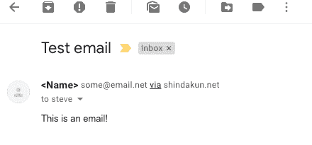

# 尝试学习围棋-现在发送休息请求

> 原文：<https://dev.to/shindakun/attempting-to-learn-go---now-sending-rest-requests-akp>

# 忘记了得，还是发帖吧

到目前为止，我们已经看了几个关于如何从远程 REST API 请求数据的小例子。然而，这一次，我们将探索如何向远程端点提交数据。你可能会使用像 [@bgadrian](https://dev.to/bgadrian/comment/73o2) 提到的 [`go-swagger`](goswagger.io) 这样的东西来完成所有这些，并且可能会在生产环境中使用。出于学习的目的，我们将通过使用标准库或我编写的使用标准库的小软件包来解决我们所能解决的问题。

这次我们将看看如何使用 MailGun API 发送电子邮件。我选择 MailGun 是因为它相对简单，并且有很好的文档记录，而且我碰巧已经有了一个账户。如果你打算跟随，你[应该注册](https://signup.mailgun.com/new/signup)。

* * *

## GOPATH

但是首先！我希望永远不要进入 GOPATH，因为根据你运行的操作系统，它可能会有点奇怪。考虑到这一点，我将在 [wiki](https://github.com/golang/go/wiki/SettingGOPATH) 中涵盖大部分细节，并尽可能少地触及。在很大程度上，我假设如果你正在阅读这篇文章，你可能已经安装了 Go 并准备好了。我试图把这个项目放在一起有点不同，因为我想开始把一些可重用的包放在一起，我们希望在未来的帖子中可以借鉴。考虑到这一点，我们将编写一个非常简单的“只发送”邮件客户端。我的第一步是在我的目录`github.com/shindakun`中的 GOPATH(对我来说是`/Users/steve/Code/go`)中创建一个目录。也许我应该把它直接放在`ATLG`回购中，因为它无论如何都会在那里结束...或者将其转换为 Go 模块...我想我以后会担心的，让我们来做这些目录吧。

```
mkdir $GOTPATH/github.com/shindakun/mailgunner
mkdir $GOTPATH/github.com/shindakun/mailgunner/client 
```

我将首先介绍“客户机”的代码。请记住，我们试图尽可能多地使用标准库——这就是为什么我们没有为 Go 导入现有的 MailGun 客户端。在我们的客户端目录中创建一个`main.go`文件，并开始设置我们的包。

*先不说这个——我推荐使用 [VSCode](https://code.visualstudio.com/) 和`ms-vscode.go`插件...或者不用——使用你觉得合适的编辑器。*

```
package  client  import  (  "net/http"  "net/url"  "strings"  ) 
```

对于客户端来说，不会有太多的移动部件，所以我们只需要一些导入。`strings`和`net/url`将帮助我们准备好添加到请求中的数据，`net/http`将负责把 HTTP 请求放在一起。

进口的方式，有一对夫妇的方式，我可以看到做下一部分。但是，我认为这里介绍的这个最有意义——至少在我看来是这样。首先，我们为`MgClient`声明一个结构，这个结构将保存 API URL、我们的 API 令牌和 [`http.Client`](https://golang.org/pkg/net/http/#Client) 。

将接受 API URL 和令牌并返回我们的结构。这种设置允许我们在多个项目中使用不同的 MailGun 帐户，我们可以根据需要传递它。

```
type  MgClient  struct  {  MgAPIURL  string  MgAPIKey  string  Client  *http.Client  }  func  NewMgClient(apiurl,  apikey  string)  MgClient  {  return  MgClient{  apiurl,  apikey,  http.DefaultClient,  }  } 
```

接下来的`FormatEmailRequest()`是客户端软件包真正的大提升。这是`MgClient`的一个方法，所以它通过来自`NewMgClient()`的返回返回给调用者——我们稍后再看。这里发生了一些不同的事情，所以我把函数分成了两半来涵盖每一个(完整的代码清单将在 GitHub 的下面或上面)。`data`对象使用`url.Values{}`允许我们将键值对放在一起，最终形成表单提交。当我们调用这个函数时，我们传递了所有的变量值。

```
func  (mgc  *MgClient)  FormatEmailRequest(from,  to,  subject,  body  string)  (r  *http.Request,  err  error)  {  data  :=  url.Values{}  data.Add("from",  from)  data.Add("to",  to)  data.Add("subject",  subject)  data.Add("text",  body) 
```

由于我们的电子邮件详细信息已经过时，我们需要构建我们的 HTTP 请求。这与我们之前所做的类似。但是，请注意，我们使用的是`http.MethodPost`而不是`http.MethodGet`。此外，我们正在使用`strings.NewReader()`创建一个`io.Reader`，我们将`data.Encode()`传递给它。`.Encode()`简单地说 [URL 对](https://golang.org/pkg/net/url/#Values.Encode)我们的键值对进行编码，所以我们将得到类似于`to=emailaddress&from=someotheraddress`等等的东西。然后我们设置[基本授权头](https://developer.mozilla.org/en-US/docs/Web/HTTP/Authentication)和[内容类型头](https://developer.mozilla.org/en-US/docs/Web/HTTP/Headers/Content-Type)。这种情况下的格式不是 JSON，而是 URLencoded 格式。

```
 r,  err  =  http.NewRequest(http.MethodPost,  mgc.MgAPIURL+"/messages",  strings.NewReader(data.Encode()))  if  err  !=  nil  {  return  nil,  err  }  r.SetBasicAuth("api",  mgc.MgAPIKey)  r.Header.Add("Content-Type",  "application/x-www-form-urlencoded")  return  r,  nil  } 
```

“客户”包就是这样！简单吧？在以后的文章中，我会在添加一两个测试的地方试着回到这段代码。你可以看到，我已经开始考虑这个问题了，如果出现问题，确保我们从`FormatEmailRequest()`返回一个错误。这里的想法是，我们希望在包中出错，但是将它传递出去，这样无论是谁使用这个包，都可以按照他们选择的方式来处理它。

* * *

## 邮枪手

现在，我们将返回到我们的主`mailgunner`目录，并创建一个新的`main.go`文件。我们的导入非常干净，只包括来自标准库的`fmt`和`io/ioutil`，加上我们新的`client`包和另外一个。我在我的 [Slackbot 帖子](https://dev.to/shindakun/a-simple-slack-bot-in-go---the-bot-4olg)中简单提到了 [`envy`](https://github.com/shindakun/envy) 包，它是一个非常小的模块，只是简单地获取一个环境变量或返回一个错误。使用 ENV 变量是一种很好的方式来[将 API 键排除在 Git repos 之外](https://12factor.net/config)。“ENVy”的代码可以很容易地包含进来(毕竟只有 5 行代码)，但我认为这样可以让一切更整洁一些。相反，重写它成为它自己的包。下面你可以看到`envy.Get()`被用来从`MGKEY`环境变量中获取 MailGun API 密匙。

```
package  main  import  (  "fmt"  "io/ioutil"  "github.com/shindakun/envy"  "github.com/shindakun/mailgunner/client"  )  func  main()  {  mgKey,  err  :=  envy.Get("MGKEY")  if  err  !=  nil  {  panic(err)  } 
```

随着基本设置的完成，我们将进入更好的内容。首先，我们将创建一个新的`MgClient{}`并将它存储在`mgc`中。然后我们用我们的测试信息呼叫`mgc.FormatEmailRequest()`。如果您愿意，您也可以将 API URL 从代码中移到 ENV 变量或`const`中。

```
 mgc  :=  client.NewMgClient("https://api.mailgun.net/v3/youremaildomain.com",  mgKey)  req,  err  :=  mgc.FormatEmailRequest("<Name> some@email.domain",  "other@email.domain",  "Test email",  "This is a test email!")  if  err  !=  nil  {  panic(err)  } 
```

从现在开始，大部分代码将类似于我们前面的例子。我们用`mgc.Client.Do()`发出实际请求，从`res.Body`中读出`[]byte`数据，最后转换成字符串并打印。

```
 res,  err  :=  mgc.Client.Do(req)  if  err  !=  nil  {  panic(err)  }  defer  res.Body.Close()  body,  err  :=  ioutil.ReadAll(res.Body)  if  err  !=  nil  {  panic(err)  }  fmt.Println(string(body))  } 
```

当该说的都说了，该做的都做了，我们的输出应该是这样的。

```
$ MGKEY=key-key go run main.go
{
  "id": "<20181206152053.2.AEFB08ACDA47726E@youremaildomain.com>",
  "message": "Queued. Thank you."
} 
```

[](https://res.cloudinary.com/practicaldev/image/fetch/s--dZD5nTgH--/c_limit%2Cf_auto%2Cfl_progressive%2Cq_auto%2Cw_880/https://thepracticaldev.s3.amazonaws.com/i/lv2w3pry0jl2u3uloqqd.png)

## 下次

我们正越来越接近用我们已经布局好的部分做点什么——不是很接近，但是很接近了。接下来，我们将修改我们的 API“getter”[代码，从一个远程端点下拉一个用户列表。一旦我们有了用户，它应该是一个很短的旅程，让代码在适当的位置发送给每个人一封电子邮件。](https://dev.to/shindakun/attempting-to-learn-go---continuing-rest-adventures-2l4l)

* * *

你可以在 GitHub 上的 repo 中找到这个和大多数其他试图学习围棋的帖子的代码。

##  [【新达昆】](https://github.com/shindakun) / [ atlg](https://github.com/shindakun/atlg)

### 我在 dev.to 上发布的“尝试学习围棋”帖子的来源报告

<article class="markdown-body entry-content p-5" itemprop="text">

# 尝试学习围棋

在这里你可以找到我为尝试学习围棋而写的代码，这些代码是我在 [Dev.to](https://dev.to/shindakun) 上写的。

## 帖子索引

| 邮政 | 密码 |
| --- | --- |
| [制作下载器第 01 部分](https://dev.to/shindakun/attempting-to-learn-go---building-a-downloader-part-01-44gl) | - |
| [制作下载器第 02 部分](https://dev.to/shindakun/attempting-to-learn-go---building-a-downloader-part-02-2k7i) | - |
| [制作下载器第 03 部分](https://dev.to/shindakun/attempting-to-learn-go---building-a-downloader-part-03-2214) | - |
| [制作下载器第 4 部分](https://dev.to/shindakun/attempting-to-learn-go---building-a-downloader-part-04-3ln9) | - |
| [制作下载器第 05 部分](https://dev.to/shindakun/attempting-to-learn-go---building-a-downloader-part-05-44o) | - |
| [使用 REST API](https://dev.to/shindakun/attempting-to-learn-go---consuming-a-rest-api-5c7g) | [src](https://raw.githubusercontent.com/shindakun/atlg/master//go-api-01/main.go) |
| [继续休息冒险](https://dev.to/shindakun/attempting-to-learn-go---continuing-rest-adventures-2l4l) | [src](https://raw.githubusercontent.com/shindakun/atlg/master//go-api-02/main.go) |
| [现在发送休息请求](https://dev.to/shindakun/attempting-to-learn-go---now-sending-rest-requests-akp) | [src](https://raw.githubusercontent.com/shindakun/atlg/master//go-api-03/main.go) |
| [REST API 和模板上的位](https://dev.to/shindakun/attempting-to-learn-go---rest-api-and-a-bit-on-templates-4kca) | [src](https://raw.githubusercontent.com/shindakun/atlg/master//go-api-04/main.go) |
| [再次通过 API 发送电子邮件](https://dev.to/shindakun/attempting-to-learn-go---sending-email-via-api-again-2e4e) | [src](https://raw.githubusercontent.com/shindakun/atlg/master//go-api-05/main.go) |
| [让我们模块化吧！](https://dev.to/shindakun/attempting-to-learn-go---lets-get-modular-390i) | [src](https://github.com/shindakun/mailgunner) |
| [让我们再一次模块化！](https://dev.to/shindakun/attempting-to-learn-go---lets-get-modular---again-10cd) | [src](https://github.com/shindakun/mailgunner) |
| [构建开发日志第 1 部分](https://dev.to/shindakun/attempting-to-learn-go---building-dev-log-part-01-1c3m) | [src](https://raw.githubusercontent.com/shindakun/atlg/master//go-devsite-01/main.go) |
| [构建开发日志第 2 部分](https://dev.to/shindakun/attempting-to-learn-go---building-dev-log-part-02-179c) | [src](https://raw.githubusercontent.com/shindakun/atlg/master//go-devsite-02/main.go) |
| [构建开发日志第 3 部分](https://dev.to/shindakun/attempting-to-learn-go---building-dev-log-part-03-7lk) | [src](https://raw.githubusercontent.com/shindakun/atlg/master//go-devsite-03/main.go) |
| [构建开发日志第 4 部分](https://dev.to/shindakun/attempting-to-learn-go---building-dev-log-part-04-2bok) | [src](https://raw.githubusercontent.com/shindakun/atlg/master//go-devsite-04/main.go) |
| [构建开发日志第 5 部分](https://dev.to/shindakun/attempting-to-learn-go---building-dev-log-part-05-4mo1) | [src](https://raw.githubusercontent.com/shindakun/atlg/master//go-devsite-05/main.go) |
| [按扩展名 01 列出文件](https://dev.to/shindakun/attempting-to-learn-go---listing-files-by-extension-1n10) | [src](https://raw.githubusercontent.com/shindakun/atlg/master//go-sort-01/main.go) |
| [按扩展名 02 列出文件](https://dev.to/shindakun/attempting-to-learn-go---sorting-and-moving-files-by-extension-227j) | [src](https://raw.githubusercontent.com/shindakun/atlg/master//go-sort-01/main.go) |
| [开发至 API 01](https://dev.to/shindakun/interacting-with-the-devto-article-api-4g34) | [src](https://raw.githubusercontent.com/shindakun/atlg/master//go-devtoapi-01/main.go) |
| [开发至 API 02](https://dev.to/shindakun/interacting-with-the-devto-article-api---again-sort-of-2o8g) | 参见上面的代码 |

</article>

[View on GitHub](https://github.com/shindakun/atlg)

* * *

| 喜欢这篇文章吗？ |
| --- |
| 给我买杯咖啡怎么样？ |

* * *