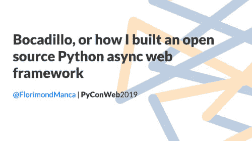
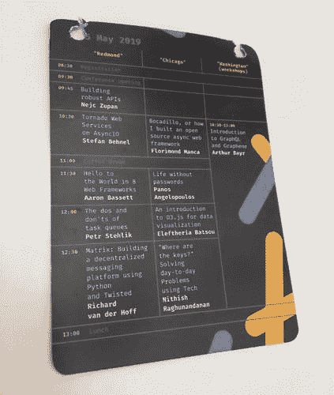
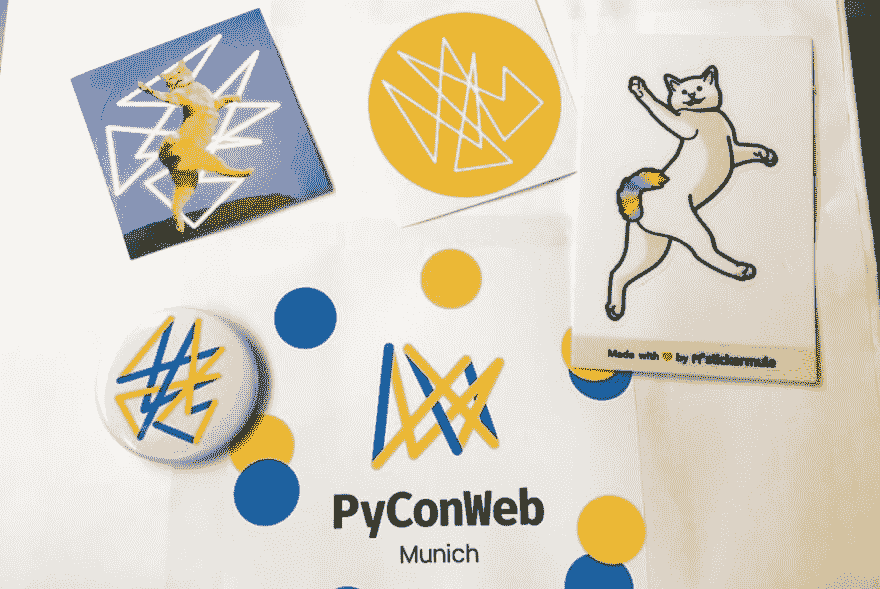

# 参加科技会议:初学者指南

> 原文：<https://dev.to/florimondmanca/attending-tech-conferences-a-beginner-s-guide-45hp>

PyConWeb 是一个专注于 Python、Web 开发和相关技术的会议。2019 年版于 5 月 25 日和 26 日在慕尼黑举行，我也在场！🙌

参加这次会议对我来说非常特别。这是我第一次参加科技会议，也是 T2 第一次做科技演讲！

我做的演讲是关于 Bocadillo、web 开发的异步 Python 和开源，持续了 30 分钟。这是一个很好的机会来解释 ASGI 背后的概念，强调 Bocadillo 的一些关键特性，并分享我对维护开源项目的了解。全部以 10 个问题长的*“Q&A with my "*的形式。如果你感兴趣，这些幻灯片可以在 GitHub 的[网站上找到。✨](https://github.com/florimondmanca/talks/blob/master/2019_05_25-bocadillo_pyconweb2019.pdf)

<figure>

<figcaption>Title slide!</figcaption>

</figure>

在这篇文章中，我想与你分享我参加科技会议的心得，如果你打算亲自参加的话，给你一些**可行的建议**！

## 基础知识

### 什么是科技大会？

**会议**是对某一特定主题感兴趣的专业人士和爱好者聚集在一起学习、培训和分享关于该主题的想法的活动。

有许多不同类型的观众，如研究人员，商人，工程师等会议。有许多不同的活动，但最常见的是讲座和 T2 研讨会。

即使在科技会议中，也有大量的话题存在。会议通常围绕技术(编程语言、框架等)或领域(前端开发、安全等)来组织。).比如 PyConWeb 就是“一个关于 Python 中 Web 工具的会议”。

### 我为什么要参加？

参加科技会议的原因可能和参加会议的人数一样多。所以我的回答是**这取决于你**！

你是想**了解某个特定话题的**，参与**社交**(即结识新朋友)**找工作**，还是仅仅**享受美好时光**？

不过大多数时候，我会说是这些的组合**。**

就我个人而言，我去 PyConWeb 首先是因为我要在那里做一个演讲(这本身就是一个很好的理由，对吧？)，还因为我喜欢 Python 和 web 开发，我很好奇这个主题的会议会是什么样子。老实说，我真的不知道该期待什么，但最终我学到了很多东西，并结识了很多新的友好的人。

### 参加会议需要成为专家吗？

**绝对不行！**

让我重申一下，因为我认为这是非常重要的一点:**每个人都属于会议！**

没有“有资格”或“没有资格”参加会议的说法。每个人都受欢迎，无论他们的技术水平或领域知识如何。毕竟，你是来学习的！

我在 PyConWeb 2019 上遇到了一些人，他们开始接触 Python 和/或 Web 开发，或者正在过渡到 Python 和/或 web 开发，还有一些更具体领域的专家。

人们使参加会议变得如此有趣，所以加入并成为它的一部分吧！

### 如何找到会议？

起初，你应该在哪里寻找即将到来的事件可能并不明显。

找到它们的一个简单方法是简单地问一个搜索引擎。例如，搜索“python 会议”会产生关于我周围的会议的结果(例如 PyConFR)，还会产生列出这些会议的网站，例如[python.org](https://python.org/community/workshops)、[pycon.org](https://pycon.org)或 [confs.tech](https://confs.tech/python) 。

Twitter 也是一个了解即将到来的会议的好方法。只需搜索“conf ”,你就会找到大量的官方会议账户！

### 决定参加的会议

既然有很多可能的会议你可以参加，你应该选择哪一个？

我认为以下标准足以帮助你做出决定:

*   主题:这可能是显而易见的，但是选择一个你会感兴趣的会议。
*   **地点**:一开始，在你住的地方附近找一个会议可能是最好的，但你也可能想趁机去另一个城市或国家旅行。
*   规模/受欢迎程度:小型和大型会议各有利弊。中小型会议(如 PyConWeb)感觉更像家庭聚会，而大型会议显然倾向于吸引非常臭名昭著的演讲者和闪亮的赞助商，但可能更难驾驭。
*   价格:有些会议比其他会议更昂贵，尽管这并不一定反映活动的质量。
*   **日期**:同样，这可能是显而易见的，但要确保你能参加。如果你不是，不用担心——一年中的任何时候都会有会议！

你可能还想看看评价，以及人们对之前版本的评价。

现在是时候深入了解更多关于**在会议**之前、期间和之后应该做什么的具体提示了！

## 发布会前

### 取票

所以你已经选择了一个会议，而且你很兴奋要去——很好！现在是时候**拿你的票**了。

的确，一般会议中的**都不是免费的**。据我所知，门票价格从 60-70 欧元的小型会议到几百欧元的大型活动不等。

组织一次会议实际上会有很多成本，包括支付场地、后勤或安全费用。然而，许多会议都有赞助商，这有助于他们降低价格。

如果你自己负担不起这个价格，调查一下**你的雇主是否能帮助**可能是个好主意，比如通过每年的自学预算。

如果你是一名学生，许多会议都有特别的学生票，通常比较便宜。

在 PyConWeb，我花了大约 45 欧元，这是一张 90 欧元的学生票，有 50%的演讲者折扣。入场券是全包的:会谈、研讨会、食物和饮料。然而，并非所有的会议都是如此。特别是，一些会议可能会对研讨会收取额外费用。

### 物流

根据地点的不同，你可能需要预订**住宿和交通**，所有这些都是有价格的。

PyConWeb 发生在慕尼黑，所以我不得不从巴黎出发，预定了一个住宿的地方。这意味着大约 200 欧元的交通费用(火车和地铁费用)和大约 150 欧元的住宿费用。

通常有许多可能的选择，我建议花时间**比较价格**。

最好在会议前一周搞清楚后勤**，这样你就能尽可能放松地到达会议现场，准备好享受你的时间。**

### 准备

尽管你不是在演讲，但在我看来，参加会议需要做一些准备，以便从中获得最大收益。

在会议的前几天，浏览一下讲座和研讨会的列表是个好主意，看看哪些是你想参加的。

在会议的前一天，PyConWeb 团队已经设置了一个**移动网络应用**，上面列有日程安排、演讲者简介和实用信息。我可以喜欢那里的演讲，了解其他演讲者的背景。不是所有的会议都提供应用程序，但如果有，我强烈推荐使用它！

PyConWeb 团队也有一个讨论聊天。如果你参加的会议也有一个，那就加入并打个招呼吧！这是一个自我介绍的好方法，看看还有谁会在那里。

## 会议期间

既然你已经到了会场，你应该做什么？让我们仔细看看！

### 会谈

毫无疑问，会谈是任何会议的亮点。演讲者来自世界各地，谈论他们的经历，分享想法，并确保观众享受他们的时间。会议组织者选择尽可能多样化和有趣的 T2 讲座。

<figure>

<figcaption>Printed schedule for the morning of May 25th at PyConWeb 2019.</figcaption>

</figure>

尽管如此，参加所有的会谈通常是不可能的。

大多数会议都有一个以上的讲座，这意味着两个或两个以上的讲座同时进行。因此，你必须决定你想参加哪个讲座。

一些会议**会录制演讲**并在会后在网上发布——如果是这样的话，你可以更自由地决定观看哪些演讲。

那么，**你应该优先考虑哪些会谈？**

我认为你应该主要参加关于你不知道的的**话题，或者你知道的以原创方式**呈现的**话题的讲座。毕竟，你最有可能在这里学习，对不对？**

而且，这可能是反直觉的，我认为你应该至少去听一个你认为不会让你感兴趣的演讲。你可能会对你的发现感到惊讶，并会帮助填补一个本来可能是空的房间(这可能是演讲者最害怕的)。

在演讲过程中，我强烈建议你**记下你可能想问的关键点或问题**。就我个人而言，它帮助我更好地记住关键的学习点。如果你这样做，最好使用**笔和纸**而不是你的笔记本电脑，因为这对演讲者和其他与会者来说都不太打扰。

如果谈话结果有点无聊，**不要分神**开始浏览你的手机。这会让说话者感到沮丧，让他们更不自在，让每个人的体验变得更糟。相反，把它当成一个观察是什么让谈话变得无聊的机会。

谈完后，你可以(应该？如果你喜欢这个演讲，就向演讲者伸出手，告诉他们你为什么觉得这个演讲有趣。演讲者总是乐于接受反馈和他们可以改进的方法！显然，你也可以问他们任何不清楚的问题或者你想了解更多的信息。

在走廊上，你也可以**和其他与会者讨论你刚刚看过的演讲**，或者询问那些参加过其他演讲的人对它的看法。

### 其他活动

虽然会谈是大多数会议的主要活动，但还有许多其他活动在进行。

其中一项活动是**研讨会**。它们通常比讲座(2 到 3 个小时)更长，并且包含关于工具或技术的实践环节。

例如，我决定参加 Ben Parsons 举办的关于使用 [Matrix](https://matrix.org) 进行实时异步消息传递的研讨会，我非常喜欢！

PyCon events 组织的另一项活动是**闪电对话**。它们由每个人都可以做的 5 分钟的简短演讲组成，而且参加起来非常有趣。

大厅里可能还会有**赞助商展位**。去打个招呼可能是个好主意，例如，如果你对职业机会感兴趣或者只是想得到一些**赞助商的赠品**(贴纸、书签等)。

最后，请务必参加**会议开幕式**和**会议通知**。他们绝对没有看起来那么无聊(里面的烂段子！)，组织者可能会宣布有趣的特别比赛或活动，你可以参加。例如，PyConWeb 正在进行一场自拍比赛，以及一场为会议吉祥物猫的名字而举行的公开头脑风暴会议(猫最终被选为`CharField`！).

<figure>

<figcaption>PyConWeb 2019 swag, featuring CharField himself. 🐈</figcaption>

</figure>

### 社交媒体

如果你对社交媒体感兴趣，会议是帖子和推文灵感的不可思议的来源。事实上，在会议期间，人们通常比平时更活跃，所以不要害羞！

在我的演讲过程中，一些与会者发了微博——我把我的推特账号放在了每张幻灯片的页脚——这很好，因为这可能意味着他们认为**这个演讲值得分享**。我也发了很多别人的言论！

顺便说一句，拿出你的手机，拍一张照片，发表一些关于这次谈话的东西，这肯定是没问题的。但是一定要以不妨碍其他与会者享受演讲的方式进行。尽量快一点，否则你可能会走神，错过一些有趣的内容。为了完全避免这种情况，你也可以拍张照片，然后在演讲结束后写下这篇文章。

### 联网

参加会议是一个极好的机会去认识和联系新朋友。事实上，这可能是许多与会者的主要动机。我对自己在 PyConWeb 上结识的新朋友印象深刻！

认识新朋友变得非常容易:

1.  找出一个你还不认识的人或一群人。
2.  打招呼，说出你的名字，握手。
3.  搭讪！

我认为这甚至更容易，因为我是一个人来参加会议的。我知道如果我和其他人一起来，我会倾向于和我的团队或同事在一起。

一旦你进去了，记得鼓励**吃豆人形状**。换句话说，留下一个小缺口打开，而不是形成一个封闭的圆圈。这表明人们正在寻找一个群体，他们是**欢迎加入**。

如果你不确定要谈什么，实际上有许多可能的话题。例如，你可以问其他人:

*   他们来参加会议的动机是什么。
*   它们与会议主题的关系。在 PyConWeb，我喜欢问别人他们使用什么 Web 框架，或者他们使用 Python 做什么，以及他们是如何进入这个领域的。
*   他们从哪里来，打算呆多久。
*   他们过去参加过哪些会议或活动。
*   …

不胜枚举！只是听听，听听答案。还有，准备好自己回答那些问题！

会议的另一个好处是，许多会议都是国际性的。我显然遇到了来自慕尼黑或德国的与会者，但也有来自加拿大、葡萄牙、英国、新加坡、印度和斯洛文尼亚的人！

请注意，如果你是本地人，但会议是国际性的，谈话和走廊闲聊的语言可能是英语。

最后一点，要知道**网络和社交会让人精疲力尽**，尤其是如果你像我一样，有点内向的话。

事实上，你不应该觉得有义务不断地与人交谈。没事的**休息一下**，独自坐在某个地方，**给自己充电**。

每个人都有自己的极限，所以记得**照顾好自己**让会议成为一次难忘的经历。

### 行为

很多会议都有一个**行为准则**，这是一个简短的文件，规定了人们在会议期间应该如何表现。

PyConWeb 行为准则只有几页长，但是 TL；大会开幕时给我们的博士学位是:

> 我们都是成年人。善待他人，并期待同样的回报。

毕竟，会议是一项专业活动，这意味着你应该表现得像个专业人士。

这并不意味着它必须是*正式的*——你完全可以与演讲者和其他与会者进行**非正式而有趣的讨论**。周六晚上的派对就是一个很好的例子！

但在这样做的同时，一定要保持尊重、开放和包容。

## 发布会后

当正式项目结束时，仍然有许多方法可以让您的会议体验继续下去。

首先，对组织者和工作人员说声谢谢！他们努力组织会议，确保一切顺利进行。当你甚至无法注意到他们在会议之前或会议期间所做的工作时，你知道他们成功地做到了。所以，向他们伸出手，说声谢谢！

比如:你喜欢谈话的选择吗？时间表管理得好吗？你喜欢额外的活动吗？告诉他们！你可以通过多种方式做到这一点:面对面、在社交媒体上、在聊天中等等。

你可以做的另一件事是**联系你在会议期间遇到的人**。感谢他们的讨论，提出下次见面，并跟进你们的谈话。做这件事的最佳时机是在最后一轮会谈之后。

如果你们已经交换了联系信息(Twitter、LinkedIn、电话、电子邮件……)，你也可以在大家回家后**保持联系**。

除了扩展人际网络，你还可以自己做一些事情。

例如，尝试**将你在会议**中学到的一两件事应用到实际项目中。如果有，记得和说话的人分享！

例如，我创建了 [fetch-metadata-asgi](https://github.com/florimondmanca/fetch-metadata-asgi) ，这是一个 PoC ASGI 中间件，用于即将到来的 fetch 元数据规范。这是[对 Lukas Weichselbaum 关于新的网络安全特性的演讲的跟进](https://twitter.com/florimondmanca/status/1132565224450592768?s=12)。

最后，花时间**反思你的经历**绝对是个好主意。如果你有一个博客，你可以写一篇博文并与与会者和组织者分享。来自 PyConWeb 2019 的示例:

*   这篇博文！
*   [为演讲而来，为莱佛士而留](https://jugmac00.github.io/blog/pyconweb-2019/)jürgen Gmach——精彩的摘要，包含演讲幻灯片和源代码的链接。
*   [PyConWeb 2019](https://www.operun.de/blog/pyconweb-2019) 作者杰西·斯蒂佩尔。

## 包装完毕

PyConWeb 2019 对我来说充满了第一次:第一次在德国和慕尼黑，第一次参加技术会议，第一次在会议上发表演讲！

我真的很喜欢。这让我考虑更多地参与公开演讲，参加更多的会议——尤其是来自 Python 社区的会议。我刚刚得知 [PyConFR 2019 已经确定](https://twitter.com/pyconfr/status/1133004539018268672)在 10 月举行，所以那可能是我的下一站！

我将在下一篇博客文章中写下我在 PyConWeb 演讲的经历，格式类似:*“在技术会议上演讲:初学者指南”*。敬请关注，同时你可以在 GitHub 上观看我的演讲[的幻灯片。](https://github.com/florimondmanca/talks/blob/master/2019_05_25-bocadillo_pyconweb2019.pdf)