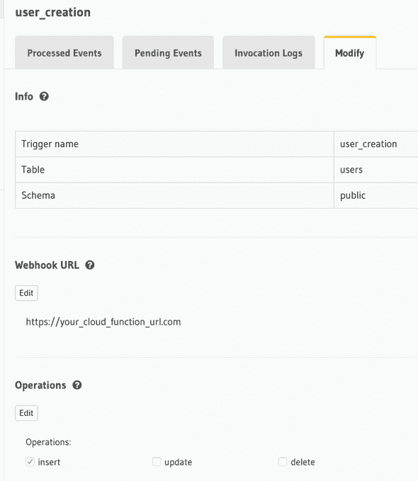
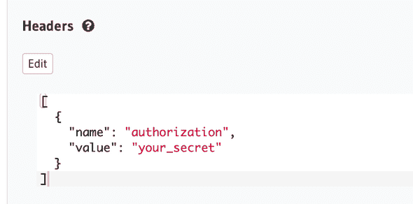

# 基于 Firebase 的 Hasura GraphQL 引擎认证——我的思考

> 原文：<https://dev.to/apvarun/auth-for-hasura-graphql-engine-with-firebase-my-thoughts-1bmk>

对于大多数用例来说，Hasura 的 GraphQL 引擎本身就是一个嵌入式后端。它为您提供了使用 GraphQL 作为前端接口来设置全功能后端的灵活性。它充当 Postgres 数据库和您的前端应用程序(web 或移动)之间的一层。

身份验证是完全不同的一类问题，这在任何类型的应用程序中都很常见。Hasura 已经有了关于如何让他们的平台与 Auth0 或 Firebase 认证服务协同工作的文档。🔥

当我开始的时候，一切似乎都很完美。我选择 firebase 是因为他们的认证服务没有基于用户数量的定价(至少在我写这篇文章的时候)。随着应用程序的扩展，这肯定会节省几个美元。

所以我继续实施。

* * *

## 出现了问题

但是我遇到了一个问题。根据文档，我必须使用 firebase 客户端 SDK 创建帐户。这对我来说很糟糕，因为我必须为我的用例创建批量帐户。

另一个问题是，如果我继续使用客户端 API 创建帐户，我还必须将相同的细节(除了密码)传递给我的数据存储(GraphQL 引擎)。这真的很不直观，也不能确保信息在两个位置都存在。

* * *

## 我是怎么寻址的？

**T.L.D.R** :事件触发器+云函数

GraphQL 引擎还支持事件触发器，可以设置这些触发器来调用基于 DB 操作的 web 钩子。通过 GraphQL 端点对表进行的任何插入、更新或删除操作都会触发与之相关的事件。

我能够设置可以在插入事件中调用的云函数，云函数托管在 firebase 函数上。云函数的端点被提供给事件触发器，然后当事件被触发时，它发出一个 POST 调用。

#### 创建用户样云功能

```
const functions = require("firebase-functions"),
  admin = require("firebase-admin"),
  express = require("express"),
  cors = require("cors"),
  bodyParser = require("body-parser"),
  generator = require("generate-password"),
  env = require("./envfile");

const app = express();
app.use(cors({ origin: true }));
app.use(bodyParser.urlencoded({ extended: false }));
admin.initializeApp(functions.config().firebase);

app.post("/", (req, res) => {

  // Check for POST request
  if (req.method !== "POST") {
    res.status(400).send("Request not supported");
    return;
  }

  // Destructure POST params
  let { email, accountrole, id } = req.body.event.data.new,
    headers = req.headers;

  // Custom header for API call authorization
  if (headers.authorization !== env.authKey) {
    res.status(404).send("Unkonwn error");
    return;
  }

  // Generate account password
  const password = generator.generate({
    length: 12,
    numbers: true
  });

  admin
    .auth()
    .createUser({
      email: email,
      emailVerified: false,
      password,
      uid: String(id)
    })
    .then(userRecord => {
      // See the UserRecord reference doc for the contents of userRecord
      console.log("Successfully created new user foe email ", email);

      // Send them an email with initial password or a password reset link
      // SendEmail(...)

      // Custom claims for validation by the GraphQL engine
      const customClaims = {
        "https://hasura.io/jwt/claims": {
          "x-hasura-default-role": accountrole,
          "x-hasura-allowed-roles": ["admin", "user"],
          "x-hasura-user-id": id
        },
        authorized: false // custom parameter that can be updated later
      };

      // Assign custom claims
      return admin
        .auth()
        .setCustomUserClaims(userRecord.uid, customClaims)
        .then(() => {
          console.log("Custom claims set for " + email);
        })
        .catch(console.log);
    })
    .catch(error => {
      console.log("Error creating new user:", error);
    });
});

exports.user = functions.https.onRequest(app); 
```

当用户填写注册表单时，会触发一个变异将数据插入到用户表中。这将使用事件触发器将相同的信息发布到云函数。

[](///static/d6625d32ba0791a2d1433636c37230ce/e986a/event_trigger.png)

该触发器仅在用户表中有新的插入时运行。

请注意，由于我们在 cloud 函数中检查了头部，您还需要在头部中传递秘密令牌，如下所示。

[](///static/ea32ed7c10eb9478ea436cbd764c1dd1/ba6f7/event_authorization.png)

因此，一旦注册完成，将在 firebase auth 中创建一个用户(使用电子邮件和生成的密码)。

为了登录，我们可以使用 firebase auth 脚本并直接从 UI 进行身份验证。

## 有什么成就

> 注册过程可以包括多个元信息以及用户名/电子邮件。(密码由该过程自动生成)。

如果我们使用用户的 SDK 将用户直接注册到 firebase，我们至少需要发送两个并行的 API 调用来将用户信息保存在我们的数据库中。这是一种简化的方式，因此用户数据的存储不会出现不一致。

> 现在，您将能够批量创建帐户，因为每次插入表时都会触发事件触发器。该过程变得完全由事件驱动。

* * *

希望这对那些试图解决同样问题的人有所帮助。如果有任何疑问或建议，我很乐意在 [twitter](https://twitter.com/intent/tweet?url=https%3A%2F%2Fapvarun.com%2Ffirebase-graphql-engine-auth/&&text=@apvarun%20&original_referer=) 上收到您的来信。