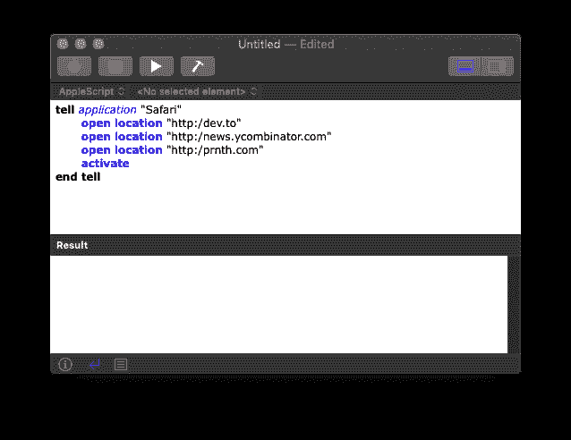
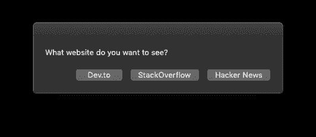

# 使用 Applescript 轻松实现自动化

> 原文：<https://dev.to/prnthh/automate-anything-easily-with-applescript-2oao>

如果你发现自己经常做一系列的动作，从长远来看，写一个脚本来做这些动作可能会节省很多时间。AppleScript 可让您自动化 Mac 上的任何操作，从文件 I/O 到交互式提示和在 web 浏览器中填充。它甚至可以自动给你回复信息！

与常规编程语言不同，它与 OSX 的深度集成让您可以创建丰富的 GUI 和复杂的操作，这需要付出更多的努力才能实现更通用的语言，如 Python。

最近我写了一个脚本，它以我的 git 分支为名，自动构建 iOS 和 Android 变体，并在完成后在 Slack 上向我发送通知。否则这将涉及大量的人工工作，因为构建是在两个独立的 Jenkins web 仪表板上开始的。这是我通常一天做几次的事情，多亏了这个脚本，我可能累计节省了几分钟。😄

若要开始编写脚本，请在 Mac 上打开脚本编辑器。

[](https://res.cloudinary.com/practicaldev/image/fetch/s--uoTn4Vyz--/c_limit%2Cf_auto%2Cfl_progressive%2Cq_auto%2Cw_880/https://thepracticaldev.s3.amazonaws.com/i/kr9teugxh5m19goj9qyw.png)

在许多情况下，您只需按下“录制”按钮并执行一次操作序列，就可以生成 AppleScript。脚本编辑器会在您执行每个操作时为其生成代码。

* * *

[](https://res.cloudinary.com/practicaldev/image/fetch/s--_51VXm0U--/c_limit%2Cf_auto%2Cfl_progressive%2Cq_auto%2Cw_880/https://thepracticaldev.s3.amazonaws.com/i/djxs23aicm33uuzt63za.png)

AppleScript 不能正常工作的情况之一是在与网页上的内容进行交互时。为此，我喜欢直接在页面上执行 Javascript，我认为这是比检测 GUI 中的元素更强大的方法。

* * *

下面的代码片段定义了一个名为 clickClassName 的函数，该函数单击页面上的选定元素，在本例中是第三个按钮。

```
to clickClassName(theClassName, elementnum)
  tell application "Safari"
    do JavaScript "document.getElementsByClassName('" & theClassName & "')[" & elementnum & "].click();" in document 1
  end tell
end clickClassName

clickClassName("button", 3) 
```

* * *

## 用户输入

您可以在您的脚本中接受用户输入，并且您会得到这些漂亮的对话框，带有各种输入类型选项。这有助于在运行脚本时选择选项。
[](https://res.cloudinary.com/practicaldev/image/fetch/s--5hoH1j8A--/c_limit%2Cf_auto%2Cfl_progressive%2Cq_auto%2Cw_880/https://thepracticaldev.s3.amazonaws.com/i/zviv41j6zm3f5gy0llrg.png)T4】

```
display dialog 
    "What website do you want to see?" buttons {"Dev.to", "StackOverflow", "Hacker News"}
set theSite to button returned of result
display dialog theSite 
```

## 持久数据

属性会在两次启动之间保存，并可用于记住您上次的输入。

```
property variable : 0
display dialog variable
set variable to 100 
```

第一次运行时将显示 0，第二次运行时将显示 100。

* * *

支持自动化的应用程序数量惊人。前往“文件”>“打开字典”以查看支持 AppleScript 控制的已安装应用程序列表，以及有关支持的命令的文稿。

最后，您需要将它保存为应用程序，这样它就不会在您每次尝试运行它时打开脚本编辑器。进入文件>导出>设置文件格式为“应用程序”>保存。

[](https://res.cloudinary.com/practicaldev/image/fetch/s--4Uhb2fwy--/c_limit%2Cf_auto%2Cfl_progressive%2Cq_auto%2Cw_880/https://thepracticaldev.s3.amazonaws.com/i/n2aq0ggatysr0zslgxbr.png)

* * *

最好的脚本是你为自己写的，但这里有一些有用的脚本可以帮助你开始:
[https://www . computer world . com/article/2524645/10-applescripts-to-make-you-love-you-MAC-even-more-。html](https://www.computerworld.com/article/2524645/10-applescripts-to-make-you-love-your-mac--even-more-.html)
[https://www . smashingmagazine . com/2009/05/MAC-hacks-17-applescripts-to-make-your-life-easy/](https://www.smashingmagazine.com/2009/05/mac-hacks-17-applescripts-to-make-your-life-easier/)
[https://drago86.wixsite.com/scripting/scripts](https://drago86.wixsite.com/scripting/scripts)