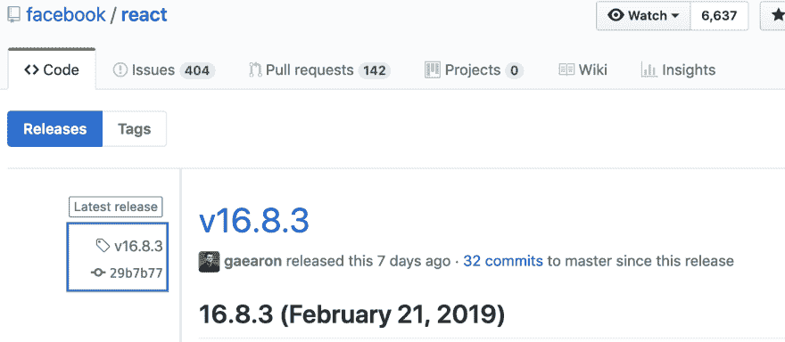

# 自动化 NPM 版本控制

> 原文：<https://dev.to/gulshansaini/automate-npm-versioning-29k5>

如果您已经在使用 [npm cli](https://docs.npmjs.com/cli/version.html) 来管理包/产品版本，那么这篇文章可能不适合您。

* * *

使用 npm cli 来维护软件包版本似乎非常明显，但实际上完全不同。我见过手工处理版本控制的项目。

* * *

## 什么是版本？

当我们发布一个包时，我们需要对它进行版本化。一个版本的版本控制也可以与术语标签交换。

当我们创建一个版本时，我们实际上是将一个 git 提交 id 指向人类可读的字母数字字符串。在下面的例子中，我们可以看到`v16.8.3`是如何链接到提交 id `29b7b77`的

[](https://res.cloudinary.com/practicaldev/image/fetch/s--IeQjGfHw--/c_limit%2Cf_auto%2Cfl_progressive%2Cq_auto%2Cw_880/https://thepracticaldev.s3.amazonaws.com/i/gmuqogkaihicxp6991ih.png)

## 什么是语义版？

释放可能属于以下任何类别

*   **主要版本**:不向后兼容的变更
*   **次要版本**:向后兼容新特性
*   **补丁发布**:没有新特性的 Bug 修复发布

例如，如果当前软件包版本是 1.0.0

*   补丁发布版本将是 1.0.1
*   次要版本是 1.1.0
*   而且，主要发布版本将是 2.0.0

现在，您可以手动更新 package.json 中的版本，并在当前提交 id **上创建新的标记，但是**这不是我们想要的。我们希望在这个过程中有一些自动化。

**咱们，动手吧！！**

## 用 npm cli 自动化语义版本？

为了演示自动化过程，我将快速创建一个新包，并在我的本地驱动器上初始化存储库

```
mkdir semver && cd $_ && npm init -y && git init 
```

Enter fullscreen mode Exit fullscreen mode

**接下来**，让我们用单个`console.log`语句创建一个 javascript 文件，来可视化 git 日志中的变化

```
echo "console.log(\`index file -> v1.0.0\`)" > index.js 
```

Enter fullscreen mode Exit fullscreen mode

此外，让我们将更改提交到本地存储库

```
git add .
git commit -m "initial commit" 
```

Enter fullscreen mode Exit fullscreen mode

如果我们打开 package.json 我们可以看到，现在版本设置为 1.0.0

```
{
  "name": "semver",
  "version": "1.0.0",
   // skipped rest of lines
} 
```

Enter fullscreen mode Exit fullscreen mode

* * *

### 让我们从创建补丁发布开始

为了更加真实，让我们将`console.log`语句改为打印`index file -> v1.0.1`

打开你最喜欢的编辑器并进行修改——最后,`index.js`文件的内容应该是

```
console.log(`index file -> v1.0.1`) 
```

Enter fullscreen mode Exit fullscreen mode

此外，不要忘记提交您的更改。

```
git add .
git commit -m "fixed issue with console statement" 
```

Enter fullscreen mode Exit fullscreen mode

要创建补丁发布，我们只需要在终端
中输入`npm version patch`

```
npm version patch
v1.0.1 
```

Enter fullscreen mode Exit fullscreen mode

就是这样——NPM 自动更新了 package.json 并创建了新的标签`v1.0.1`。

为了验证，在编辑器中打开 package.json，您应该会看到新版本

```
{
  "name": "semver",
  "version": "1.0.1",
   // skipped rest of lines
} 
```

Enter fullscreen mode Exit fullscreen mode

**类似地**，为了验证一个新的标签`v1.0.1`是否被创建，我们可以在终端
中键入`git tag`

```
git tag

//output
v1.0.1 
```

Enter fullscreen mode Exit fullscreen mode

那多酷啊！！！

* * *

### 现在，让我们创建次要版本

同样，在 index.js 中做一些向后兼容的更改，并提交这些更改

```
// contents of index.js after changes
console.log(`index file -> v1.1.0`)

// commit changes
git add .
git commit -m "updated minor version in logs" 
```

Enter fullscreen mode Exit fullscreen mode

为了制作次要版本，我们只需修改命令的最后一部分，如下所示

```
npm version minor

//output
v1.1.0 
```

Enter fullscreen mode Exit fullscreen mode

酷！！！您可以再次验证 package.json 中的更新版本和使用`git tag`命令创建的新标签

* * *

### 最后，让我们创建主要版本

让我们用下面的内容替换 index.js 的内容，并提交更改

```
// contents of index.js after changes
console.log(`Hello`, process.env.USER)

// commit changes
git add .
git commit -m "replaced console message with new one" 
```

Enter fullscreen mode Exit fullscreen mode

为了升级主要版本，我们更新最后一个命令如下

```
npm version major

// we should see below output
v2.0.0 
```

Enter fullscreen mode Exit fullscreen mode

* * *

最后，如果我们在终端上运行`git tag`命令，我们应该会看到我们在
上面创建的所有标签

```
git tag

// output
v1.0.1
v1.1.0
v2.0.0 
```

Enter fullscreen mode Exit fullscreen mode

* * *

您可以在终端中键入`npm version --help`来查看所有可用选项，或者在官方页面 [npm cli](https://docs.npmjs.com/cli/version.html) 上进一步阅读

我希望你喜欢这篇文章！！