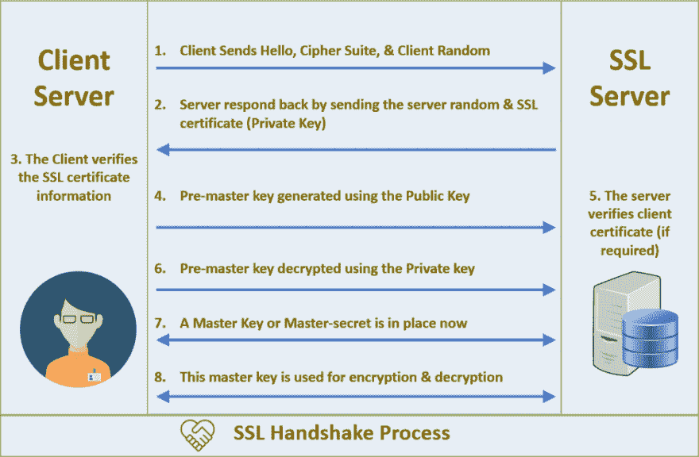

# 我们内部应用的自动化 SSL

> 原文：<https://dev.to/vinayhegde1990/automated-ssl-on-our-internal-applications-51hn>

*本文原帖 [**Bizongo 工程**](https://hustle.bizongo.in/automated-ssl-for-our-internal-applications-8bcf2ffc8d4a)T5】*

* * *

如果您来自软件工程行业，我相信您一定知道安全套接字层(SSL)作为任何应用程序的额外安全层有多重要，尤其是当您处理用户身份验证、秘密令牌和支付等敏感信息时。

由于我们 Bizongo 像所有电子商务公司一样每天都要处理如此重要的信息，因此很明显，所有应用程序都应该尽可能安全地进行通信。这就是 SSL 进入场景的地方，如下图所示，或者作为交互式网络应用 **[这里](https://tls.ulfheim.net/)** 。

[](https://res.cloudinary.com/practicaldev/image/fetch/s--D2CnKdsi--/c_limit%2Cf_auto%2Cfl_progressive%2Cq_auto%2Cw_880/https://cheapsslsecurity.com/blog/wp-content/uploads/2017/10/ssl-tls-handshake-process-1024x670.png)

虽然我们面向公众的店面、后端 API 拥有它(*以及精心策划的防火墙规则*)，但我们的内部应用程序在这方面落后了。因此，我们开始探索可能的解决方案，以发现 [**LetsEncrypt**](https://letsencrypt.org/docs/faq/) ，一个免费的认证机构，可用于生成浏览器信任的完全兼容的证书。

[](https://res.cloudinary.com/practicaldev/image/fetch/s--jsnO3LOt--/c_limit%2Cf_auto%2Cfl_progressive%2Cq_auto%2Cw_880/https://i.imgflip.com/1cvwdb.jpg)

### **我们的处境如何？**

您一定认为获得一个 LetsEncrypt SSL 就足够了，但是还有更多。这是由于我们的一些特殊要求，如下所列:

1.  我们跨几个域的内部环境都是 2 级通配符，即:`*.qaX.domain.com`其中 x 是 1，2，3…n。传统的通配符 SSL 不包括这些，因为它们只处理 1 级，例如:`*.domain.com` — [引用 1](https://community.letsencrypt.org/t/allow-multiple-level-wildcard-certificates/67242) 和[引用 2](https://community.letsencrypt.org/t/multi-level-subdomain-for-the-wildcard-certificate/57319)
2.  我们不想最终在所有服务器上安装一堆软件，使维护、升级和调试变得繁琐，同时变得非常不可扩展。
3.  SSL 证书可在有限的时间内获得 *(LetsEncrypt 的有效期为* [**90 天**](https://letsencrypt.org/2015/11/09/why-90-days.html) )，因此需要定期更新。我们希望自动化这一点，以方便我们的整个工程团队避免由于过期而产生的任何潜在问题。
4.  像 *nginx* 这样的所有相关服务都应该重新加载，以无缝地反映更新后的 SSL。
5.  最后，我们的解决方案还应该有电子邮件/ Slack 通知，以便更好地观察。

### **解:**

在深入研究之前，请注意谷歌搜索将展示大量详细介绍如何设置 **LetsEncrypt** 以安装和自动化 SSL 续订的文章。然而，他们中的大多数只覆盖了*裸*域和/或 *www* 而不是*通配符*，因此无法帮助我们解决这个问题。所以，我们想自己写一个，让有类似用例的人受益。

说够了，让我们开始吧！

为了涵盖以上所有要点，我们开始使用托管我们所有基础设施的 AWS API 在**组合中创建一个 Shell 脚本。由于 LetsEncrypt 坚持高合规性，任何人为一个域生成或更新 SSL 的人也应该能够证明其所有权。这可以通过 [**方法**](https://letsencrypt.org/how-it-works/) 实现，如 **HTTPS** 通过独立网络服务器验证，或者 **DNS** 通过发布临时解析 TXT 记录验证。**

 **我们发现后者很简单，因为它没有向外界公开我们内部环境的端口 443，也不需要额外的开销来列出 LetsEncrypt 的 IP 地址。由于 DNS 记录是临时需要的，因此可以在每次续订后创建和删除它们。

下面是记录的样子:

```
_acme-challenge.qa1.domain1.com 300 IN TXT “<random-hash-value-1>”
_acme-challenge.qa2.domain2.com 300 IN TXT “<random-hash-value-2>”
....
...
..
.
_acme-challenge.qaX.domainX.com 300 IN TXT “<random-hash-value-X>” 
```

Enter fullscreen mode Exit fullscreen mode

考虑到这一点，在继续实现剩余的逻辑之前，我们的脚本的初始迭代在目标服务器上检查了 LetsEncrypt 包，即: *certbot* 。这是它变得棘手的地方，因为 Certbot 依赖于 Python 库，要么是 2.7 版，要么是 3.4+版，带有 [**sudo 特权**](https://certbot.eff.org/docs/install.html) 。对于门外汉来说，摆弄这些可能会破坏 Unix 系统的许多部分(像 **apt** *，* **yum** *包管理器*)。

所以我们发现了这个 [**实用程序**](https://github.com/Neilpang/acme.sh) ，它是一个 Shell 脚本，作为一个 [**ACME**](https://en.wikipedia.org/wiki/Automated_Certificate_Management_Environment) 协议客户端，用于生成或更新 SSL 证书。然后，我们决定在单个主机上运行我们的脚本(*而不是所有的*)，将它们转移到必要的服务器，用 Slack 状态消息重新加载任何相关的服务。

这是我们最终定制脚本逻辑的样子:

1.  对我们的内部域进行`openssl`调用，以检查现有的 SSL 证书并获取其日期。
2.  检查今天的日期是否与上述日期相差 7 天，然后执行脚本的剩余部分，否则退出。
3.  如果执行，生成所有前面提到的通配符 SSL 并`rsync`到我们内部服务器上具有正确权限的目标文件夹。
4.  进行配置测试，如果上述成功，只重新加载`nginx`**。**
***   使用`curl`触发一个松弛的网络挂钩，并向配置的通道发送一个适当的信息。**

 **### **结果如何？**

我们了解了 LetsEncrypt 如何提供额外的安全层，并利用它作为一个完全预定的自动化解决方案来保护我们的内部环境，从而为我们省去手动证书管理的麻烦。我们的内部应用程序还通过加密通道进行通信，这在当今数据窥探、网络钓鱼和数字盗窃的时代是一项至关重要的保护措施。

* * *

虽然我们相信这篇文章将帮助您部署类似的解决方案，使您的基础设施更加安全，但您是否有任何其他想法或最佳实践来改进这一点？欢迎在下面的评论中分享。****