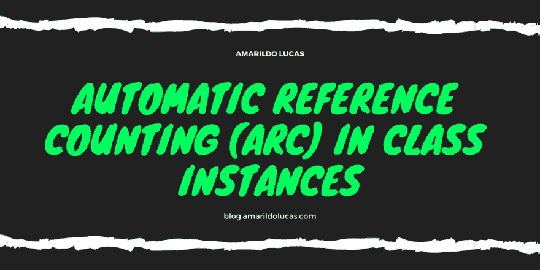

# 类实例中的自动引用计数(ARC)

> 原文：<https://dev.to/amarildo/automatic-reference-counting-arc-in-class-instances-13a9>

## 电弧概论

[](https://res.cloudinary.com/practicaldev/image/fetch/s--nwe-JWCd--/c_limit%2Cf_auto%2Cfl_progressive%2Cq_auto%2Cw_880/https://thepracticaldev.s3.amazonaws.com/i/mtohx0ju0k471p4myywx.png)

在 Swift 语言中，内存管理是开箱即用的，你甚至不需要自己考虑。

在这篇文章中，我将分享关于 ARC 的基本知识。ARC 就是管用！当你的类实例不再需要的时候，它会释放你的类实例所使用的内存。

**按苹果的话:**

> 每次创建一个类的新实例时，ARC 都会分配一块内存来存储关于实例的信息。另外，当不再需要某个实例时，ARC 会释放该实例使用的内存，以便该内存可以用于其他目的。

## 我们来练习吧！！！

让我们看看这是如何与我们以前的音乐应用程序的想法例子。

你有一个`class`叫做`Artist`。我们现在将玩一会儿代码。

```
class Artist {
    let name: String

    init(name: String) {
        self.name = name
        print("Artist \(name) is being initialized")
    }

    deinit {
        print("Artist \(name) is being deinitialized")
    }
} 
```

Enter fullscreen mode Exit fullscreen mode

我们现在将创建一个`Artist`实例，并将其分配给一些变量。

```
var artist1: Artist?
var artist2: Artist?
var artist3: Artist?

artist1 = Artist(name: "Taylor Swift")

artist2 = artist1
artist3 = artist1

artist1 = nil
artist2 = nil 
```

Enter fullscreen mode Exit fullscreen mode

因为`artist3`中的实例不是`nil`，`Artist`实例，所以它永远不会被释放。您可以通过查看控制台结果中打印的`"Artist \(name) is being deinitialized"`的编号来检查这一点。这是因为现在有一个来自`artist1`的对新`Artist`实例的强引用。第三个`strong reference`从未被释放，因此，它的实例被破坏。所以您需要将该行改为`artist3 = nil`，以便修复最后一个强引用。

现在让我们学习一下除了`strong`、`weak`和`unowned`之外的新引用，通过理解为什么有时一个类的实例永远不会到达它有零个`strong references`的点，这就是所谓的`strong reference cycle`。

在这里，我们将`class` es 之间的一些关系定义为`weak`或`unowned`，而不是`strong references`。

## 关于弱小的一个实际例子。

我们有一个叫 T1 的 T0，另一个叫 T2。

```
class Artist {
    let name: String
    var label: Label?

    init(name: String) {
        self.name = name
        print("Artist \(name) is being initialized")
    }

    deinit {
        print("Artist \(name) is being deinitialized")
    }
} 
```

Enter fullscreen mode Exit fullscreen mode

第二个`class`叫`Label`。

```
class Label {
    let name: String
    weak var artist: Artist?

    init(name: String) {
        self.name = name
        print("Label \(name) is being initialized")
    }

    deinit {
        print("Label \(name) is being deinitialized")
    }
} 
```

Enter fullscreen mode Exit fullscreen mode

让我们玩一些`initialization`。下面是结果！

```
var artist: Artist?
var label: Label?

artist = Artist(name: "Taylor Swift")
label = Label(name: "Sonic Music")

artist!.label = label
label!.artist = artist

artist = nil
label = nil 
```

Enter fullscreen mode Exit fullscreen mode

正如你所看到的，当我们将 nil 传递给两个变量时，`strong reference`没有降到零，实例也没有被释放。既不调用`deinitializer`,也不在控制台中打印任何内容。这可能会导致内存泄漏和您的应用程序出现其他问题。当人们使用`UITableView`委托方法的实例或者试图捕获`Clocure`内部的值时，我看到这种情况经常发生。我们将在以后的文章中详细介绍这些主题。

那么，我们如何打破这一点？

## 弱弱弱！

在这种情况下，因为我们可以有不带`Label`的`Artist`或不带`Artist`的`Label`，所以可以使用`weak`引用。因为在这个上下文中`Label`的寿命可以比`Artist`先结束，所以我们使用`weak references`。

> 当另一个实例的生命周期较短时，也就是说，当另一个实例可以首先被释放时，我们使用`weak references`。

在前面的例子中，我们只需要通过在`Artist`声明前添加`weak reference`来改变我们的类。

```
weak var artist: Artist? 
```

Enter fullscreen mode Exit fullscreen mode

`Artist`实例仍然有一个`strong reference`到`Label`实例，但是`Label`实例现在有一个`weak reference`到`Artist`实例。

现在，如果我们在测试中添加了`artist = nil`，我们将会看到控制台和实例被释放的不同结果。**尝试自己一点点！**

## 那么什么时候使用`unowned reference`呢？！

当另一个实例具有相同或更长的生存期时，我们使用它。

在下面的快速示例中，您可以看到两个`class`e 并理解它们的关系。一个`Artist`可以有零个或多个`Album`，但是一个`Album`不能没有一个`Artist`。

```
class Artist {
    let name: String
    var album: Album?

    init(name: String) {
        self.name = name
        print("Artist \(name) is being initialized")
    }

    deinit {
        print("Artist \(name) is being deinitialized")
    }
} 
```

Enter fullscreen mode Exit fullscreen mode

```
class Album {
    let title: String
    unowned let artist: Artist

    init(title: String, artist: Artist) {
        self.title = title
        self.artist = artist
        print("Album \(title), Artist \(artist.name) is being initialized")
    }

    deinit {
        print("Album \(title) is being deinitialized")
    }
} 
```

Enter fullscreen mode Exit fullscreen mode

这是使用`unowned reference`的一个很好的场景。因为一个`Album`总是有一个`Artist`，所以我们在定义的属性中使用`unowned reference`来避免`strong reference cycle`。你可以用
更新`Album`类

```
unowned let artist: Artist 
```

Enter fullscreen mode Exit fullscreen mode

查看一些结果，请尝试不同的输入来测试不同的输出，以便更好地理解。

**总是检查`deinitializer`是否被调用。**T3】

```
var artist: Artist?
var album: Album?

artist = Artist(name: "Taylor Swift")
artist!.album = Album(title: "Fearless", artist: artist!)

artist = nil 
```

Enter fullscreen mode Exit fullscreen mode

**就这样。**

## 资源

虽然互联网上有很多关于 ARC 的信息，但我主要使用了苹果 Swift Book，它非常清晰和完整。

*   [https://docs.swift.org/swift-book/](https://docs.swift.org/swift-book/)

我希望你喜欢这篇文章，如果是的话，请关注我，因为更多的内容将会很快出现。我将在接下来的文章中写更多关于内存管理的内容。

还考虑在 **[Twitter](http://twitter.com/amarildulucas)** 上关注我？😬**@ amaridulucas**

请注意:英语不是我的母语，所以请随时给我发送任何关于打字错误或任何事情的反馈。