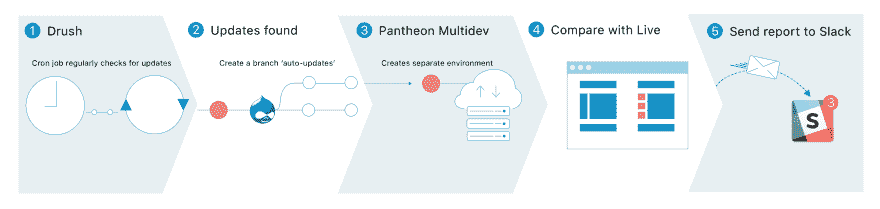

# 使用 Pantheon multidev 自动检查 Drupal 的更新

> 原文：<https://dev.to/ygerasimov/automating-checking-your-drupals-updates-with-pantheon-multidev-16o>

Drupal 更新可能非常不同。其中一些-简单的补丁，你只是推出和忘记。其中一些-破坏你的网站。棘手的是，你永远不知道更新在你的网站上会有什么样的表现，除非你真的尝试过。

这就是为什么很难给客户估计需要多长时间的原因。他们通常不喜欢根据一些随机事实回答 1 到 20 个小时。

就这样，更新的推出被一拖再拖。然后，半年或一年后，我们肯定会发现网站在更新后会崩溃。现在英雄时代开始了。

如果网站不仅会告诉你它需要更新，而且会告诉你它在推出后是否会崩溃，那该多好。

如今，多亏了 Pantheon 的 multidev，在技术上可以自动检查你的更新在网站上的表现。

主要思想是定期检查更新(使用 drush 命令)，然后如果发现更新，创建一个单独的环境，并在那里滚动更新。之后，为了确保他们没有破坏网站(至少在视觉上)，我们可以运行一些视觉回归测试。因此，对于“推出更新需要付出多少努力”，我们有了更可预测的答案。

这是一篇关于如何设置的完整教程文章[。](http://docs.diffy.website/tutorials/put-your-sites-updates-on-autopilot-with-pantheon-multidev-and-visual-testing)

当然，修复较小的更新要比修复多年延迟后的重大突破容易得多。