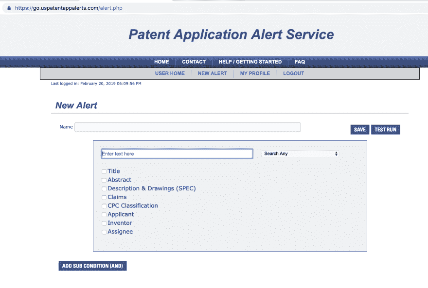
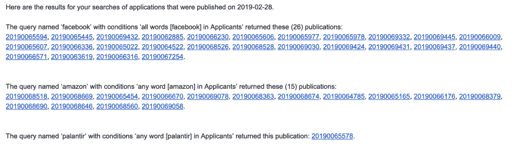
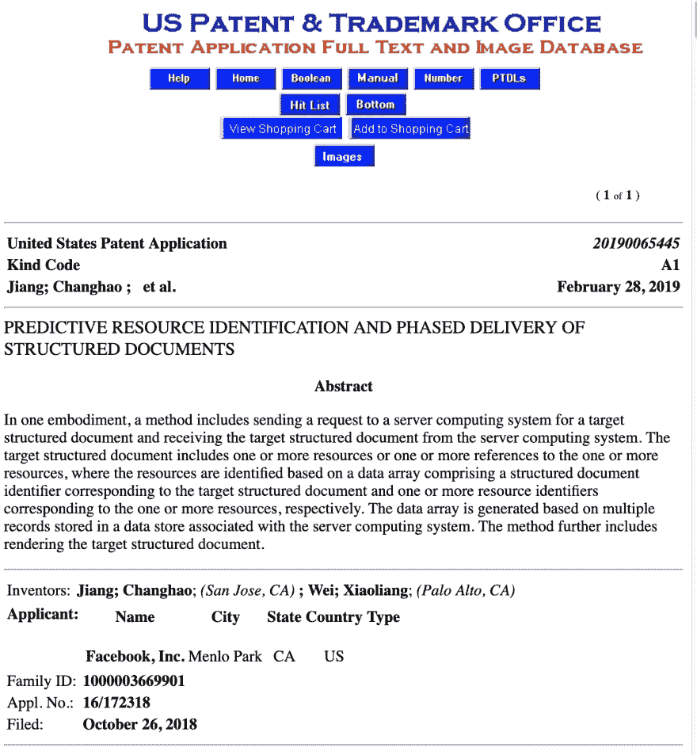
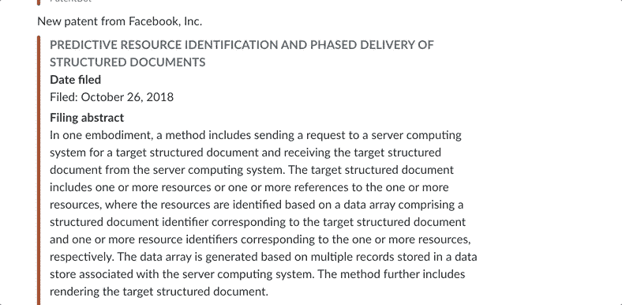

# 向 Slack 自动发送美国专利申请警报

> 原文：<https://dev.to/logan/automating-delivery-of-us-patent-application-alerts-to-slack-3don>

最近，我迷上了美国专利申请。具体来说，我对大型科技公司的专利申请感兴趣。当我在一篇关于面部识别软件的文章中看到微软的一些专利申请时，我开始阅读专利。考虑到主题的含义，我发现专利语言枯燥和法律化的本质很吸引人。所以我在谷歌上搜索“我如何发现发布了哪些专利申请”，我发现了一个很棒的软件:美国专利商标局的[专利申请提醒服务](https://www.uspatentappalerts.com/)。现在，每周我都会坐下来喝杯咖啡，通读专利申请。

在这篇文章中，我们将介绍我为什么这样做，USPTO 服务做什么，公众可以使用什么专利数据库，以及我做了什么来使我的团队更容易获得专利申请。

## 什么是专利申请，为什么重要？

### 专利申请的新闻价值

当专利申请向公众发布时，它们通常会成为新闻报道。以下是我在研究过程中发现的一些例子:

1.  [“苹果专利暗示 AR 耳机将与你的 iPhone 配合使用”](https://www.cnet.com/news/apple-patent-hints-at-ar-headset-thatll-work-with-your-iphone/)
2.  [“苹果公司的一份专利申请揭示了可折叠 iPhone 可能的样子”](https://www.businessinsider.com/apple-patent-filing-reveals-possible-design-for-foldable-iphone-2019-2)
3.  [“亚马逊申请了一项技术专利，可以将你的身份和工作联系起来”](https://www.buzzfeednews.com/article/daveyalba/amazon-filed-facial-recognition-patent-application)
4.  [“脸书在盯着拼车”](https://money.cnn.com/2016/01/28/technology/facebook-ridesharing/index.html)
5.  [“优步欲申请人工智能识别醉酒乘客的专利”](https://money.cnn.com/2018/06/07/technology/uber-patent-identify-drunks/index.html)
6.  [“Palantir 的新专利罕见地揭示了其数据方法”](https://www.cbinsights.com/research/palantir-patents-data-mining/)
7.  [“谷歌、亚马逊专利申请披露数字家庭助手隐私问题”](https://www.consumerwatchdog.org/sites/default/files/2017-12/Digital%20Assistants%20and%20Privacy.pdf)

如你所见，专利申请包含了对公众有用的信息，揭示了公司认为值得保护的创新。

### 专利申请的重要性提醒

为了让你相信专利申请*提醒*的重要性，我需要稍微谈谈专利申请是如何工作的。当像脸书这样的公司或个人认为他们发明了一种新的“工艺”或“机器”时，他们可以申请专利来阻止另一个实体在未经他们同意的情况下制造、使用或销售他们的发明。为了获得专利，企业被迫做出权衡。虽然他们可以通过保护他们的想法来赚钱，但他们也必须在申请专利时向公众公开他们的想法。

根据法律，专利申请必须在提交后 18 个月内公开。然而，很少有例外。首先，有一种叫做“临时”专利申请的东西。临时专利申请允许申请人建立一个早期的申请日期，但 USPTO 不会将其公开或决定是否授予专利，除非申请人在一年内提交常规的非临时专利申请。如果申请人没有申请非临时专利，临时申请永远不会公开。

还有两个更罕见的未公开申请和已发布专利的例子。首先，有那些在外国专利保护下申请的。第二，USPTO 可能决定一项发明对国家安全有影响。撇开那些例子不谈，一般来说，美国专利申请提交后，会由 USPTO 公布给公众查看(不管它是否已经被授权)。

### USPTO 数据库

所以，你可能会认为这意味着专利申请提醒服务(PAAS)会在专利被授予之前对每个非外国、非临时和非国家安全相关的专利申请发出提醒，但这并不完全正确。来自应用程序数据库的应用程序将向 PAAS 发出警报。然而，在某些情况下，专利可能会在 18 个月的公布截止日期之前获得批准。

有两个主要的公共数据库用于全文搜索与专利相关的信息:AppFT 和 PatFT，它们包含专利申请和已批准专利的信息。

因此，在 AppFT 中发布并编入索引的*申请最终会被批准，而那些申请可能永远不会被批准。然而，所有的*专利*都被公布并编入 PatFT(除了那些涉及国家安全的)。因此，那些在授权之前发布然后最终授权的申请在两个数据库中都是实时的。*

现在，您已经有了足够的背景知识来评估通过*应用程序*警报服务发出的警报意味着什么:

1.  这并不意味着申请被批准(也可能永远不会被批准)
2.  你错过了那些在被授权前没有被公布的专利，这些专利只存在于 PatFT 中
3.  你错过了临时专利，一些外国相关专利，以及那些涉及国家安全的专利

然而，直接处理 AppFT 仍然给了我们很多工作。记住这一点，让我们讨论一下警报服务。

### 专利申请提醒服务(PAAS)

PAAS 是在专利申请公布时提供定制电子邮件提醒的系统。它的创建是为了让公众能够监控*最新的*专利申请发布。您可以使用该服务为各种搜索词添加提醒。

虽然这些警报无疑让记者更容易报道公司的专利申请，但专利警报系统的核心原因是刺激创新。USPTO 认为，如果人们能够方便地获得专利相关信息，他们就会提交更高质量的专利申请，并追求新颖的发明。这是因为专利申请要求你使用“现有技术”来证明你的专利是新颖的。“现有技术”是指任何可以作为你的发明已经为人所知的证据的东西。USPTO 认为，如果它能帮助你找到表明你的发明不新颖的“现有技术”，你就不会申请专利。越多可见的专利申请，就越能发现“现有技术”。

几个月前，当我发现 PAAS 的时候，我就注册开始接收这些提醒。我列出了美国十大科技公司，以及一些向我推荐的公司，如 Palantir 或 Clear，只是想看看它们是什么样的。这是向您的警报添加新公司的界面:

[](https://res.cloudinary.com/practicaldev/image/fetch/s--0E43HzBE--/c_limit%2Cf_auto%2Cfl_progressive%2Cq_auto%2Cw_880/https://i.imgur.com/Q3qhohA.png)

我运气最好，只需搜索术语并选择“申请人”。所有其他类别会给你太多的噪音。

我喜欢阅读专利申请。对我来说，它们看起来像是用工程师们描述的语言对这些公司正在做的事情进行的未经过滤的观察。有趣的是，构建这些产品的工程团队和 BuzzFeed 记者通常听到的公关团队之间似乎存在脱节。例如，虽然亚马逊公关淡化了他们的面部识别技术可能被执法部门使用的程度，但他们专利中的语言却陶醉于这些可能性。这是因为知识产权律师和公共关系部门的激励不一致。律师和工程师的目标是让专利获得批准，而不是以隐藏技术反乌托邦特征的方式来撰写专利。

如果你想在大公司工作，读一读他们的专利申请。这会让你对他们的工作有一个很好的了解。

## 一项专利申请 Slackbot

一旦我开始收到这些警告，我几乎立刻就开始用专利相关的推文来烦我的推特粉丝。

> 使用时间多路复用的眼睛跟踪:“系统通过配置包括多个光源的源组件来实现时间多路复用，以在第一时间段向用户的眼睛投射至少第一光图案”
> 
> 同样非常酷但是非常令人毛骨悚然【pic.twitter.com/4a40xToGe6 T2】
> 
> — Logan McDonald (@_loganmcdonald) [February 7, 2019](https://twitter.com/_loganmcdonald/status/1093504704280252418?ref_src=twsrc%5Etfw)

> 他们在开发饥饿游戏吗？？？
> 
> "模块可能[...]分析指标数据以根据参与者的身体指标生成游戏输入，并将游戏输入提供给游戏系统以影响游戏的进行"【pic.twitter.com/BIBQkPWwOL T2】T3】
> 
> — Logan McDonald (@_loganmcdonald) [February 14, 2019](https://twitter.com/_loganmcdonald/status/1096041820230991873?ref_src=twsrc%5Etfw)

你可能会注意到，上面的推文和我之前链接的故事都是在周四。美国东部时间周四上午 7 点左右，PAAS 向公众发布所有新的专利申请。每个星期四，我都会收到我订阅的公司发来的新一轮提醒。看起来是这样的:

[](https://res.cloudinary.com/practicaldev/image/fetch/s--jn9e89oK--/c_limit%2Cf_auto%2Cfl_progressive%2Cq_auto%2Cw_880/https://i.imgur.com/ro2cQ9r.png)

我对邮件的格式不是很满意。我必须浏览并点击每一个链接，然后到它的单独页面去阅读它。所以我有了一个想法:如果我能把这封邮件转换成只显示摘要和标题的数据会怎么样？那会是什么样子？我的目标是让急于立即发现最有趣的应用程序的人们更容易访问 PAAS。

我想看看是否有人在 Github 上构建了实现这个目标的东西，但是什么也没有找到。此外，虽然存在用于搜索实际专利数据库的 API，但是不存在用于查询最近更新的申请的 API。最后，我认识到专利是一笔大生意。解析新应用程序的专有软件可能存在，但我没有权限使用它。

所以我开始做一个新的懒人机器人。我对 Slackbot 的总体设计依赖于 Slack 通道的传入 webhooks，当我们收到来自 USPTO 的电子邮件时，将数据发送到这些 webhooks。

### se 和 SNS

第一个问题是，我们如何从电子邮件中获取数据到我们的 Slack webhooks/channels。

我已经通过 Route53 设置了一个 DNS 条目，所以我想试试 AWS 的[简单电子邮件服务(SES)](https://aws.amazon.com/ses/) 会很有趣，可以为那个条目制作一封电子邮件，我可以用它来转发 USPTO 的电子邮件。你必须通过为你的账户中的电子邮件定义“规则集”来设置[电子邮件接收](https://docs.aws.amazon.com/ses/latest/DeveloperGuide/receiving-email-setting-up.html)。我把它设置成接收 UTF8 电子邮件到一个`patents@mydomain.com`电子邮件。

然后，我将 SES 规则集连接到一个[简单通知服务(SNS)](https://aws.amazon.com/sns/) 动作，该动作将电子邮件转发到一个名为`patents`的 SNS 订阅。

然后我用那封邮件注册了 PAAS，通过 SNS 在 AWS 端收到了邮件，并用他们提供的链接确认了我的邮件。太好了！现在我们有了`SES -> SNS`,然后我们只需要把 SNS 连接到我们的 Slackbot 上。因此，在这一点上，我们有几种方法可以选择。我们可以使用`https`将数据作为`POST` *转发到一个端点，或者*我们可以设置一个 lambda 函数来获取转发的数据并将其转发到 Slack。我决定设置一个端点，因为我不想设置部署 lambda，但两者都可以。

### 时差应用

Slack 有很多关于[设置传入网页钩子](https://get.Slack.help/hc/en-us/articles/115005265063-Incoming-WebHooks-for-Slack)的文档。我创建了一个名为“PatentsBot”的 Slackbot，并授予它通过某些 webhooks 向频道发布内容的权限。

我决定为我想关注的每家公司建立一个不同的渠道，因此我有这样的内容:

```
#patents-uber
#patents-amazon
#patents-facebook
... 
```

我希望我的代码能够解析并理解它应该将这些公司收到的任何新应用程序发送到哪里，并将它们发送到正确的渠道。

现在我们只需要接收它，解析它，并将其转发到我们现有的 webhooks。

### 解析邮件

在这个项目之前，我没有用代码接收和解析电子邮件的经验，所以我能够学习很多关于电子邮件编码和 python 中可用于电子邮件解析的各种选项。

如果我们回头看看上面的电子邮件，我们可以看到给了我们一个超链接的 id 列表。这些链接没有太多意义(即没有采用一致的路由格式):

```
http://appft.uspto.gov/netacgi/nph-Parser?Sect1=PTO1&Sect2=HITOFF&d=PG01&p=1&u=%2Fnetahtml%2FPTO%2Fsrchnum.html&r=1&f=G&l=50&s1=%2220190065445%22.PGNR.&OS=DN/20190065445&RS=DN/20190065445 
```

...很好，对吧？然而，如果你点击链接，你会发现一个格式良好的 HTML 文档，如下所示:

[](https://res.cloudinary.com/practicaldev/image/fetch/s--26Qaszi0--/c_limit%2Cf_auto%2Cfl_progressive%2Cq_auto%2Cw_880/https://i.imgur.com/XSS7SE5.png)

这是足够的信息，以~~可容忍的~~可解析的 XML 进行格式化。我决定从电子邮件中提取所有超链接，加载它们相关的 HTML，解析出摘要、提交日期和公司名称，然后将这些数据作为一条 Slack 消息转发，而不是试图单独从电子邮件中解析出有意义的信息。

这是代码，一个`build_slack_msgs`方法，它解析构建我们将发送给 Slack 的消息。这是从 SNS 接收由 SES 转发的 json 对象，找到所有带有 AppFT URL signage，`http://appft.uspto.gov.`的链接，从每个链接请求数据，解析该数据，并返回一些元数据。

```
message = data['Message']
json_file_parsed = json.loads(message)['content']
parsed_email = email.parser.Parser().parsestr(json_file_parsed)
links = []

# Let's pull out all those nasty links and collect them for part in parsed_email.get_payload():
    links += re.findall(r'\<(http://appft.uspto.gov.*)\>',quopri.decodestring(str(part)).decode('utf8'))

message_data = []

# Then we parse the information we can obtain from those links for link in links:
    html = urllib.request.urlopen(link).read().decode()
    html_tree = lxml.html.fromstring(html)
    title = ' '.join(html_tree.xpath('/html/body/font')[0].text_content().strip().split())
    # regarding the following line... I'm sorry, but it works
    applicant = html_tree.xpath('/html/body/table[3]/table/tr/td/table/tr[2]/td')[0].text_content().strip()
    date = ' '.join(html_tree.xpath('/html/body/table[3]/table/tr')[3].text_content().split())
    abstract = ' '.join(html_tree.xpath('/html/body/p[2]')[0].text_content().split())
    slack_webhook = find_slack_webhook(applicant) # method to retrieve our Slack channel from secrets
    if slack_webhook:
        message_data.append(
            {
                'applicant': applicant,
                'title': title,
                'link': link,
                'date': date,
                'slack_webhook': slack_webhook,
                'abstract': abstract
            }
        ) 
```

我想指出的是，我正在使用几个特殊的包来解析来自 PAAS 的电子邮件。

第一个是`email`的 [`parser`的](https://docs.python.org/3/library/email.parser.html)。这个包提供了一个理解电子邮件文档结构的标准解析器，包括 MIME 文档。`parsestr`获取一个字符串对象，然后从给定的对象中读取数据。

下一包是 [`quopri`](https://docs.python.org/2/library/quopri.html) 。`quopri`执行 MIME(多用途互联网邮件扩展)文档的可打印传输编码和解码，这是电子邮件中使用的编码。它获取电子邮件对象并对其进行解码。

最后，一旦我们有了从电子邮件中解析出来的链接列表，我们将使用 [`lxml`](https://lxml.de/) 来解析与这些链接相关联的 html。我们给它我们从`requests`得到的解码后的 html 字符串作为响应，它返回一个格式良好的树，我们可以用它来查看 html 属性。

在我们在电子邮件中形成了关于我们各种专利申请的格式良好的数据块之后，我们格式化消息以将它们发送给 slack:

```
msgs = build_slack_msgs(data)
for msg in msgs:
    if msg['slack_webhook']:
        Slack_data = {
            "attachments": [
                {
                    "fallback": "Patent filing.",
                    "color": "#d32600",
                    "pretext": "New patent from {}".format(msg['applicant']),
                    "title": "{}".format(msg['title']),
                    "title_link": msg['link'],
                    "fields": [
                        {
                            "title": "Date filed",
                            "value": "{}".format(msg['date'])
                        },
                        {
                            "title": "Filing abstract",
                            "value": "{}".format(msg['abstract']),
                            "short": False
                        }
                    ],
                    "footer": "PatentBot"
                }
            ]
        }

        response = requests.post(
            msg['slack_webhook'],
            data=json.dumps(Slack_data),
            headers={'Content-Type': 'application/json'}
        ) 
```

这就完成了我们的设计:

```
PAAS service -> SES email -> SNS subscription -> https endpoint POST -> Slack incoming webhook POST 
```

当我们把这些放在一起，我们得到这个:

[](https://res.cloudinary.com/practicaldev/image/fetch/s--jBSc7z6J--/c_limit%2Cf_auto%2Cfl_progressive%2Cq_66%2Cw_880/https://i.imgur.com/SFupcJz.gif)

易读、自动化的专利提醒直接发送到我们的团队 Slack 频道！Slack 中的用户现在可以准确地订阅他们想要的频道。然后，有三个简单的步骤将此代码扩展到新公司:

1.  您可以通过[登录 USPTO](https://go.uspatentappalerts.com/login/login.php) 并选择“添加提醒”来添加带有 USPTO 提醒的公司
2.  编辑我们的秘密文件，添加另一个 Slack webhook
3.  将逻辑添加到`find_slack_webhook`以指定哪些关键字将识别频道

目前，我在一个测试间隙中设置了大约 20 个通道，而我只让我的同事使用其中的 6 个😅。

## 未来的改进

在过去的一个月里，我们很高兴收到各种公司的专利警报，但总有改进的方法。

我们应该考虑加入任何美国专利商标局的 API。我想在 PatFT 数据库中查询我们可能遗漏的关于在 18 个月出版截止日期前授予的专利的信息。我们可能会使用 [USPTO 的 PatentPublicData API](https://github.com/USPTO/PatentPublicData) 来做这件事。

我感兴趣的另一个测试版 API 是 [USPTO action rejection API](https://developer.uspto.gov/api-catalog/uspto-office-action-rejection-api-beta) ，它允许检索被拒绝的申请。跟踪那些被接受或拒绝的申请是非常好的。

一如既往，我乐于接受新的研究途径的建议，以尽快获得最新的专利信息。此外，如果有任何律师开发人员，请让我知道我是否可以扩展任何东西或有任何错误。本人没有法律背景却渴望学习！

大喊到 [@frewsxcv](https://github.com/frewsxcv/) 和我一起在这里复习代码，调试我的解码。感谢 [@mkaemingk](https://github.com/mkaemingk) 编辑和 [@chrswng](https://github.com/chrswng) 和我聊专利。

感谢阅读！