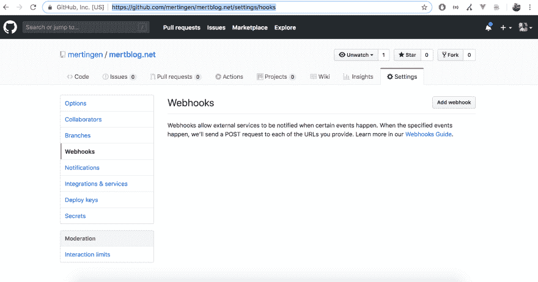
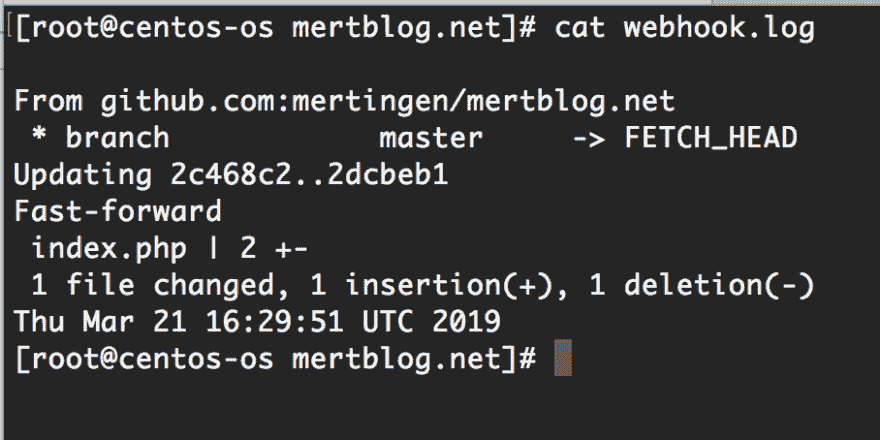

# 用 Github Webhook 自动化 Git 事件

> 原文：<https://dev.to/_mertsimsek/automating-git-events-with-github-webhook-39dg>

Webhooks 允许您构建或设置集成，这些集成订阅 GitHub.com 上的某些操作。当其中一个事件被触发时，Github 会向 webhook 的配置 URL 发送一个 HTTP POST 有效负载。Webhooks 可用于更新外部问题跟踪器、触发 CI 构建、更新备份镜像，甚至部署到您的生产服务器。你只是被你的想象力所限制。如果您想配置 url 或事件，您应该运行以下 URL。

[https://github.com/【所有者】/【存储库】/设置/挂钩](https://github.com/%5Bowner%5D/%5Brepository%5D/settings/hooks)。

你会看到这个页面，点击**添加 webhook** 按钮来配置我们的新 webhook。

[](https://res.cloudinary.com/practicaldev/image/fetch/s--FG6s3z8s--/c_limit%2Cf_auto%2Cfl_progressive%2Cq_auto%2Cw_880/https://thepracticaldev.s3.amazonaws.com/i/9g49g2mg4pbjrasyo7fz.png)

输入您的密码后，从现在开始您可以配置第一个 webhook。这真的很简单。

[](https://res.cloudinary.com/practicaldev/image/fetch/s--uBEnAyMb--/c_limit%2Cf_auto%2Cfl_progressive%2Cq_auto%2Cw_880/https://thepracticaldev.s3.amazonaws.com/i/kwfykcgytaqvzxaz8gks.png)

此时，我们应该键入一个有效负载 url。它应该是欢迎来自 Github 的有效载荷的文件。秘密部分有助于授权。创建 webhook 后，Github 发送一个带有这个秘密的请求。如果这个秘密与我们从那个文件中得到的回复相同，Github 就会发现。为此，我创建了这样一个 PHP 文件`github_webhook.php`。

```
<?php

echo 'thisismertblogsecret'; 
```

如果一切顺利，你会在你的 Github 设置页面上看到 Webhook 列表。从现在开始，所有的推送事件都将被发送到你的有效负载 url。为了处理这个请求，我修改了文件。

```
#echo 'thisismertblogsecret';

if ($_POST && $_POST['payload']){
    $payload = json_decode($_POST['payload'], true);
    if (isset($payload['ref']) && $payload['ref'] == 'refs/heads/master'){
        exec("/usr/bin/git pull origin master >> ./webhook.log 2>&1 && echo $(date) >> ./webhook.log");
    }
} 
```

我们已经简化了一个文件。它处理来自 Github 事件的请求。如果请求推，它运行拉命令。它发送输出一个名为`webhook.log`的文件。让我们做个测试。我将发送 push 命令，它将运行 pull 命令。

[](https://res.cloudinary.com/practicaldev/image/fetch/s--WIuUXC2l--/c_limit%2Cf_auto%2Cfl_progressive%2Cq_auto%2Cw_880/https://thepracticaldev.s3.amazonaws.com/i/qf8ga3txf6yxwhg4x5cu.png)

如您所见，输出被输入到我们的日志文件中。此外，拉动过程成功。

## 常见错误

**1-)错误:无法打开。git/FETCH_HEAD:权限被拒绝**

只需运行以下命令。

```
chown root:nginx .git/FETCH_HEAD

chmod 775 .git/FETCH_HEAD 
```

2-)权限被拒绝(publickey)。致命错误:无法从远程存储库中读取。

这也很容易。想象一下， **github_webhook.php** 由 Nginx 用户运行。不是根用户。因此，每个用户在 Ssh 连接中都有一个密钥。你应该为 Nginx 用户创建一个密钥。

```
sudo -u nginx ssh-keygen -t rsa 
```

您可以看到带有此路径的密钥，`/var/lib/nginx/.ssh/`。

对，然后你要把这个 key 添加到资源库的 deploy keys 中，[https://github . com/[owner]/[repository]/settings/keys](https://github.com/%5Bowner%5D/%5Brepository%5D/settings/keys)。从现在开始，你将能够摆脱它。

好了，关于那件事我的谈话结束了。在某些情况下，Github Webhook 确实对开发者有帮助。如果你有任何问题或麻烦，不要犹豫打出来。