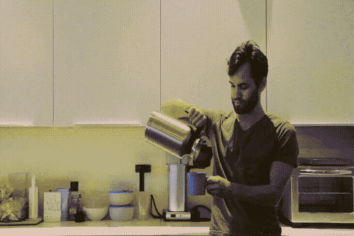

# 自动化我的工作环境

> 原文：<https://dev.to/programazing/automating-my-work-environment-1oj1>

下班前重启电脑是公司的政策。为什么？我想努力帮助保护客户的健康记录。

起初，这让我很恼火，因为我必须每天重新打开我的应用程序和我的故事。这不仅需要时间，还需要宝贵的脑力来记住我到底在做什么。第二天在一个故事中间捡起来已经够糟糕了，但是不要强迫我在喝第一杯咖啡之前重新开始。

[](https://i.giphy.com/media/3ov9k3e37ziS9FrC9y/giphy.gif)

我希望，像许多人一样，我的第一个想法是将所有信息保存在一个文本文件中，这样我每天早上都可以阅读。这样我就知道我在做什么，我需要做什么，以及我需要重新打开的任何重要链接。一个简单而粗糙的想法令人沮丧。虽然这确实产生了我的每日跟踪系统，我将在以后的文章中讨论。

当我对每天早上复制和粘贴所有这些链接感到厌烦时，第一个解决方案出现了。我通过安装 [Firefox](https://www.mozilla.org/en-US/firefox/) 和 [Better-OneTab](https://github.com/cnwangjie/better-onetab) 扩展解决了这个问题。现在，在一天结束的时候，我点击“更好的一个”按钮，我打开的标签就会被保存下来，并为第二天做好准备。您甚至可以命名和同步您的标签集。

在我的上一份工作中，我实际上有一个批处理脚本，我每天都用它来启动我需要的所有东西。为什么我没有一开始就把它用在这个位置上，我不知道。现在，每天早上我都从我的桌面上运行批处理脚本，然后我就开始运行了。这里有一个简单的模板可以帮助你开始:

```
@ECHO OFF

REM I'm a big fan of moving to the folder before starting an app.

CD "C:\Program Files (x86)\Microsoft Office\root\Office16\"

START OUTLOOK.EXE

REM Sometimes it's fine not to though.

START firefox

REM This will open in the default browser.

START "" https://www.stackoverflow.com

REM This will open in the browser you name even if the browser is already opened.

START firefox https://duckduckgo.com 
```

Enter fullscreen mode Exit fullscreen mode

现在我真的喜欢在一天结束时重启电脑。它重置了我所有应用程序的状态，并帮助我重置了我的精神状态。我不使用批处理脚本来关闭一切，因为我想确保我已经保存了我正在处理的东西。就好像重启我的电脑对我的大脑来说是一个工作日结束的信号。现在，每天早上打开应用程序和网站，帮助我进入正确的空间，专注于工作。

这也许并不惊天动地，但我希望这两件事能帮助你掌控你的一天。我将很快再写一篇关于我如何使用 Outlook 过滤器的文章。它们有助于控制我一天中收到的铺天盖地的电子邮件。如果你没有 Outlook 也不用担心，它们足够通用，任何电子邮件客户端都可以工作。