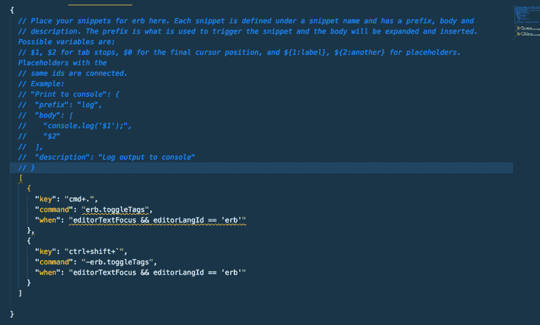

# 自动化 Rails 中枯燥的东西(Rails Snippet Pack v1)

> 原文：<https://dev.to/loganwohlers/automating-the-boring-stuff-in-rails-rails-snippet-pack-v1-57n2>

在踏上软件开发的道路之前，我在金融行业工作——这实际上意味着我在 Excel 工作。很多。每天花在电子表格上的时间有时超过 10，000 行——每一行都属于一个至少投资了几十万美元的账户。不用说，我必须在 excel 中变得更快——所以我尽可能地学习了每一个键盘快捷键和工作流程(正是我无法实际编写/自动化最低效的流程，最终将我引向了编码——这很有效——我变得非常非常快。但是自从我开始在文本编辑器中编写实际代码后，我的速度就慢了。在 Excel 中，我飞得离太阳太近了——现在我在做任何新项目时，有一半时间都感觉自己像糖蜜一样。公平地说，这些东西完全是肌肉记忆(我不能告诉你我使用的 excel 快捷键，我的手指就知道)，但更重要的是，它还利用了可用的工具，这样你就可以花更多的时间思考，花更少的时间打印 HTML 表单。

考虑到这一点，我一直在有意识地利用热键/快捷键来加速我的代码(我的同事 Brian 关于有用的键盘快捷键的帖子，你可以在这里阅读，其中许多与本文的其余部分结合使用:[https://dev . to/bouhm/you-should-be-using-keyboard-shortcut s-2poe](https://dev.to/bouhm/you-should-be-using-keyboard-shortcuts-2poe))，我已经可以感觉到它产生了很大的影响。然后我开始用 rails 工作——键入完全相同的表单和控制器语法(因为作为一个类，我们被禁止使用 Rails 的“脚手架”),然后 Rails 厚颜无耻地期望你包装一切'< %= '和' %【T3]'(squids 和冰淇淋代码——正如他们在行业中所说的那样)让我发疯。创建一个简单的 RESTful 路由流花费了太多时间——所以我最终转向了 snippets。我以前见过并使用过它们(主要是在 HTML 中),它们客观上令人惊叹——但我很难找到能在 rails 中很好工作的 ERB 版本——即使这样，我也想要为我自己反复输入的文本量身定制的东西。在我看来，代码片段的问题是它们很奇怪，而且对于初学者来说语法相当不友好:

 *说真的这是什么？我只想加点鱿鱼和冰淇淋甜筒！*

然而，当我发现-[https://snippet-generator . app](https://snippet-generator.app)立即消除了进入的障碍，并允许我开始将我所做的工作转化为片段时，一切都变得明朗了。一旦我做了几个有用的，我就停不下来了，所以我试着把它们列了一个清单，不仅对我自己有用，而且对我所有的同学/学习第二个 mod 课程的同学也有用。目前这还不算多——但它确实极大地加快了我的流程，并且当我一次又一次地遇到相同的问题时，我会添加一些东西(加上生成器，它们非常容易编写)——从这里开始的下一步将是研究真正的任务自动化——主要通过脚本。我希望在我的程序上有一个按钮开始，并朝着这个方向努力，这将继续是一个有趣的经历。

链接到 github 页面 w/ the snippets-更多即将推出
[https://github.com/loganwohlers/Rails-Snippets](https://github.com/loganwohlers/Rails-Snippets)

感谢阅读！请留下任何反馈和建议-

洛根