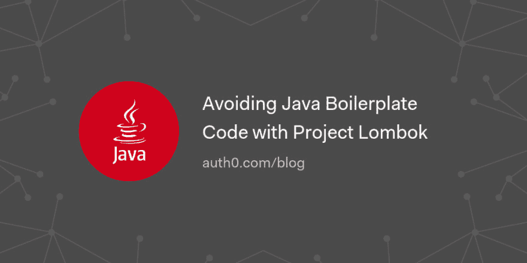

# 用 Lombok 项目避免 Java 样板代码

> 原文：<https://dev.to/auth0/avoiding-java-boilerplate-code-with-project-lombok-1bgj>

在本文中，您将学习如何避免 Java 项目中的样板代码。您将通过使用 Project Lombok 的特性来实现这一点，这是一个非常棒的 Java 库，旨在帮助开发人员提高开发速度。您将通过在小示例中使用本库的特性来学习如何使用它们。

[Read on ☕️](https://auth0.com/blog/avoiding-java-boilerplate-code-with-project-lombok/?utm_source=dev&utm_medium=sc&utm_campaign=javaboilerplate_lombok)

