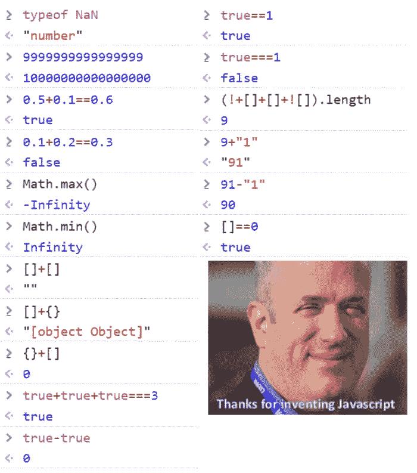

# 避免怪异的 Javascript 行为(true + true === 2 但却是真的！== 1)

> 原文：<https://dev.to/neutrino2211/avoiding-weird-javascript-behaviour-true--true--2-but-true--1-pn9>

每一种编程语言都被设计成直观的，Javascript 也不例外，但它确实有一些让它脱颖而出的古怪之处，其中之一就是它对类型的怪异行为，我很确定你已经看到了迷因。

[](https://res.cloudinary.com/practicaldev/image/fetch/s--_LM23l-b--/c_limit%2Cf_auto%2Cfl_progressive%2Cq_auto%2Cw_880/https://thepracticaldev.s3.amazonaws.com/i/a2k7x6ghilt6hp5mhgd7.png)

当你第一次看到它的时候，这可能会让你精神受创，但这并不是必须的，所以我想给你一点启发，帮助你避免遇到这种情况。

## Javascript 类型如何工作

Javascript 是一种非常非常松散的语言，这一点都不坏，但是在某些情况下，它可能会导致非常糟糕的情况。其中一个时刻发生在几年前我第一次看到它的时候。

```
true + true === 2 // => true

true !== 1 // => true 
```

Enter fullscreen mode Exit fullscreen mode

乍一看，这看起来非常*错误*,但是不要担心这里没有任何错误，这就是 javascript 的工作方式。Javascript 处理类型的方式非常不同，它只有 6 种基本类型，你写的所有代码都由其中一种表示。

*   `boolean`

*   `number`

*   `string`

*   `object`

*   `function`

*   `undefined`

仅仅这一点还不足以导致如此奇怪的行为，但处理它们的方式确实如此，javascript 总是转换类型以最适合它们的用途，这被称为**类型强制**，有时它会将值类型更改为开发人员不希望的类型，这就是为什么`true + true === 2`。

二进制运算符`+`主要是用来将数字相加，但是当它面对布尔值时，它被迫将它们转换成数字，因此`true`变成了`1`，这使得`true + true`变成了`1 + 1`，表达式变成了

```
1 + 1 === 2 // => true 
```

Enter fullscreen mode Exit fullscreen mode

但是第二个表达似乎推翻了我上面的解释，但它确实也很有意义。`!==`操作符执行严格的比较，因此它检查值和类型，但是由于`true`是布尔值而`1`是数字，它们并不严格相等，因此表达式为真。

## 真真假假

javascript 中的每个值都有自己的布尔值(truthy/falsy)，这些值用在需要布尔值但没有给定的操作中，您很可能以前使用过这个特性，但从来不知道下面会发生什么。

示例:

```
const array = [];

if(array){
    console.log('Truthy!');
} 
```

Enter fullscreen mode Exit fullscreen mode

在上面的代码中，`array`不是一个布尔值，但是因为值是“真”，所以 if 块将被执行。

#### 福尔西 vs `false`

假值是具有固有布尔值`false`的值，以下是假值。

*   Zero
*   ''或""
*   空
*   不明确的
*   圆盘烤饼

示例:

```
const zero = 0;
const emptyString = "";

if(!zero){
    console.log("0 is falsy");
}

if(!emptyString){
    console.log("An empty string is falsy")
}

console.log(NaN || 1); // => 1
console.log(null || 1); // => 1
console.log(undefined || 1); // => 1 
```

Enter fullscreen mode Exit fullscreen mode

注意，值`false`是 falsy，但 falsy 值不是`false`，区分它们的正确方法是使用**严格比较**运算符。

示例:

```
0 == false // => true
0 === false // => false 
```

Enter fullscreen mode Exit fullscreen mode

#### 真理 vs `true`

每个不是`falsy`的值都被认为是`truthy`，包括

*   用线串

*   数组

*   目标

*   功能

示例:

```
function somethingIsWrong(){
    console.log("Something went horribly wrong")
}

function callback(){
    console.log("Hello From Callback");
}

const string = "Hello world!"
const array = [1,2,3];
const object = {};

if(string){
    console.log(string) // => "Hello world!"
    const functionToCall = callback || somethingIsWrong
    functionToCall() // => "Hello From Callback"
    console.log(array || "That was not meant to happen")
    console.log(object || "This is strange")
} 
```

Enter fullscreen mode Exit fullscreen mode

## 式威压

类型强制是将一种类型转换为另一种类型的过程，javascript 中的每个值都可以被强制。

有两种类型的胁迫:

*   隐式:这是在需要时自动完成的，例如

```
"0" + 5 == "05" // => true 
```

Enter fullscreen mode Exit fullscreen mode

上面的例子以其最容易识别的形式展示了隐式强制，`+`操作符不仅用于添加数字，也用于添加字符串，所以当它被告知将数字添加到字符串时，它必须首先将数字转换为字符串，这将`5`变为`"5"`，并且表达式变成。

```
"0" + "5" == "05" // => true 
```

Enter fullscreen mode Exit fullscreen mode

*   显式:这是指开发人员通过编写适当的代码来转换类型，例如

```
"0" + String(5) == "05" 
```

Enter fullscreen mode Exit fullscreen mode

## 类型转换

当值被强制时，它会经历三种转换之一。

*   ToString:这是由`+`操作符隐式触发的，也可以通过调用`String`函数显式触发，例如

```
const height = 5.8;
console.log("Hello I am " + height + "ft tall") // => "Hello I am 5.8ft tall" 
```

Enter fullscreen mode Exit fullscreen mode

在连接浮点数和字符串之前,`+`操作符隐式地将它们转换成字符串。

```
const height = 5.8;
console.log("Hello I am " + String(height) + "ft tall") // => "Hello I am 5.8ft tall" 
```

Enter fullscreen mode Exit fullscreen mode

这里我们使用`String`函数显式地将浮点数转换成字符串。

*   ToBoolean:这由它们的上下文或逻辑运算符(`!`、`||`和`&&`)隐式触发，由`Boolean`函数显式触发。

```
if(3){
    console.log("Implicitly by context")
}

if(Boolean(1)){
    console.log("Explicitly by the 'Boolean' function")
}

console.log(!0) // => true

console.log(0 || "Hello") // => "Hello"

console.log(4 && 5) // => true 
```

Enter fullscreen mode Exit fullscreen mode

注意，`||`操作符不返回`"Hello"`的真值，而是返回实际的字符串本身

*   ToNumber:数字转换非常棘手，因为它是由许多操作符`> < <= >= | & ^ ~ - + * / % != ==`触发的。注意，当两个操作数都是字符串时，二进制的`+`不会触发数值转换，T2 也不会触发数值转换。

关于强制还有很多东西我不能在这里解释，所以这里有一个链接指向[一篇关于 javascript 类型强制的优秀文章](https://medium.freecodecamp.org/js-type-coercion-explained-27ba3d9a2839)。

## 避免这种行为

避免这种行为的最好方法是进行类型检查，在普通 javascript 中，一种简单的方法是在比较值或使用关键字`typeof`检查变量类型时使用严格的等式运算符`===`。

示例:

**无类型检查**

```
const number = 21;
const string = "21"

function add100(number){
    console.log(100 + number)
}

add100(number) // => 121
add100(string) // => "10021" 
```

Enter fullscreen mode Exit fullscreen mode

**同类型检查**

```
const number = 21;
const string = "21"

function add100(number){
    if(typeof number == "number"){
        console.log(100 + number)
    } else {
        console.log("Need a number, not a "+typeof number);
    }
}

add100(number) // => 121
add100(string) // => "Need a number, not a string" 
```

Enter fullscreen mode Exit fullscreen mode

不幸的是，上面的例子不能帮助你检查类，因为你需要使用关键字`instanceof`。

```
class ImportantClass {
    constructor(){
        this.importantValue = 1;
    }

    doImportantStuff(){
        console.log(this.importantValue);
    }
}

function useImportantClass(value){
    if(value instanceof ImportantClass){
        value.doImportantStuff();
    } else {
        console.log("Value needs to be of type ImportantClass, not "+typeof value)
    }
}

const value = new ImportantStuff();

useImportantClass(value); // => 1
useImportantClass("Not important"); // => Value needs to be of type ImportantClass, not string 
```

Enter fullscreen mode Exit fullscreen mode

但是迄今为止避免这种情况的最简单的方法是使用 Typescript。如果你没听说过， [Typescript](https://www.typescriptlang.org/) 是 javascript 的一个类型化超集，编译成普通的 javascript。简而言之，Typescript 及其编译器帮助您编写非常确定的代码，如果您想了解更多信息，我鼓励您单击该链接，因为该站点的解释比我多。

## 感谢阅读！！！

*考虑在[推特](https://twitter.com/neutrino2211)上关注我吧*