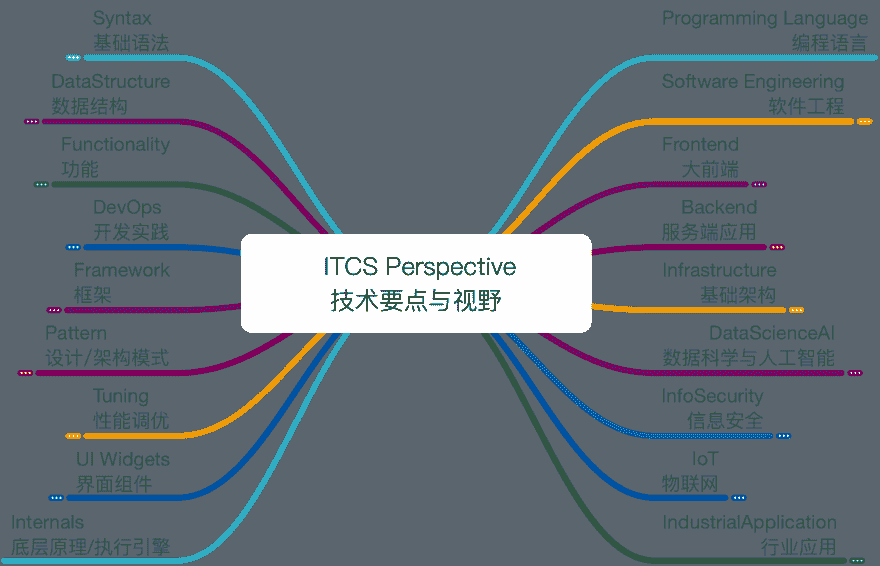

# 另一个令人敬畏的列表:银河系统和结构化指南

> 原文：<https://dev.to/wxyyxc1992/awesome-lists-systematic--structured-guide-to-galaxy-45jo>

大家可能都很熟悉所谓的牛逼榜单:

> 一个令人敬畏的列表是由社区策划的令人敬畏的东西的列表，关于从 CLI 应用到奇幻书籍的一切。就像其他成千上万令人敬畏的名单一样，

[Awesome Lists](https://github.com/wxyyxc1992/Awesome-List/blob/master/README-en.md) 为 ITCS 收集精选的、有价值的、最新的链接，包括编程语言(Java、JavaScript、Python、Go、Rust 等。)、软件工程、后端(Spring、Nginx、微服务等。)、基础设施(数据库、网络等。)、信息安全&渗透、行业应用、DataScienceAI(统计学、机器学习、深度学习、NLP、CV)、前端技术(iOS、Android、RN、electronic)等。请注意，我已经尝试按照最“容易解决”的顺序来排列书籍。所以想法是从上到下看书。

[牛逼榜单](https://github.com/wxyyxc1992/Awesome-Lists/blob/master)和其他有什么区别？

*   所有的列表都是以系统和结构化的方式组织的，保持我的终极知识图(见下文)。
*   单个列表中的链接是手动排序的，分为多个部分:概述、资源(书籍、课程等)、教程等。

## 导航

最后，让这些列表自己说话:

*   如果你不想学习 Web 开发，你可能会喜欢 [DOM 列表](https://github.com/wxyyxc1992/Awesome-Lists/blob/master/Web/Syntax/DOM/DOM-List.md)、 [CSS 列表](https://github.com/wxyyxc1992/Awesome-Lists/blob/master/Web/Syntax/CSS/CSS-List.md)、 [React 列表](https://github.com/wxyyxc1992/Awesome-Lists/blob/master/Web/Framework/React/React-List.md)、 [Redux 列表](https://github.com/wxyyxc1992/Awesome-Lists/blob/master/Web/Framework/Redux/Redux-List.md)、 [Vue 列表](https://github.com/wxyyxc1992/Awesome-Lists/blob/master/Web/Framework/Vue/Vue-List.md)、 [PWA 列表](https://github.com/wxyyxc1992/Awesome-Lists/blob/master/Web/Tuning/PWA/Web-PWA-List.md)、 [Web 性能列表](https://github.com/wxyyxc1992/Awesome-Lists/blob/master/Web/Tuning/Performance/Web-Performance-List.md)、[Web 组装列表](https://github.com/wxyyxc1992/Awesome-Lists/blob/master)等。
*   如果你不想学 Java，去微服务吧...你可能喜欢 [Java List](https://github.com/wxyyxc1992/Awesome-Lists/blob/master/Web/Syntax/DOM/DOM-List.md) 、 [JVM List](https://github.com/wxyyxc1992/Awesome-Lists/blob/master/ProgrammingLanguage/Java/JVM/JVM-List.md) 、 [Go List](https://github.com/wxyyxc1992/Awesome-Lists/blob/master/ProgrammingLanguage/Go/Go-List.md) 、[微服务 List](https://github.com/wxyyxc1992/Awesome-Lists/blob/master/Backend/MicroService/MicroService-List.md) 、 [Spring List](https://github.com/wxyyxc1992/Awesome-Lists/blob/master/Backend/WebFramework/Java/Spring/Spring-List.md) 、 [DevOps List](https://github.com/wxyyxc1992/Awesome-Lists/blob/master/Backend/DevOps/DevOps-List.md) 等。
*   如果你不想学习分布式系统、数据库、并发编程...你可能喜欢 [Docker 列表](https://github.com/wxyyxc1992/Awesome-Lists/blob/master/Infrastructure/Virtualization/Container/Docker/Docker-List.md)、 [Kubernetes 列表](https://github.com/wxyyxc1992/Awesome-Lists/blob/master/Infrastructure/Virtualization/Orchestration/Kubernetes/Kubernetes-List.md)、 [Linux 列表](https://github.com/wxyyxc1992/Awesome-Lists/blob/master/Infrastructure/OS/Linux/Linux-List.md)、 [HTTP 列表](https://github.com/wxyyxc1992/Awesome-Lists/blob/master/Infrastructure/Network/HTTP/HTTP-List.md)、[分布式系统列表](https://github.com/wxyyxc1992/Awesome-Lists/blob/master)、[区块链列表](https://github.com/wxyyxc1992/Awesome-Lists/blob/master/Infrastructure/DistributedSystem/Blockchain/Blockchain-List.md)、 [Flink 列表](https://github.com/wxyyxc1992/Awesome-Lists/blob/master/Infrastructure/DistributedComputing/Streaming/Flink/Flink-List.md)、 [Kafka 列表](https://github.com/wxyyxc1992/Awesome-Lists/blob/master/Infrastructure/DistributedComputing/MOM/Kafka-List.md)、[数据库列表](https://github.com/wxyyxc1992/Awesome-Lists/blob/master/Infrastructure/Database/Database-List.md)、 [MySQL 列表](https://github.com/wxyyxc1992/Awesome-Lists/blob/master/Infrastructure/Database/RDB/MySQL/MySQL-List.md)、 [PostgreSQL 列表【t](https://github.com/wxyyxc1992/Awesome-Lists/blob/master/Infrastructure/Database/RDB/PostgreSQL/PostgreSQL-List.md)
*   如果你不想学人工智能，深度学习，张量流...你可能喜欢 [DataScienceAI 书单](https://github.com/wxyyxc1992/Awesome-Lists/blob/master/DataScienceAI/DataScienceAI-Book-List.md)、 [DataScienceAI 课程单](https://github.com/wxyyxc1992/Awesome-Lists/blob/master/DataScienceAI/DataScienceAI-Course-List.md)、[机器学习单](https://github.com/wxyyxc1992/Awesome-Lists/blob/master/DataScienceAI/MachineLearning/MachineLearning-List.md)、[深度学习单](https://github.com/wxyyxc1992/Awesome-Lists/blob/master/DataScienceAI/DeepLearning/DeepLearning-List.md)、 [NLP 单](https://github.com/wxyyxc1992/Awesome-Lists/blob/master/DataScienceAI/NLP/NLP-List.md)、 [TensorFlow 单](https://github.com/wxyyxc1992/Awesome-Lists/blob/master/DataScienceAI/Toolkit/TensorFlow/TensorFlow-List.md)、 [PyTorch 单](https://github.com/wxyyxc1992/Awesome-Lists/blob/master/DataScienceAI/Toolkit/PyTorch/PyTorch-List.md)等。

您可以使用 [xCompass](https://https:wxyyxc1992.github.io/home/#/search?query=React) 在网页中搜索，或者使用 [alfred-sg](https://github.com/wxyyxc1992/xCompass/blob/master/soogle/alfred-sg/) 在 MAC 中搜索。

## 知识图表

有大量的精选链接帮助你学习任何关于航向优先的知识，包括教程、实践、开源、课程、书籍等等。每个域可能包含以下文件:

*   {Something}-List.md -该文件可能包含或分为以下内容:
    *   概述、案例研究和备忘单
    *   资源&图书&收藏
    *   教程和学习路径
*   {Something}-Syntax-List.md -该文件可能包含或分为以下内容:
    *   变量和表达式
    *   控制流和错误处理程序
    *   函数和函数式编程
    *   类别和对象
    *   元编程
*   { Something }-data structure-list . MD-该文件可能包含或分为以下内容:
    *   基型
    *   索引集合
    *   键控集合
*   { Something }-Functionality-list . MD-此文件可能包含或分为以下内容:
    *   储存；储备
    *   网络
    *   系统/流程
*   {Something}-DevOps-List.md -此文件可能包含或分为以下内容:
    *   构建者、任务执行者、捆绑者、依赖性管理
    *   调试
    *   测试、单元测试、集成测试、e2e 测试
    *   架构、模块系统、状态管理、
    *   JavaScript 编程语言源代码的编码标准。
*   { Something }-Production-list . MD-此文件可能包含或分为以下内容:
    *   性能优化/调整
    *   发布/部署
    *   可访问性/监视器
    *   实时
    *   I18n
*   { Something }-open source-list . MD-牛逼的工具、框架、项目
*   {Something}-Internals-List.md 引擎盖下的内部机制，核心/编译器/引擎