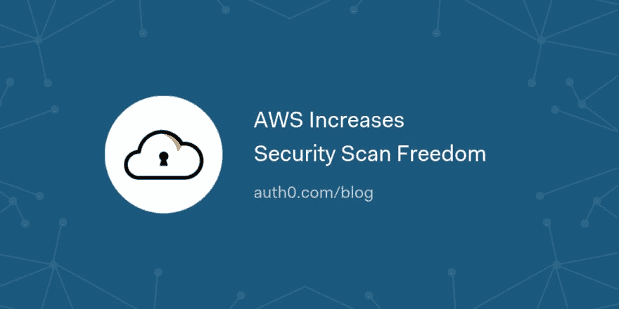

# AWS 增加了安全扫描的自由度

> 原文：<https://dev.to/auth0/aws-increases-security-scan-freedom-1jgi>

由于最近对 AWS 渗透测试政策的更改，AWS 客户现在在对其 AWS 资源执行安全扫描时有了更多的自由。在 Auth0，我们正在利用这一政策变化来更好地了解和保护我们向外界公开的云资源。

在政策更新之前，AWS 客户需要提交渗透测试授权请求，并在获准执行扫描之前等待批准。这一政策变化允许对许多 AWS 服务进行渗透测试，而无需预先批准。

[读读☁️](https://auth0.com/blog/aws-increases-security-scan-freedom/?utm_source=dev&utm_medium=sc&utm_campaign=aws_pentesting)

