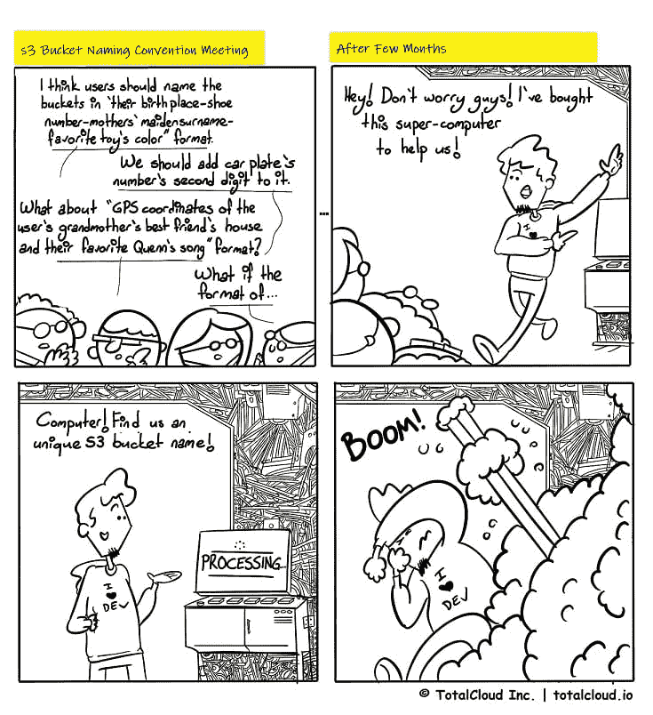
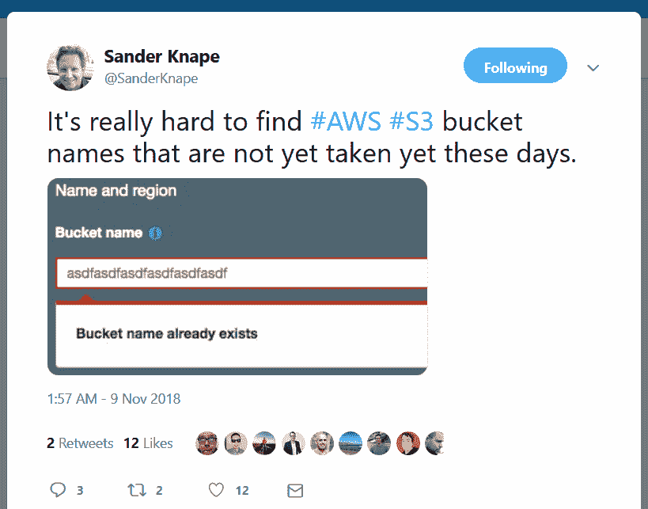

# AWS S3 铲斗命名挑战

> 原文：<https://dev.to/totalcloudio/aws-s3-bucket-naming-challenge-1gj9>

你是否曾努力寻找一个独特的 AWS S3 桶名？戴夫出了点状况。

查看桑德·奈普的推特——你会知道我们在谈论什么。这很有趣，但发人深省。

亚马逊网络服务的受欢迎程度与日俱增。据[消息人士](https://www.clickittech.com/aws/top-10-aws-services/)称，在 EC2 和 RDS 之后，S3 是最受欢迎的服务。现在想象一下，一天之内会有数千个桶被创建出来。不知道几年后给 AWS S3 桶命名会变得多么具有挑战性！更重要的是，如果你有公司政策规定的命名惯例，你肯定需要一些运气。

你怎么看？你能帮这个戴夫吗？在[@ totalcloudio](https://twitter.com/totalcloudio)T3 发推文给我们

注:最初发布于 2019 年 2 月 5 日 [blog.totalcloud.io](http://blog.totalcloud.io/aws-s3-bucket-naming-challenge/) 。