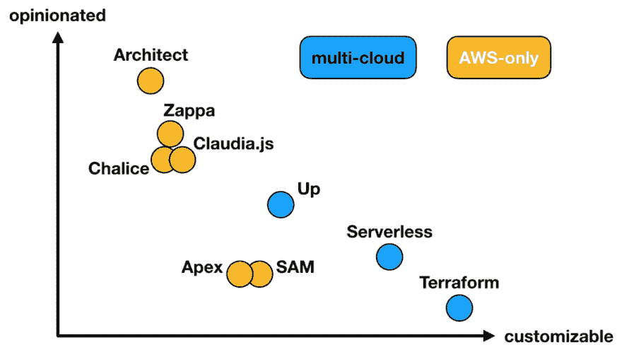
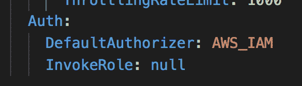
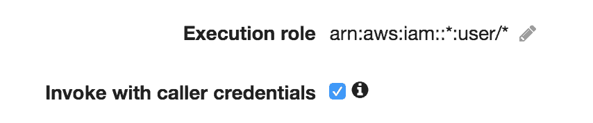
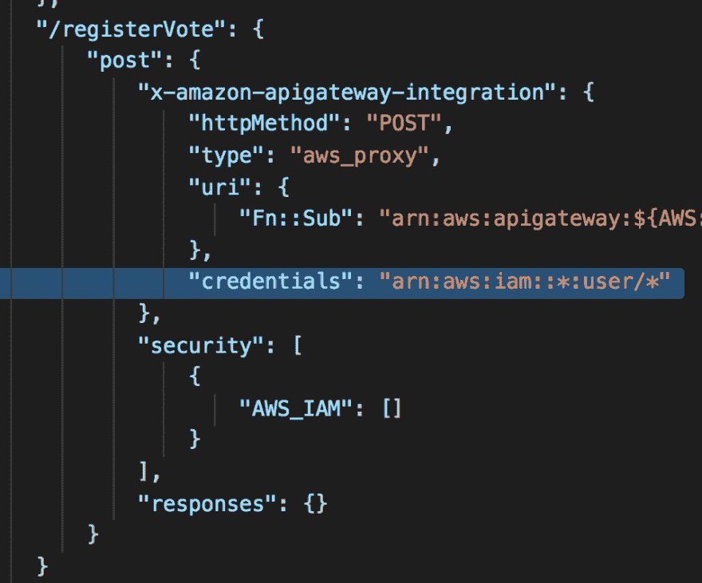

# AWS SAM + Cloudformation 宏，天上掉馅饼的补丁

> 原文：<https://dev.to/theburningmonk/aws-sam-cloudformation-macros-a-patch-made-in-heaven-1877>

在过去的几周里，我一直在和一个雄心勃勃的客户合作——Solve T1，他正在开发一款新的谋杀悬疑游戏。他们正在做一些技术上非常酷的事情，并且正在构建一个完全无服务器的堆栈。

在使用 Solve 的过程中，我花了很多时间与 [AWS SAM](https://github.com/awslabs/serverless-application-model) 在一起。正如我在这篇[文章](https://lumigo.io/blog/comparison-of-lambda-deployment-frameworks/)中解释的那样，那次经历也帮助我形成了对山姆的看法。与[的无服务器框架](http://serverless.com/framework/)相比，它缺少无服务器通过其插件系统提供的可定制性。

有了无服务器框架，我可以编写插件来定制框架的内置行为。每当我不同意框架的选择时，这让我摆脱了牢狱之灾。然而，我和山姆没有这样的奢侈。

就在今天，我在 API Gateway 中遇到了 SAM 的[对 AWS_IAM](https://aws.amazon.com/about-aws/whats-new/2019/aws_serverless_application_Model_support_IAM/) 授权器的支持问题。内置行为是这样的，每当我选择使用 AWS_IAM 作为授权者时，它将默认使用`InvokeRole`到`CALLER_CREDENTIALS`。即使我明确地将`InvokeRole`设置为`null`。

这意味着调用者的 IAM 角色将用于调用 Lambda 函数。因此，要调用我的 IAM 保护的端点，我需要用 IAM 概要文件对请求进行签名，该概要文件具有以下权限:

*   [execute-api:针对 api 网关资源调用](https://iam.cloudonaut.io/reference/execute-api.html)
*   **和**[lambda:invoke function](https://iam.cloudonaut.io/reference/lambda.html)针对位于 API 网关之后的 Lambda 函数

这完全打破了抽象层！作为一个呼叫者，我不仅需要知道我希望与之通话的端点，还需要知道它是如何实现的。如果 API 维护者重命名端点后面的函数，我的代码会突然中断。

如果这个问题也影响到你，那么请继续关注这个 Github 问题。

由于 SAM 没有插件系统，我不得不等待 SAM 团队来解决这个问题。

或者，我有吗？

因为 SAM 最终只是用一个叫做`AWS::Serverless-2016–10–31`的神奇宏生成的云。我可以用我自己的宏修改它转换的 CloudFormation 模板。

在这种情况下，我们能够通过编写 CloudFormation 宏来摆脱牢狱之灾:

*   寻找`AWS::ApiGateway::RestApi`云形成资源
*   迭代地从`AWS_PROXY`积分中移除任何`credentials`字段

有了这个宏，我们能够解除自己的锁定。

诚然，使用 CloudFormation 宏来定制 SAM 的行为是一种相当笨拙的方法！然而，在缺乏定制 SAM 的内置机制的情况下，这是我们能够想到的最好的坏主意。如果你知道更简单、更优雅的解决方案，请在评论中告诉我们！

p.s. Solve 正在寻找一名后端工程师加入他们在伦敦肖尔迪奇的团队。如果你正在寻找一个使用无服务器技术的机会，为数百万用户开发游戏，那么你应该考虑申请！

帖子 [AWS SAM + Cloudformation macros，一个天上人间](https://theburningmonk.com/2019/05/aws-sam-cloudformation-macros-a-patch-made-in-heaven/)的补丁首先出现在 theburningmonk.com[的](https://theburningmonk.com)上。

