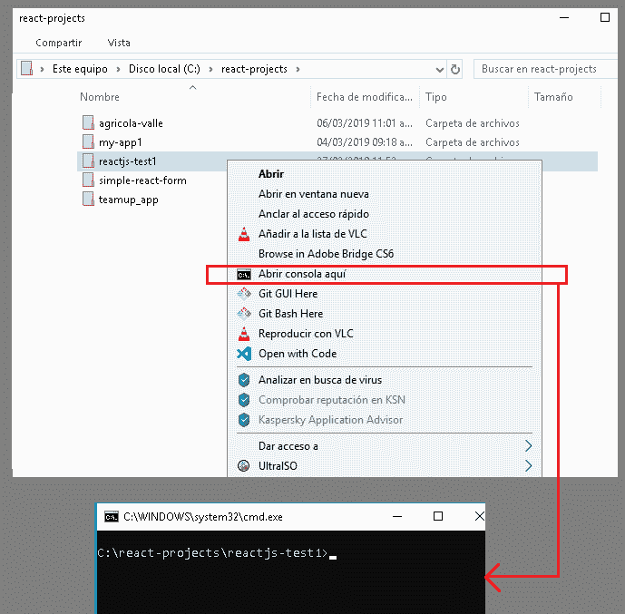
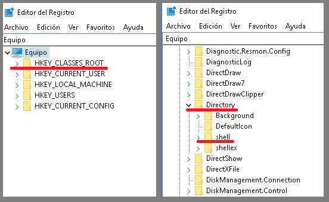
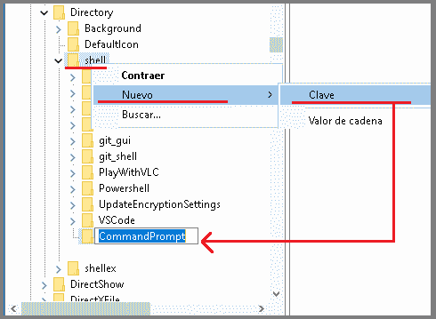
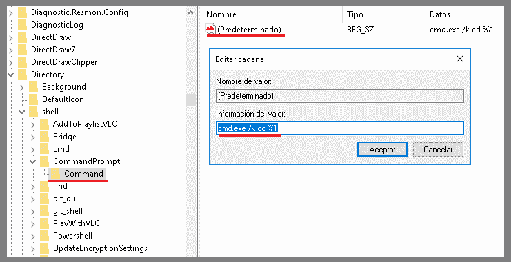
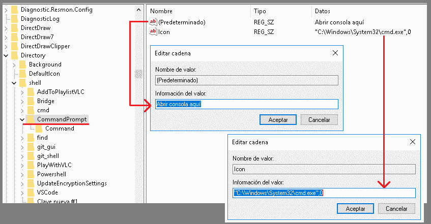

# 从 Windows 上的任何文件夹打开控制台。

> [https://dev . to/sergioxdev/打开控制台-从-任何文件夹-在 windows id 2](https://dev.to/sergioxdev/abrir-la-consola-desde-cualquier-carpeta-en-windows-id2)

最近我一直从事 web 开发工作，从控制台运行项目时经常遇到的一个问题是，我实在懒得去根 **(C:/)** ，然后进入项目所在的文件夹，这样我才能运行项目。

因此，我的任务是想办法打开我正在处理的文件夹上的控制台，并节省几秒钟宝贵的工作时间，这是世界上最简单的事情，下面的步骤将对其进行总结。

**打开注册表编辑器，通过打开 Windows 主菜单并键入:REGEDIT，您会看到一个蓝色立方体图标。在其他 Windows 版本中，可能需要在命令中执行此操作**

 ****定位文件夹:**【HKEY _ classes _ root】</b>
及其内部:**目录< /b >
及其内部:**外壳********

现在右击 **shell** 文件夹，然后选择:**新>键**，将创建一个您必须命名的新文件夹:**【command prompt】**

**在您刚创建的文件夹上，他们将再次右键单击并创建另一个密钥，现在他们将其命名为**。****

 ******在您的 Command 文件夹内，选择显示在您右侧的孤立文件为**(默认)**，并向您显示一个窗口，您可以在该窗口中键入:**【值信息】**在此处键入[**

 **

**最后再次选择创建**的第一个文件夹，然后选择**(默认)**文件，同样在的**字段中退出******

 ******作为额外的，只有在您愿意的情况下，可以在同一个文件夹**中添加另一个值，方法是右键单击**(默认)**文件，然后选择**【新】T14【降级值】******

 ****

这样，您就可以在几秒钟内从您正在处理的目录中打开控制台。我希望这对你们有所帮助，如果有任何疑问，请留下你们的意见。****************