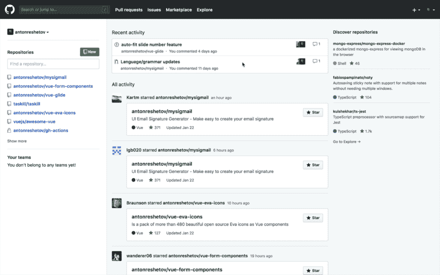

# 返回 980px GitHub 仪表板

> 原文：<https://dev.to/antonreshetov/back-to-980px-github-dashboard-41l>

如果你不喜欢新的 GitHub 仪表板(像我一样)，也许这就是你需要的。

Chrome 的一个小扩展。

让 GitHub Dashboard 再次变得伟大:)

[https://github.com/antonreshetov/980-github-dashboard](https://github.com/antonreshetov/980-github-dashboard)