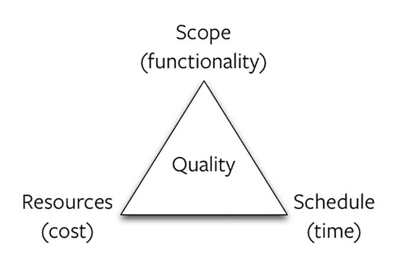

# 回到起点

> 原文：<https://dev.to/_codingblocks/back-to-square-one-6fk>

我最近发布了一个用我不熟悉的技术构建的网站。我完成了副业项目的目标，也学到了很多新技术。耶！

### 然而…

我对我的工作质量感觉不好。我走了偷懒的捷径，找到了“创造性的”变通方法，这与我想学的技术精神背道而驰。我从一开始就知道这是一个问题，因为我曾经多次走上这条路，我意识到我有相互矛盾的动机。

我想学习新的技术，但我也想在假期结束前出货。当然，最后期限是我自己设定的，但我认为这很重要，因为我尝试的大部分副业在到达陵墓前很久就枯萎死亡了。

### dev 要做什么？

听说过[项目管理三角](https://rapidbi.com/time-quality-cost-you-can-have-any-two/)吗？这个想法是，所有的项目都需要时间、质量和资源，而你最终总是在这三者中的一个上吝啬。

对我来说，资源基本上是固定的，所以我必须在我自己设定的期限和网站质量之间做出选择。我做了一个有意识的牺牲质量的决定，因为我认为这会给我一个成功结果的最好机会…而且这个项目是成功的！

### 那么我为什么感觉不好呢？

我相信[我们在副业中编码的方式](https://dev.to/thejoezack/be-careful-with-side-projects-21oo)有助于我们将习惯带入我们的专业编程中。通过走捷径，我正在鼓励坏习惯，建立不利的“肌肉记忆”。

根据上面的项目管理三角概念,“正确”的答案是把质量放在第一位，牺牲项目所需的时间和资源。

### 我做的决定对吗？

最终，我对事情的结果感到满意。如果我选择专注于质量，那么我可能仍然会研究技术，而这个副业可能会降级为我曾经的一个想法。

我完成了我的目标，现在我对新技术有了一些经验，我可以做出明智的决定，投入更多的时间来正确地学习它们。我跳过了一些步骤，所以我要回到起点。我将从底层开始学习这些技术，这样下次我有一个网站的想法时，我就可以用更少的妥协做得更好。

那么，你对副业的理念是什么？我做了正确的决定吗？

PS:如果你对这个项目或者我的蹩脚代码感兴趣，这个项目是开源的。在 [Github](https://github.com/codingblocks/devpodcasts.app) 上。

(迈克尔·帕苏斯基的照片)