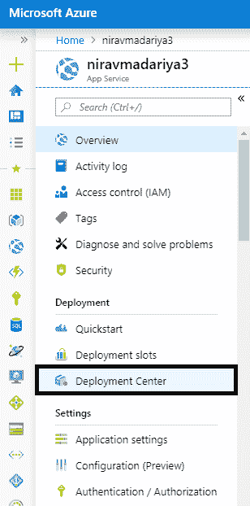
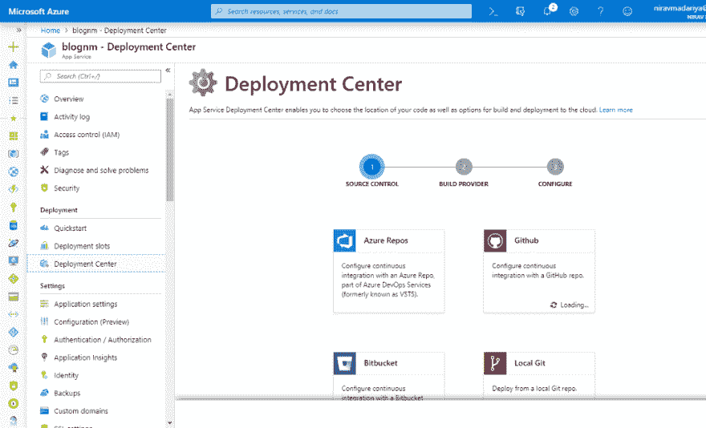
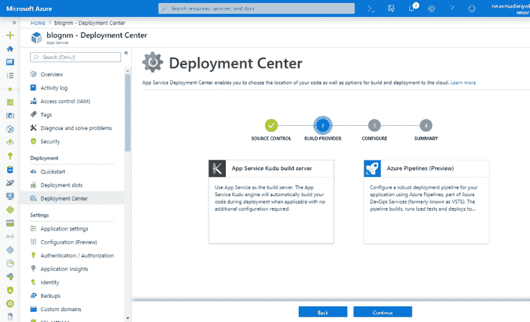
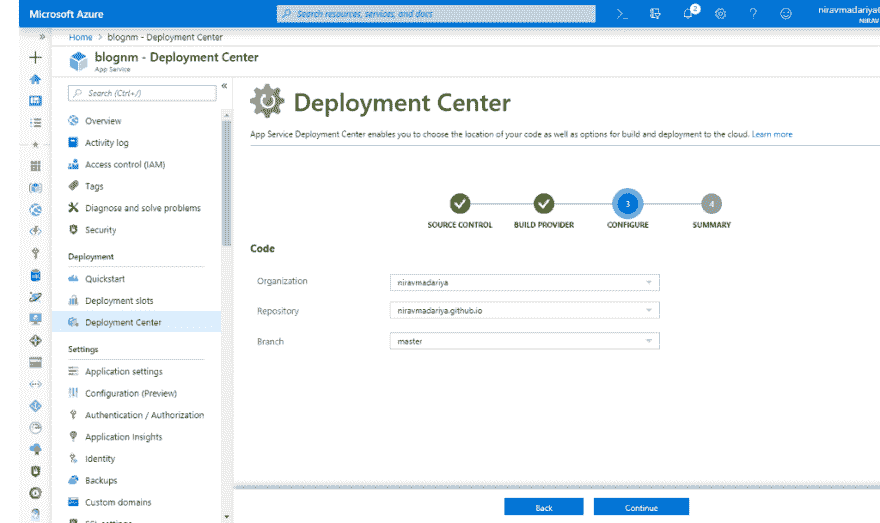
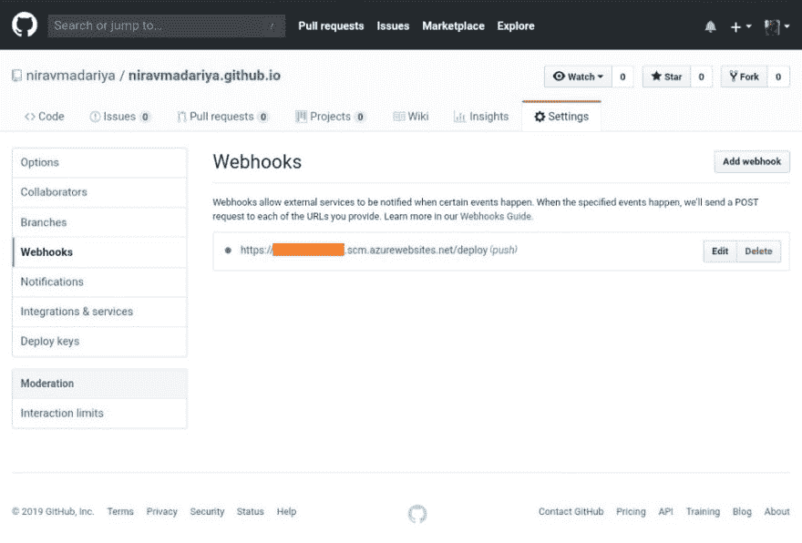
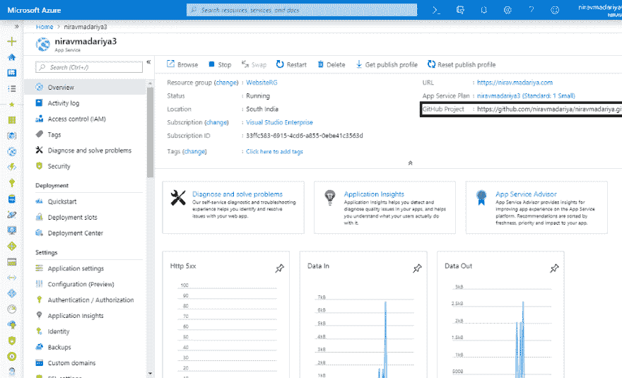
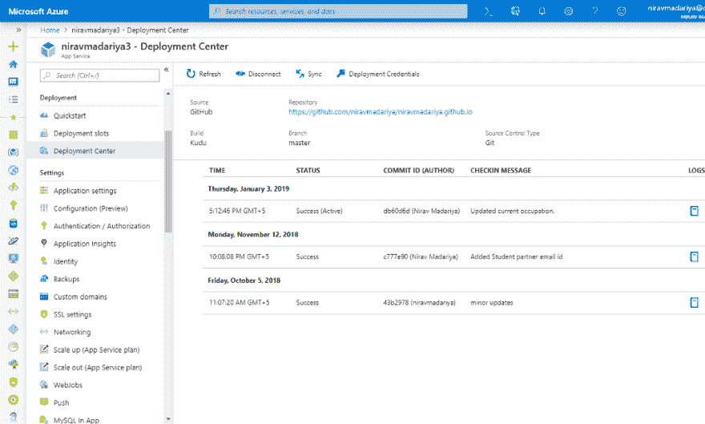

# Azure 网站中的基本 DevOps(以及幕后👅)

> 原文：<https://dev.to/niravmadariya/basic-devops-in-azure-websites-and-behind-the-scenes-2g44>

如果你想在 azure 的 webapp 中实现 CI/CD，你不需要成为一个“专业人士”。

Azure 网站中的一个功能**部署中心**是所有 Azure 网站都附带的，以前称为连续交付选项卡。

* *简介** :

Deployment Center (Basic CI/CD)提供了几个选项来部署(源代码管理)和部署平台(构建提供者)，如下所述。

**部署选项(源代码管理):**

1.  [Azure Repos](https://azure.microsoft.com/en-us/services/devops/repos/) (来自 Azure DevOps)
2.  开源代码库🐙
3.  BitBucket
4.  本地 Git
5.  OneDrive
6.  DropBox
7.  外部(公共 Git 或 Mercurial repo)
8.  文件传送协议

**部署选项(由/构建提供者部署)**

1.  Kudu 服务
2.  [天蓝色管道](https://azure.microsoft.com/en-us/services/devops/pipelines/)(预览)

我将用 4 个步骤解释 Azure 网站的基本 DevOps。让我们开始吧。

步骤 1:从设置窗格左侧转到“部署中心”

<figure> 

<figcaption>部署在 Azure 网站中心</figcaption>

</figure>

从步骤 1 开始设置源代码控制，

<figure> 

<figcaption>第一步:选择源代码控制</figcaption>

</figure>

步骤 2:选择构建提供者

<figure> 

<figcaption>第二步:选择构建提供商</figcaption>

</figure>

步骤 3:配置源代码管理

<figure> 

<figcaption>第三步:配置源码控制</figcaption>

</figure>

步骤 4:确认您所做的选择

<figure> 

<figcaption>第四步:汇总</figcaption>

</figure>

仅此而已。你可以走了。

从现在开始，无论你在你配置的 GitHub 库上提交什么，它都会在 Azure 网站上自动更新。

### **幕后:**

你配置的 Azure 网站在幕后提供 Kudu 服务。您可以在 https://<your_app>. SCM . Azure web sires . net 上访问，它使用您的 Azure 登录。</your_app>

在您刚刚配置的 GitHub 存储库中，有一个 webhook 配置为推入您的 Azure 网站 Kudu 服务，如下所示。

<figure> 

<figcaption>幕后:WebHook</figcaption>

</figure>

一旦您提交并将一些更改推送到存储库，它将触发 URL https://<your-website>. SCM . azure websites . net/deploy</your-website>

这反过来将从您的 repo 中获取最新的更改，并尝试构建应用程序。

### **验证你的部署:**

从应用程序的概述中，您将看到源代码控制的详细信息，如下所示。

<figure> 

<figcaption>验证部署设置— 1</figcaption>

</figure>

此外，在 Deployment center 中，您将看到最新的构建、部署细节、它的状态(成功或失败)、哪个构建是活动的，并记录更多信息。

<figure> 

<figcaption>验证部署设置— 2</figcaption>

</figure>

仅此而已。

### **免责声明:**

这种类型的自动部署仅用于开发/测试目的，不建议用于您的生产工作负载。

希望这篇文章已经让你清楚了 Azure 应用服务的基本 DevOps(CI/CD)的概念。如果你想和我联系，你可以在推特上给我发短信，号码是[https://twitter.com/niravmadariya](https://twitter.com/niravmadariya)

如果你喜欢这篇文章，请不要忘记为它鼓掌。很快我们会在 Azure 中看到更多概念:)

**下一个:**

*   请教专家下一步该怎么做
*   开始学习 [Azure 云开发](https://docs.microsoft.com/en-us/learn/browse/?products=azure)
*   看看 [Azure 文档](https://docs.microsoft.com/en-us/azure/)