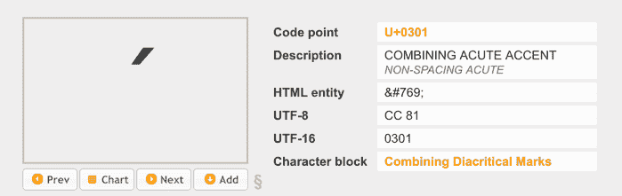
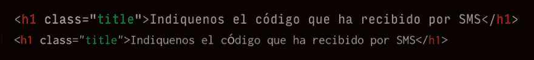

# 复制和粘贴时要小心

> 原文：<https://dev.to/bitdweller/be-careful-when-copying-and-pasting-4nng>

在我的工作中(可能也是你的),我们总是在复制和粘贴东西。无论是小片段，还是来自旧项目或网络的大块代码(当然[你永远不会这样做](https://blog.codinghorror.com/a-modest-proposal-for-the-copy-and-paste-school-of-code-reuse/))，或者只是简单的客户端内容，我们都在做。这篇文章主要关注复制内容，因为这是你从不同的来源、程序和界面复制的时候，但是它适用于任何东西。

## 开始的地方

在一个修复 bug 的早上，我看到了这个截图，上面写着 Firefox 上有一个带“código”的 bug:

一个 bug 是如此的明显可见，我却没有发现它。我用 Chromium 在我的机器上打开了有问题的页面:看起来没问题。奇怪。我打开了 Chrome、Safari 和 Firefox，它只出现在 Firefox 上。我查看了 Sublime Text 上的代码，它看起来不错:`código`。哇哦。

所以我不得不看着它，用所有浏览器工具检查它，但找不到任何线索。我在`código`这个字旁边写了一个`ó`，看起来没问题。那辆特定的`ó`肯定有问题。我可以删除这个词并继续前进，但是不，**我需要弄清这个**的真相。

所以我从 Sublime Text 中复制了这个单词，并在网上搜索“翻译 unicode”和“复制字符揭示 unicode”(你可以看到我在这方面非常迷失)，然后我被带到了几个有帮助的页面。

一个是 [r12a 的 Unicode 代码转换器](https://r12a.github.io/apps/conversion/)，它将复制的`ó`转换为`o&amp;#x0301;`。这是两个角色，而不是一个。另一页是 [Grant McLean 的 Unicode 字符查找器](http://www.mclean.net.nz/ucf/)，当我粘贴罪犯字符时显示如下:

它放弃了第一个“o ”,因为在这个框中粘贴时，它只显示最后一个字符。肯定是两个字。怎么会这样呢？我不知道。

## 我突然想到

这是客户文本，我从某处复制了这个。我记不清了，但我想这条短信是从一封客户邮件转发过来的。所以从我这边或者客户那边或者中间的人来说，这都是很奇怪的角色处理。只有 Firefox 显示错误。

**注:**似乎有些字体对这些字符的处理方式不同。当我写这篇文章时，我注意到我在 Sublime 上使用的字体表面处理了这两个字符，但如果我把它改成，例如，[伤心欲绝](href=)，它会显示不同:

这是因为 Inconsolata 的表中没有这个字符，所以它切换到默认字符。

## 解？

当然，我会一直复制和粘贴客户文本，我不会重写一切，这将消耗大量的时间。

有没有净化文本的方法来避免这种问题？