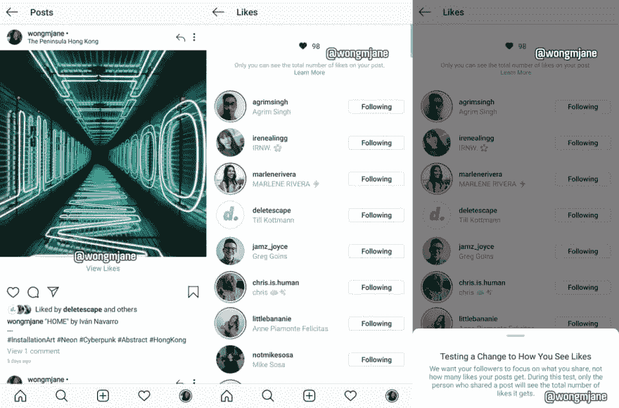

# 注意你测量的东西

> 原文：<https://dev.to/pulljosh/be-mindful-what-you-measure-4eb6>

当你衡量某样东西时，你就改变了它。

> **[观察者效应](https://en.wikipedia.org/wiki/Observer_effect_(physics)) :**
> “在物理学中，观察者效应(Observer Effect)是一种理论，即仅仅观察一种情况或现象就不可避免地改变那种现象。”

量子物理学非常奇怪，但事实证明人类也同样奇怪。谁知道呢？

在我的生活中，标准化考试是一件大事。AP 考试快到了，ACT 还在酝酿中。SAT 成绩周四出来。我不懈地努力抵制我的教育是为了战胜考试的想法，但这并不容易避免。

为了获得更多的数据，我们设计了测试来评估学生的能力。当然，这些测试并不完美——你无法在多项选择题考试中有效地衡量人际沟通等技能——但期待更多数据将导致更好的决策似乎是合理的。不幸的是，当我们衡量学生学到了什么，我们改变了他们学到的东西。

众所周知，如果学校想做得“好”(根据我们掌握的测量工具)，就必须教授可测试的技能，忽略不可测试的技能。但是一项技能与多项选择考试的兼容性与它在现实世界中的有用性完全不相关。(或者，如果你真的感觉很辣，你甚至可以争辩说相关性是存在的，而且是向下倾斜的。)因此，我们选择收集更多的数据导致了教育质量的下降。

# 我们必须小心我们测量的东西。

如果衡量可以影响结果，那么我们需要考虑我们衡量的是什么，以及我们如何改变结果。我们都知道用“代码行数”来衡量一个程序员的成功是徒劳的。

> 编程智慧[@ code Wisdom](https://dev.to/codewisdom)“用代码的行数来衡量编程进度，就像用重量来衡量飞机的建造进度。”——比尔盖茨2017 年 03 月 03 日下午 19:39[](https://twitter.com/intent/tweet?in_reply_to=837749167049031681)[](https://twitter.com/intent/retweet?tweet_id=837749167049031681)[](https://twitter.com/intent/like?tweet_id=837749167049031681)

在我最好的日子里，我写负面代码。但是如果你想让我把这个数字变大，这是一个简单的游戏:

```
if (
  true
)
{
  console.log('6 lines already! 🎉 Am I a rockstar developer?')
} 
```

Enter fullscreen mode Exit fullscreen mode

我们鼓励我们测量的东西，所以我们必须确保我们测量的是正确的东西。

幸运的是，这种测量效果也可以被武器化。这就是为什么 [Discourse](https://www.discourse.org/) 显示用户花在阅读上的时间，而不是他们写了多少:

> “在每个用户的名字旁边印上一个帖子计数，意味着你发的帖子越多，事情就越好。[...这是真的吗？
> 
> 我发现谈话的价值与人们交谈的多少关系不大。我发现说得太多会对谈话产生负面的 T4 效应。”
> 
> - [杰夫·阿特伍德(编码恐怖)](https://blog.codinghorror.com/because-reading-is-fundamental-2/)

相反，通过测量花在阅读上的时间，该系统鼓励人们多阅读。这并不复杂，但是——就像很多简单的事情一样——这种方法非常有效。

## 我们自己又该如何应用这个想法呢？

当我们开发自己的产品时，我们可以——我们必须——考虑我们的测量将产生的影响，并选择强调我们认为重要的测量。如果你正在开发一个社交媒体应用，想想你在用户帖子旁边显示的数字。它们能促进你所寻求的那种互动吗？

> 简·满春·黄[@ wongmjane](https://dev.to/wongmjane)insta gram 正在测试隐藏像计数一样的观众，
> 
> 如应用程序所述:“我们希望你的关注者关注你分享的内容，而不是你的帖子获得多少喜欢”20:13PM-2019 年 4 月 18 日

没有固定的规则。这些问题的答案会根据你的环境和目标而改变。但是在我看来，毫无疑问，简单地测量和显示数据是处理数据的好方法。

也许我们可以衡量我们如何衡量。这可能会成功。