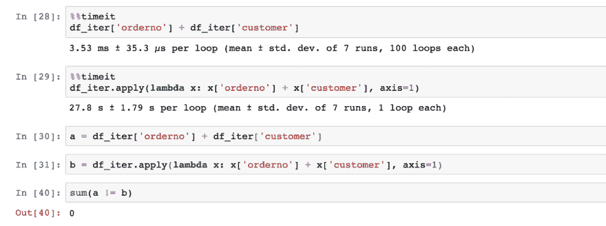
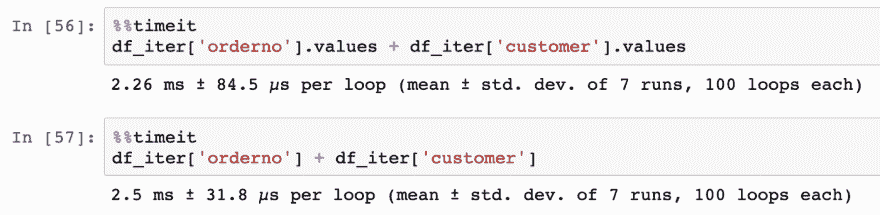
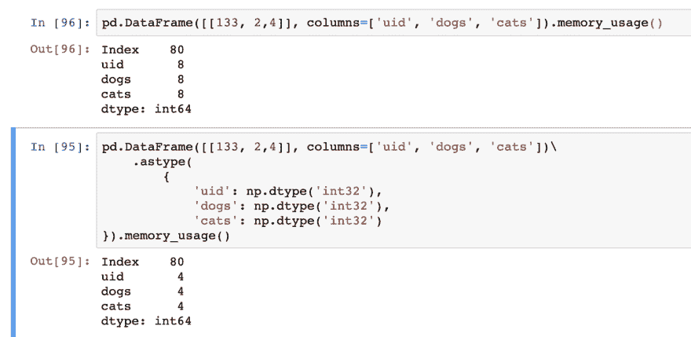
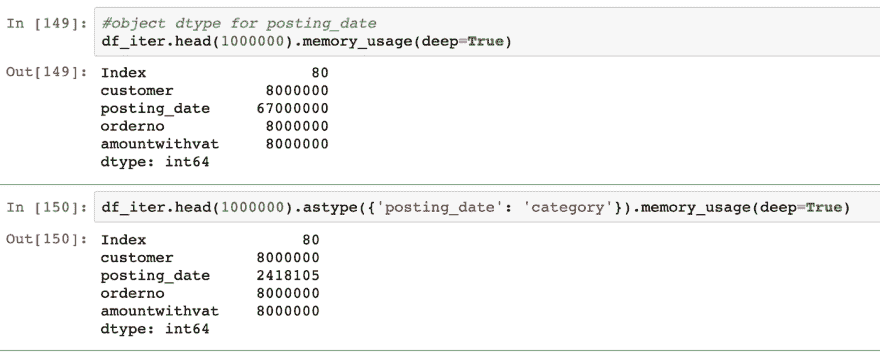
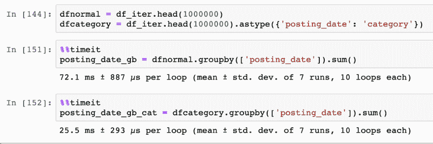
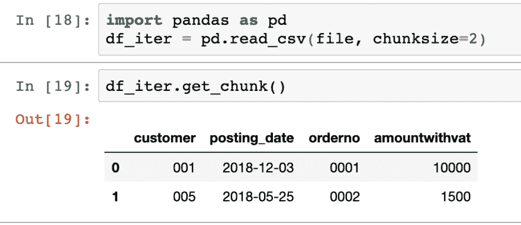
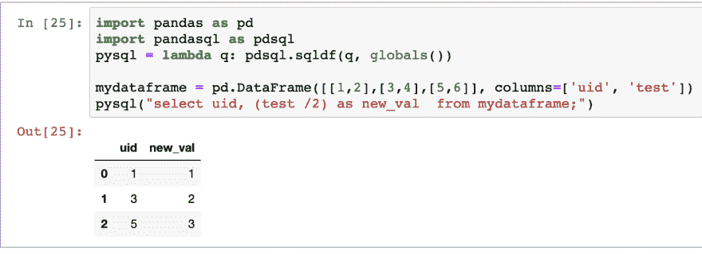
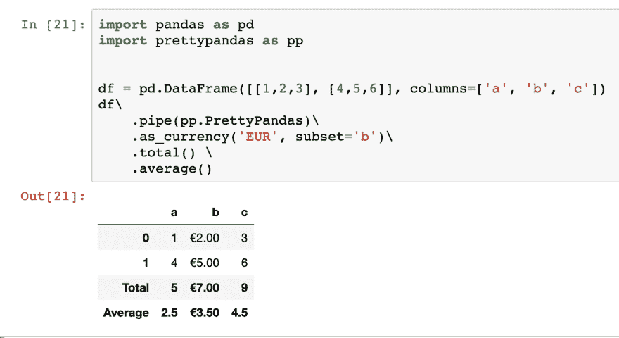

# 成为 Python 的数据操作库 Pandas 的专家

> 原文：<https://dev.to/julienkervizic/become-a-pro-at-pandas-python-s-data-manipulation-library-2161>

pandas 库是 python 中最流行的数据操作库。它提供了一种简单的方法来通过它的…

## 了解熊猫图书馆

很好地理解 pandas 的关键之一是理解 pandas 主要是一系列其他 python 库的包装器。主要的有 Numpy、sql alchemy、Matplot lib 和 openpyxl。

数据帧的核心内部模型是一系列 numpy 数组和 pandas 函数，比如现在已经废弃的“as_matrix”函数，它在 numpy 的[内部表示](https://pandas.pydata.org/pandas-docs/stable/reference/api/pandas.DataFrame.as_matrix.html)中返回结果。

Pandas 利用其他库从数据帧中获取数据，例如通过 read_sql 和 to_sql 函数使用 SQL Alchemy。而 openpyxl 和 xlsx writer 用于 read_excel 和 to_excel 函数。

Matplotlib 和 Seaborn 依次用于提供一个简单的接口，使用 df.plot()等命令绘制数据框中的可用信息

## Numpy 的熊猫——高效熊猫

您经常听到的抱怨之一是 Python 速度慢，或者难以处理大量数据。大多数情况下，这是由于编写的代码效率低下。诚然，原生 python 代码往往比编译代码慢，但是像 Pandas 这样的库为编译代码提供了 python 接口，并且知道如何正确使用这个接口，让我们充分利用 pandas/python。

### 应用&矢量化运算

Pandas 和它的底层库 Numpy 一样，执行向量化操作比执行循环更有效。这些效率归功于通过 C 编译代码而不是原生 python 代码执行的矢量化操作，以及矢量化操作在整个数据集上操作的能力，而不仅仅是当时的一个子部分。

apply 接口允许通过使用 CPython 接口进行循环来提高效率:
`df.apply(lambda x: x['col_a'] * x['col_b'], axis=1)`

但是大部分的性能提升将通过使用向量化操作本身获得，无论是直接在 pandas 中还是通过直接调用它的内部 Numpy 数组。
 
从上图可以看出，用向量化操作处理(3.53 毫秒)和用 apply 循环做加法(27.8 秒)之间的性能差异是巨大的。通过直接调用 numpy 的数组和 api 可以获得额外的效率，例如:

**Swifter**:[Swifter](https://medium.com/@jmcarpenter2/swiftapply-automatically-efficient-pandas-apply-operations-50e1058909f9?source=post_page-----264351b586b1----------------------)是一个 python 库，可以轻松地对数据帧进行不同类型的矢量化操作，其 API 与 apply 函数的 API 非常相似

### 通过数据类型高效存储数据

当通过 read_csv、read_excel 或其他数据帧读取函数将数据帧加载到内存中时，SQL 会进行类型推断，这可能会被证明是低效的。这些 API 允许您显式地指定每个列的类型。这允许在存储器中更有效地存储数据。

`df.astype({'testColumn': str, 'testCountCol': float})`
Dtypes 是来自 [Numpy](https://docs.scipy.org/doc/numpy/reference/arrays.dtypes.html) 的原生对象，它允许您定义用于存储某些信息的确切类型和位数。

Numpy 的 dtype `np.dtype('int32')`将例如表示 32 位长的整数。Pandas 默认为 64 位整数，我们可以通过使用 32 位节省一半的空间:

memory _ usage()显示每列使用的字节数，因为每列只有一个条目(行)，所以每个 int64 列的大小为 8 字节，int32 为 4 字节。

Pandas 还引入了分类数据类型，允许对频繁出现的值进行有效的内存利用。在下面的示例中，我们可以看到，当我们将字段 posting_date 转换为分类值时，它的内存利用率降低了 28 倍。
 
在我们的示例中，仅通过更改数据类型，数据帧的整体大小就下降了 3 倍多:
 
使用正确的数据类型不仅允许您在内存中处理更大的数据集，而且还使一些计算变得更加高效。在下面的例子中，我们可以看到使用分类类型将 groupby / sum 运算的速度提高了 3 倍。
 
在 pandas 中，您可以定义 dtypes，或者在数据加载期间(read_)或者作为类型转换(astype)。

Cyber pandas:[Cyber pandas](https://www.anaconda.com/cyberpandas-extending-pandas-with-richer-types/)是不同的库扩展之一，它通过支持 ipv4 和 ipv6 数据类型并有效地存储它们来实现更丰富的数据类型。

### 用组块处理大型数据集

Pandas 允许按块加载数据帧中的数据，因此有可能将数据帧作为迭代器处理，并能够处理比可用内存大的数据帧。

 
在读取数据源时定义一个 chunksize 和 get_chunk 方法的组合，允许 pandas 将数据作为一个迭代器来处理，例如在上面的例子中，数据帧一次读取 2 行。然后可以遍历这些块:

`i = 0
for a in df_iter:
# do some processing
chunk = df_iter.get_chunk()
i += 1
new_chunk = chunk.apply(lambda x: do_something(x), axis=1)
new_chunk.to_csv("chunk_output_%i.csv" % i )` 
其输出可以被输入到一个 csv 文件中，被腌制，导出到数据库中，等等

按块设置操作符也允许通过[多处理](https://docs.python.org/2/library/multiprocessing.html)来执行某些操作。

举例来说，Dask 是一个构建在 Pandas 之上的框架，构建时考虑了多处理和分布式处理。它利用了内存和磁盘上的熊猫数据帧块的集合。

## SQL Alchemy 的熊猫—数据库熊猫

Pandas 也建立在 SQL Alchemy 之上，与数据库接口，因此它能够从各种 SQL 类型的数据库下载数据集，并向其推送记录。使用 SQL Alchemy 接口而不是 pandas 的 API 直接允许我们执行 Pandas 本身不支持的某些操作，如事务或更新:

### SQL 事务

Pandas 还可以利用 SQL 事务，处理提交和回滚。Pedro Capelastegui 在他的一篇博文[特别是](https://capelastegui.wordpress.com/2018/05/21/commit-and-rollback-with-pandas-dataframe-to_sql/)中解释了熊猫如何通过 SQL alchemy 上下文管理器利用事务。
`with engine.begin() as conn:
df.to_sql(
tableName,
con=conn,
...
)` 

使用 SQL 事务的优势在于，如果数据加载失败，事务将会回滚。

### SQL 扩展

#### PandaSQL

Pandas 有一些 sql 扩展，比如 pandasql，这是一个允许在数据帧上执行 SQL 查询的库。通过 pandasql，可以像查询数据库表一样直接查询数据框对象。
T3T5】

#### SQL 更新

Pandas 本身并不支持在支持该功能的数据库上对 SQL 进行 upsert 导出。[熊猫补丁](https://github.com/ryanbaumann/Pandas-to_sql-upsert)的存在就是为了允许这个特性。

## MatplotLib/Seaborn——视觉熊猫

Matplotlib 和 Searborn 可视化已经集成在一些 dataframe API 中，例如通过。绘图命令。在[熊猫的网站](https://pandas.pydata.org/pandas-docs/version/0.22/visualization.html)上有一个关于界面如何工作的相当全面的文档。

**扩展**:存在不同的扩展，如 Bokeh 和 plotly，以在 Jupyter 笔记本中提供交互式可视化，同时也可以扩展 matplotlib 来处理 [3D 图形](https://pythonprogramming.net/3d-graphing-pandas-matplotlib/)。

## 其他分机

pandas 还有很多其他的扩展，用来处理非核心功能。其中一个是 tqdm，它为某些操作提供了进度条功能，另一个是 pretty pandas，它允许格式化数据帧和添加摘要信息。

#### tqdm

tqdm 是 python 中与 pandas 交互的进度条扩展，它允许用户在使用相关功能(progress_map 和 progress_apply)时查看地图的进度并在 pandas 数据帧上应用操作:

#### 类型要求

[PrettyPandas](https://github.com/HHammond/PrettyPandas) 是一个库，它提供了一种简单的方法来格式化数据帧并向其中添加表格摘要:

* * *

更多来自我的[黑客分析](https://medium.com/analytics-and-data):

*   [关于数据工程的演变](https://medium.com/analytics-and-data/on-the-evolution-of-data-engineering-c5e56d273e37)
*   [气流，最简单的方法](https://medium.com/analytics-and-data/airflow-the-easy-way-f1c26859ee21)
*   [电子商务分析:数据结构和应用](https://medium.com/analytics-and-data/e-commerce-analysis-data-structures-and-applications-6420c4fa65e7)
*   [在 Azure 上设置气流&连接到 MS SQL 服务器](https://medium.com/analytics-and-data/setting-up-airflow-on-azure-connecting-to-ms-sql-server-8c06784a7e2b)
*   [构建机器学习模型的 3 个简单规则，增加价值](https://medium.com/analytics-and-data/3-simple-rules-to-build-machine-learning-models-that-add-value-61106db88461)