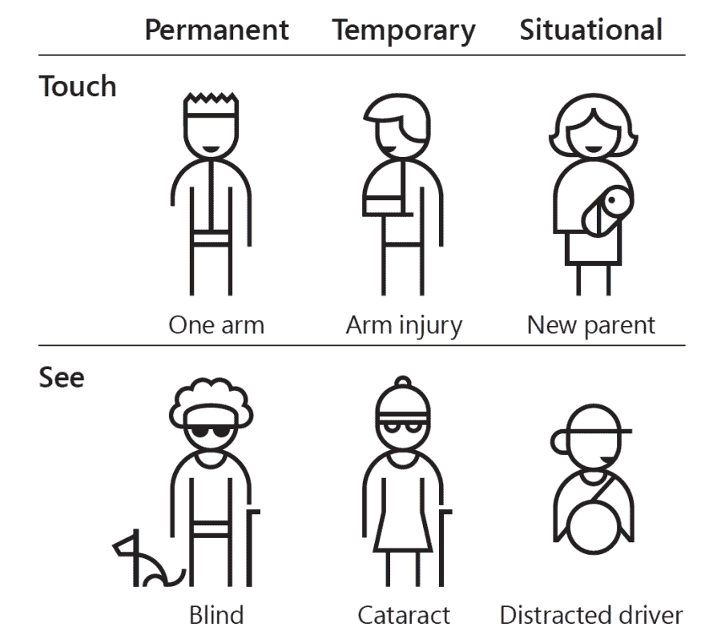
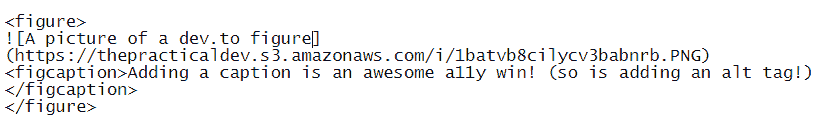
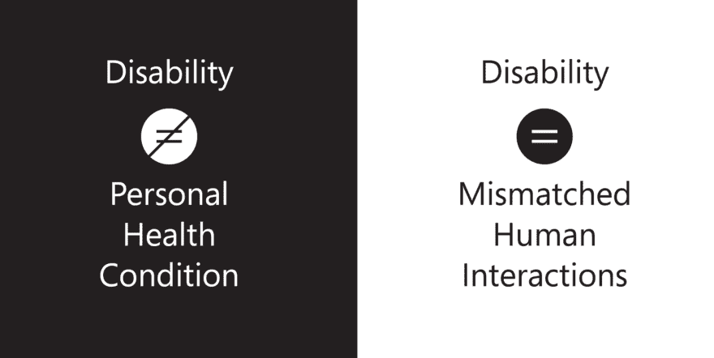
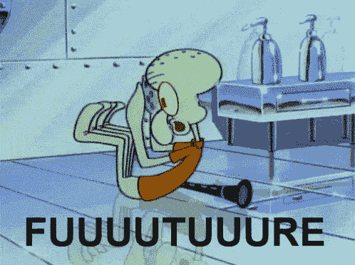

# 成为一个无障碍摇滚明星！🤘

> 原文：<https://dev.to/wuz/become-an-accessibility-rock-star-4h0c>

> 网络的力量在于它的普遍性。无论是否残疾，每个人都能获得服务是一个重要方面。
> **蒂姆·伯纳斯·李，W3C 董事、万维网发明者**

<figure>

<figcaption>How I hope you feel after reading this!</figcaption>

</figure>

这是我最初写的一篇文章，给我工作的地方的一些人上了一课。可访问性对我来说非常重要，这是帮助公司员工在 it 方面达到良好水平的指南。

我认为这场战斗的很大一部分是打开你大脑中的可访问性焦点——开始时不时地思考它，当你创建新功能时，实现一些可能产生重大影响的微小变化。我希望在这篇文章结束时，我能让大家更多地思考可访问性，为什么它很重要，以及它如何适用于一个公司的目标。

首先，我想简单介绍一下可访问性的含义。

## 可达性是...

1.  宣传:在很大程度上，可及性包括为那些可能没有能力为自己宣传的人宣传。请这样想:如果一个网站是不可访问的，并且找到联系信息或与网站维护者取得联系的唯一方式是通过该网站，你如何让他们知道你想使用他们的网站，但不能？

2.  教育:很多时候，网络平台的可访问性问题源于缺乏理解，而不是缺乏同理心。通过自我教育，我们可以大大减少未来的无障碍问题。

3.  懒:这是好消息！网站的构建考虑到了可访问性！如果你要创建一个网站，只使用内置的 HTML 元素和最小的 CSS，它将是默认可访问的！通常，不做额外的工作是使你的网站易于访问的最好方法。懒鬼得一分！

4.  普遍的:我们倾向于从狭义的角度考虑无障碍——盲人或身体残疾的人。事实上，它比我们想象的更加普遍和广泛。你们中有多少人曾经折断过手臂？这对你的工作有什么影响？根据微软的说法，有 3 种类型的残疾:

<figure>

<figcaption>There are many kinds of disability and we are all affected by them!</figcaption>

</figure>

# a11y，咏叹调，还有 WAI - oh my！

> 如果我们以自己的能力为基准，我们做出的东西对一些人来说很容易使用，但对其他人来说很难。
> **微软包容性工具包**

<figure>

<figcaption>Adding a caption is an awesome a11y win! (so is adding an alt tag!)</figcaption>

</figure>

有很多关于可访问性的词汇，这可能会使它变得混乱。让我们在这里介绍一些基本术语。

**a11Y** =“无障碍”。在 accessibility 的 A 和 Y 之间有 11 个字母。打字容易多了。

**ARIA** =“可访问的富互联网应用”。ARIA 是在 web 上构建可访问工具的标准。

**WAI** =“网络无障碍倡议”。

**WCAG** =《网页内容无障碍指南》。

<figure>

<figcaption>Disabilities encompass so much more than just health conditions.</figcaption>

</figure>

# 这有什么关系？

<figure>

<figcaption>Infinite highfives - what we'll be doing by paying attention to a11y</figcaption>

</figure>

**为...**

**...业务**

好消息是可访问性对企业来说是一个胜利。实施它不需要花费太多成本，并且可以向大大小小的许多客户推销它的好处。更容易获得的工具意味着更多的人使用平台，这意味着更多的付费客户。

**...未来**

可访问性是一个大问题。在安大略等地，已经有法律要求一定规模的公司提供无障碍网站和工具。可以预料，这将成为未来的常态。

**...用户**

非残疾用户也从可访问性中受益！像键盘快捷键和 tabIndex 支持这样的功能可以帮助超级用户和残疾用户！

**...产品团队**

考虑到可访问性的规范、设计、开发和测试都会提高与之相关的人们的同情心和技能。当我们花更多的时间考虑我们的用户(尤其是那些外表、行为和声音都不像我们的用户)和他们的需求时，我们就改进了我们自己和我们的产品。

# 微小的行动，巨大的成果

好消息是，通过简单的改变，你可以轻松获得很多胜利。

首先，停止破坏默认功能。这意味着为正确的事物使用正确的元素。`
`不应该有点击事件，``标签应该有替代文本，说明文本不应该过于复杂。[这里有一个更全面的列表](https://medium.com/valtech-design/inclusive-design-dd4e03f82094)。

接下来，安装一些关于可访问性的基本规则。Eslint 提供了 a11y 配置，有助于防止您将来犯错误，并可以帮助您纠正旧错误。有很多很棒的工具可供我们利用。

最后，花些时间看/读/学习关于可访问性的内容。下面是一个基本列表:

[A11y 项目资源](https://a11yproject.com/resources)

[对 Youtube 上的视频进行排队](https://www.youtube.com/channel/UCvNQ5aJllZ5Oi49jtMKeb0Q)

[移情驱动的发展](https://www.youtube.com/watch?v=l95VFLj3e2w)

[咏叹调简介](https://developers.google.com/web/fundamentals/accessibility/semantics-aria/)

[MDN 上的咏叹调](https://developer.mozilla.org/en-US/docs/Web/Accessibility/ARIA/ARIA_Techniques)

[AODA 法案合规性](https://www.essentialaccessibility.com/blog/aoda-compliance/)

[第 508 节合规](https://www.section508.gov/)

[网络目标资源](https://webaim.org/resources/)

[免费无障碍海报](https://github.com/UKHomeOffice/posters)

[灯泡包容性设计审核](https://bulbenergy.github.io/bulb-audit/)

# 超越 a11y

通过良好的实践，我们可以创建人人都喜欢使用的可访问的应用程序。一旦你开始走上无障碍之路，你可以做很多事情来维护它。

*继续努力* -即使有一个维护可访问性的好策略，我们也需要小心我们正在引入的问题。每个人都应该继续成长和学习这个话题，同时也要教导他人！

*可访问性，现在有更多的口味！* -到目前为止，我们主要讨论了人们可能有的残疾，但这并不是唯一的一面！我们还应该考虑技术、教育和语言的差异。网速慢和屏幕小是一个可访问性问题！获得教育和其他技术的机会也是如此。假设我们的用户使用和我们一样的设备，或者过去有过使用 web 应用程序的经验，这都是错误的假设。国际化之类的东西也很牛逼！

我希望你喜欢读这篇文章，并且你学到了一些东西！如果你有什么要补充的，请告诉我！如果你想谈论可访问性、渐进式网络应用、包容性设计或其他任何东西，我很乐意与你聊天。

* * *

来和我在 Twitter 上聊天吧！