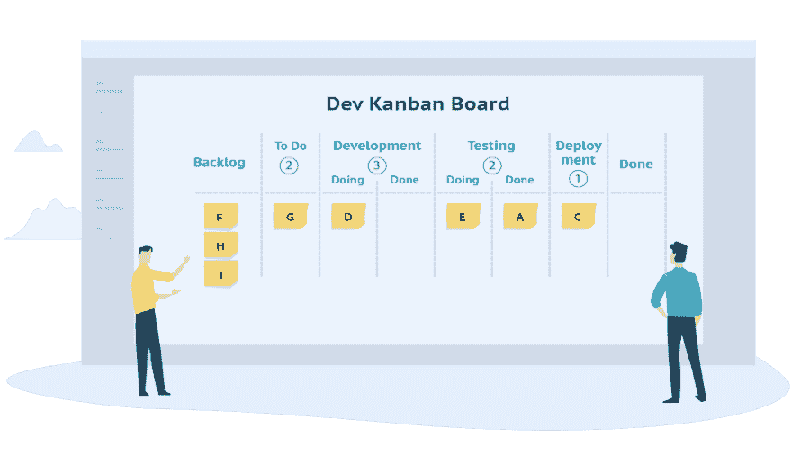

# 成为高绩效团队

> 原文：<https://dev.to/eranelbaz/becoming-high-performance-team-2lpf>

#### 我的团队成为高绩效团队的历程

很长一段时间，我的团队没有被安排一些管理方法。

为了改善这个问题，我参加了一个关于项目管理的课程，重点是——敏捷、Scrum 和看板，并尝试在我的团队中实施，这是我们的旅程

<figure> 

<figcaption>看板板</figcaption>

</figure>

### 提问

当你想做出改变，尤其是像改变我们工作方式这样的大事时，在我看来，它不应该来自上面，而应该来自人们自己，因为通过这样做，你得到了他们的承诺

所以我们开了一个团队会议，我问他们“你认为是什么阻碍了我们的进步？”

我们开始谈论我们的想法，关于我们之间的合作，关于一些人拥有的不同知识，关于长时间做同一个项目等等，从这些点我们选择了一个行动项目来解决，这就是完成的定义。

我们国防部的好处是测试、CR 和 DR，这是我们现在必须做的，并以此“迫使”我们自己进行团队合作

### 可视化工作流程

看板真正强调的一件事是工作流程——可视化和测量流程

我们总是使用某种任务和工作流管理器，但这感觉像是一种负担，所以我们建立了一个巨大的物理待办事项板，正在进行和完成以及在哪里？就在我们的门前，所以每个客户或同事都可以看到我们做了什么和我们的进展

对于我来说，另一个“帮助”板，每个需要我作为“Scrum Master”帮助的团队成员都可以在那里写，这些是我作为仆人领导者的任务

几天后，这个版块也发生了变化，我们增加了另一个 CR 专栏，一次只能写 4 个任务

为什么要限制每列的任务数量？限制是一个强大的工具，如果一个列没有限制，就意味着它没有被管理，

之前，我们有 8 个团队成员的 20 个“进行中”任务，这实际上意味着——没有在进行中，另一个影响是成员必须互相帮助才能打开困境，否则作为团队领导的你需要干预

### 每日

在我参加课程之前，每天对我来说更像是任务状态，而不是团队为了同步，我写了每天并发给我的客户，并试图理解为什么每个任务都停滞不前，新的截止日期是什么时候等等..这种方法的问题是，每日不是每日，它的状态

现在，在我理解了每天的含义——团队同步任务的时间之后

我们在物理板前谈论任务，移动任务，并互相更新我们遇到的挫折

我们设法把每天讨厌的 30 分钟会议减少到我们觉得需要的 10 分钟会议

### 每周

我们尝试的下一件事是我们开始做周会——30-45 分钟的会议，在会上我们计划下周，分解任务，并选择我们在下周关注的任务——像冲刺计划，但只有一周

对于作为团队领导的我来说，这是一个游戏改变者！从大而笨重的任务到小而易管理的任务，现在我们可以将整个版本拆分给不同的成员，这样可以最大限度地缩短周期时间，交付更少但更快的任务，最终在相同的时间内完成更多的任务

第一周是“每月”一次，我们认为我们可以在一周内完成 25 个用户故事，这太多了，在下一周我们没有增加任务，只是安排了更多的任务，在下一周我们只承担相关的用户故事，之后我们增加了新的用户故事，但减少了，我们承担了一周的确切数量

### 测量

你如何知道你正在取得进步？测量是了解这一点的唯一方法，

在你和你的团队可以分割你的任务之后，你可以选择你正在测量的日期之间的持续时间，你现在可以开始检查你的进度，并且在完成一个测量的“冲刺”之后，和你的团队一起选择你现在应该做什么以保持改进，你对完成的定义需要一些改变吗？是否要限制 WIP？采取 1-2 个行动项目，现在试着测量你的任务吞吐量，看看它如何影响你的团队。

### 回顾

我们尝试在几次部署后进行回顾，思考什么是好的，什么是坏的，以及如何变得更好，

回顾是一个非常强大的会议，因为它可能非常好，富有成效，也可能毫无用处

我们写下我们讨论过的所有要点，并努力在下次回顾会议前实现它们。

作为团队领导，我的责任之一就是找到弱点，找出如何变得更好

总而言之，说“敏捷很好，但是……”很容易。如果你真的想要一个更好的团队，更有生产力的团队，每隔几周就问他们下一个问题"**你认为是什么阻碍了我们的进步？"**

> 喜欢这个帖子？
> 通过[Patreon](https://www.patreon.com/eranelbaz)T3】支持我订阅我的 [YouTube 频道](https://www.youtube.com/channel/UCVUNeBGM5wZJKcOx0QwAaTA?sub_confirmation=1)